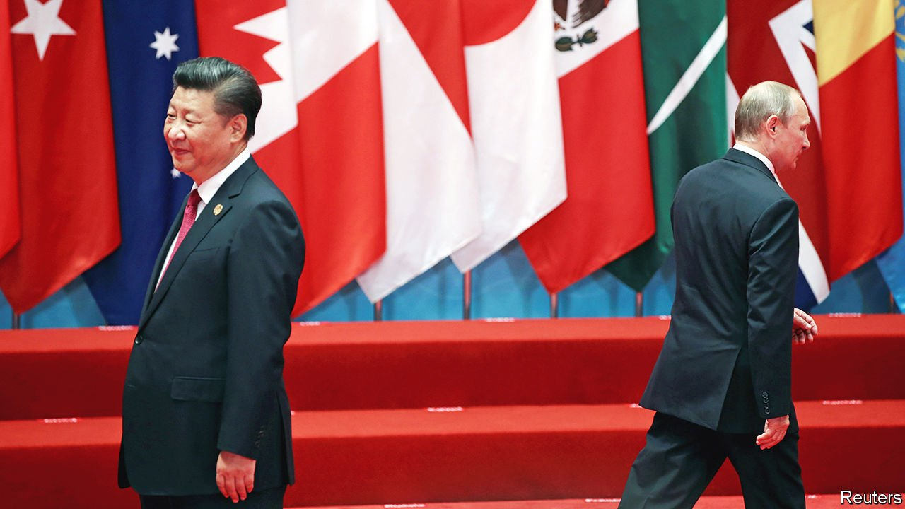
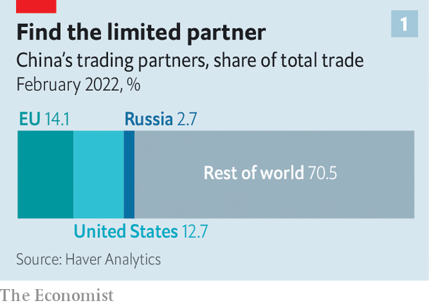
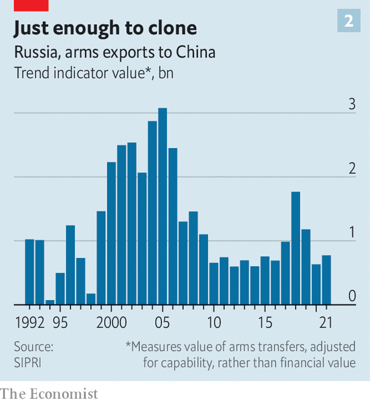
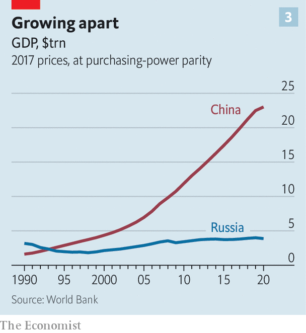
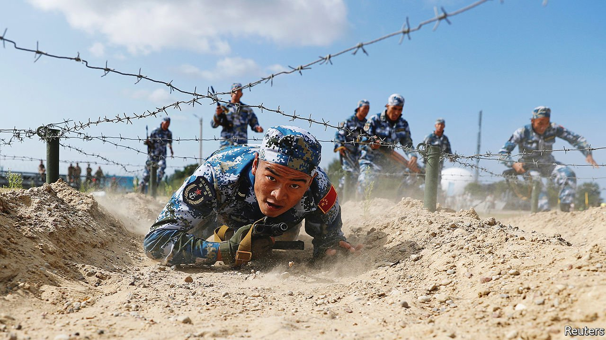

###### Testing the “limitless”

# The friendship between China and Russia has boundaries 

##### Despite what their rulers say 

 

> Mar 19th 2022 

TIME IS NOT on the side of most of those involved in Ukraine’s horrors. Every hour brings new agonies for the Ukrainian people and government. Each passing day exposes, with greater clarity, the miscalculation of Russia’s leader, Vladimir Putin, in launching a war of choice against a country he underestimated. For America and its allies, admiration for Ukraine’s resistance is tempered by fears that it cannot last for ever, as Mr Putin escalates the killing.

In contrast, one great power, China, is a study in patience. Privately, its officials project confidence that time will deliver a post-war settlement that is greatly to China’s advantage. Since the invasion on February 24th, China has rebuffed repeated pleas from foreign governments that it work more actively to persuade Russia—its “rock-solid” friend—to put a swift end to the mayhem. It has gone no further than boilerplate calls for restraint by all parties in the conflict. Western impatience is showing, with foreign ministers from Spain to Singapore calling on China to exert its “enormous influence” on Russia.


China likes to present itself as a peace-loving giant opposed to foreign incursions. In Beijing and at the UN, its envoys were left visibly squirming in the immediate aftermath of the invasion, having dismissed American warnings of war as lies. Startled by Russia’s subsequent ineptitude on the battlefield, they peppered foreign interlocutors with questions about the fighting. Meanwhile, China maintained a stance of pro-Russian pseudo-neutrality, murmuring about the need for peace while echoing Mr Putin’s arguments that he is defending Russia against America and its expanding NATO alliance.

Now Western governments fear that China may have decided to “sit back and watch the disaster”, as a diplomat puts it. In their analysis, China expects Russian brute force to prevail within weeks. They worry that the plan of Chinese leaders is to be more assertive in pushing for a ceasefire only once Mr Putin has avoided humiliation, perhaps by taking the Ukrainian capital, Kyiv, which is being shelled. Then China may offer to rebuild Ukraine’s shattered cities, hoping that its economic heft will oblige other countries to forget weeks of Chinese indifference to Russian crimes.

China has good reason to wish for an outcome that will satisfy Mr Putin. Humiliation for Russia’s leader—or worse still, his overthrow—would leave China’s president, Xi Jinping, personally exposed. Mr Xi signed a joint statement with Mr Putin less than a month before the invasion, declaring that “friendship between the two states has no limits.” It also expressed opposition to any further expansion of NATO and to American alliance-building in Asia. It described their own political systems as “genuine democracy” and portrayed efforts to promote the West’s version of it as a “serious” threat to global peace. It is a high-stakes year for Mr Xi, who hopes to secure a third term as Communist Party chief late in 2022, violating recent retirement norms. He can ill afford to be seen backing a loser.

But no matter how the war unfolds, China will treat its relationship with the Kremlin as a means of boosting Chinese power, not Russia’s. America has reportedly shared intelligence with allied governments showing that Russia has asked China for drones, surface-to-air missiles and other military aid. China’s foreign ministry has called the reports “disinformation”. Mr Xi has no desire to share the blame for Mr Putin’s war, “best friend” though he may be. Nor are there signs of China hastening to take advantage of a distracted West by attacking Taiwan, the island democracy of 24m people that China claims as its own. Unlike Mr Putin, who seems happy to stage dramatic challenges to the global order, Mr Xi appears more cautious.

One reason is economic. Bosses at China’s state-owned companies are watching the war with unease. Many have substantial businesses not just in Russia but also in Ukraine. COFCO, a government-owned food giant, counts Ukraine as an important base. China Merchants Group, a state firm, owns port terminals in Odessa, a Ukrainian city on the Black Sea coast that is on high alert for a Russian attack. In 2020 Kharkiv, a city in north-eastern Ukraine, agreed to buy 40 coaches for its metro system from China’s state-owned rail group, CRRC. With Kharkiv’s metro stations now filling with families sheltering from Russian attacks, the contract is in jeopardy.

Russia likes to tout its business links with China. On February 4th, while visiting Beijing, Mr Putin unveiled an oil-and-gas deal worth $118bn over many years, heralding it as part of a “pivot to the East”. China denounces Western sanctions against Russia. But its economic ties with Russia will become increasingly constrained.

Oil and gas dominate the trade relationship. Russia is China’s third-largest supplier of gas, and China bought nearly one-third of Russian exports of crude oil in 2020. But the recent energy deals between the two countries will hardly be a quick fix for Russia’s economic misery. China imported only 10bn cubic metres of natural gas from Russia in 2021 via the Power of Siberia, the sole pipeline that links the two countries—far short of the 175bn cubic metres imported by Europe. Even if China has appetite for the fossil-fuel exports cancelled by Europe, the relevant fields are not linked to China by a pipeline, making it hard to replace sales lost elsewhere, note analysts at Gavekal, a research firm.

 


For most other Russian products, Chinese demand is minuscule (see chart 1). Europe and America sold about $490bn in goods to China last year, six times what Russia sells to China. Weapons are the only Russian manufactured products that have strong appeal in China. After the Soviet Union collapsed in 1991, a cash-strapped Russia saw benefit in maintaining close ties with China. It began selling its former cold-war adversary tens of billions of dollars' worth of surplus weaponry, including fighter jets, submarines, helicopters, destroyers and missiles.

 


Those sales dropped off after 2006, in part because Russia objected to Chinese cloning and in part because China wanted more advanced kit, which the Kremlin was loth to sell. But Russia swallowed its misgivings when the West imposed sanctions on Russia to punish it for seizing Crimea in 2014. It agreed to sell China higher-quality equipment, including missile systems and fighters, on condition that China buy in bulk to allow Russia to make a decent profit before the stuff was inevitably copied. In the nuclear realm, the countries have co-operated an early-warning system.

China may now demand more rapid transfers of advanced Russian equipment, especially submarine and air-defence technology. It may take advantage of Russia’s economic plight to press the Kremlin to withhold such weaponry from India and Vietnam. Both of those countries are China’s rivals, but hitherto this has not deterred Russia from selling them arms.

Prepare for descent

Western sanctions are making it difficult for Russia to buy technology. But it is doubtful whether China will make up the shortfall. Take, for example, the aviation industry: Russia is in desperate need of gear to keep it working. America alone sold Russia more than $880m-worth of aircraft, engines and parts in 2021. Hopes in Moscow that China would step in were dashed on March 10th when a Russian aviation official told local media that Chinese firms were now refusing to sell aircraft parts to the country. The aviation official was then fired for making the disclosure.

The decision by Chinese firms to steer clear of Russia suggests a fear of penalties that America might impose on them should they do business with Russian firms or individuals being targeted by Western sanctions. China’s aviation industry is almost completely reliant on American technology to produce parts, says Richard Aboulafia of Teal, an aerospace consulting firm. Other potential tech suppliers in China are likely to share this anxiety about America’s possible response.

Russia may hope for greater Chinese involvement in its oil industry following the decision by Shell and BP, two Western oil majors, to pull out because of the invasion. Chinese firms would bring powerful financial backing, but they would not be able to match the Western firms’ technological expertise, says Ben Cahill of the Centre for Strategic and International Studies, a think-tank in Washington. And reliance on Chinese companies would give China “a lot of leverage over Russia”, says Mr Cahill. “They’ll probably drive a hard bargain.”

State media in China have touted the departure of Western multinationals from Russia as a business opportunity for Chinese firms. For some, it may be. Xiaomi, a Chinese handset-maker, already has nearly 40% of the smartphone market in Russia. It will probably benefit from the halt to Apple’s operations there. But Xiaomi’s sales in the country contribute just 3% of its global sales. The parlous state of Russia’s economy could discourage it from making new investments.

Chinese state-owned groups are said to be looking at possible acquisitions as Russian asset prices fall. Chinese banks could bolster the financing of yuan-denominated trade with Russia using CIPS, China's home-grown cross-border payments system. But Chinese firms are mindful of the risk to their reputations in other, more important markets should they pile into Russia. And Chinese lenders run the risk of being hit with sanctions.

Even so, China’s Communist Party does see political benefits at home from the war: it has helped fuel nationalist sentiment of a kind the party likes. Chinese officials have been fanning this with anti-American rhetoric, and by endorsing Mr Putin’s claims that Ukraine is a Nazi-infested puppet of the West. Official media and nationalist websites describe Russia as a victim of the same Western bullying that China has long endured. State television and China’s foreign ministry have repeated and amplified Russian disinformation, notably around Ukrainian laboratories alleged to be sinister Pentagon-controlled centres for bio-weapons research. Online, expressions of sympathy for Ukraine are often deleted by censors. They include a friendly interview with Ukrainian athletes at the Beijing Paralympics, which vanished after attracting too many views.

Asked to describe China’s strategic goal, diplomats at more than a dozen embassies in Beijing are in near unanimity. They say China wants a world order built around spheres of influence, with China in control of Asia, Russia wielding a veto over security arrangements in Europe and America pushed back to its own shores. If such an order is helped into existence by Russia’s war in Ukraine, so be it. But China’s overwhelming interest is in its own rise, and whether it will be blocked by America. In China’s view, the main global contest is between it and a declining America that is too racist and vicious to allow an Asian giant to become a peer.

Officials in Beijing respond to foreign horror at China’s stance on Ukraine with a mixture of swaggering bluster and blandishments. America is the object of bluster, with scholars and government advisers declaring that the war has exposed President Joe Biden’s weakness and his fear of Mr Putin’s nuclear arsenal. They predict that sanctions will fail to break Russia’s will—a point of keen interest to China, which knows it would face similar punishment were it to invade Taiwan.

In contrast, European governments with markets and technologies to which China wants access, notably Germany and France, are being targeted with a charm offensive. Europeans are being told that America wants to profit from the war, while Europe pays the price in soaring oil and gas prices and a flood of Ukrainian refugees. It is time for Europeans to seek more autonomy from America and deepen ties with China, runs the message from Chinese officials and academics.

 


In reality, China stands to gain more than any other country from Russia’s isolation. Mr Xi and Mr Putin may share a bond as nationalist strongmen, who both feel under siege from America. Both are obsessed with the threat from democratic opposition movements, denouncing protests from Hong Kong to Moscow as American-controlled colour revolutions. But it is not so long since Russian leaders were wary of growing dependent on China, a neighbour with an economy and population ten times larger than Russia’s (see chart ).

Over the past 20 years Alexei Venediktov, the founder of Ekho Moskvy, an independent radio station recently closed by the Russian authorities, has conducted an informal but informative survey. Every time he saw Mr Putin, or one of his security advisers, he would name three threats—China, Islamic terrorism and NATO—and ask them to rank them. In Mr Putin’s first two presidential terms from 2000 to 2008, Islamic terrorism came at the top, followed by China then NATO. After 2008, the order changed: China was seen as the biggest threat, followed by NATO then Islamic terrorism. After Russia’s annexation of Crimea and pivot towards China, the order changed again: NATO, then Islamic terrorism, then China. For Mr Putin, the invasion of Ukraine is not just a bid to regain historic Russian territory. It is a war on the West, and China is the most powerful partner that Russia can see.

If Mr Putin is willing to strengthen China as a champion against America, Chinese experts see opportunities. “Before, the Russians just talked and talked about co-operation” in places such as the former Soviet republics of Central Asia, says Wang Yiwei of Renmin University. Russia still dominates this region, including through a trade zone controlled from Moscow, the Eurasian Economic Union. But maybe, says Mr Wang, Russia “will have to think about looking east now, and not worrying too much about Chinese influence.”

Cold calculations

Russia may also have to give more leeway to China in the Arctic, suggests a diplomat in Beijing. China sees that region as a new strategic frontier. It wants access to natural resources there, including fishing grounds. It would like to lay digital cables across it to connect Asia and Europe. There may be opportunities for Chinese firms to build ports along Russia’s northern coasts, as climate change opens new shipping lanes. “A weakened Russia will be more malleable,” predicts the diplomat.

China will retain close military ties with Russia. These have been central to their relationship in the post-Soviet era, with the two countries often staging exercises together. To the consternation of some NATO countries, their navies have held manoeuvres in the Mediterranean and the Baltic. An exercise involving some 10,000 Russian and Chinese troops in north-west China last year was the first to feature a joint command-and-control centre and Russians using Chinese weapons.

 


But as the balance of power shifts ever further in China’s favour, many analysts expect that military exchanges will become increasingly attuned to China’s needs. America and its allies worry that Russia could help China modernise and expand its nuclear arsenal. "Nuclear weapons are one area where China thinks that Russia still possesses superior capabilities in certain areas, and possesses richer operational and training experience," says Zhao Tong of the Carnegie Endowment for International Peace in Beijing.

Still, the two sides are far from establishing the kind of interoperability that America and its allies have built over decades. Their weapons systems aren’t widely compatible. Language differences are an obstacle, too: few on either side speak both Chinese and Russian. They have no mutual defence treaty. Russia supports China’s position on Taiwan, but would probably look the other way if it attacks. Neither country wants to get involved in the other’s conflicts. Nor are they operationally ready for more than a joint counter-terrorist, humanitarian or evacuation mission.

One question facing Chinese leaders now is whether the benefits of such drills are worth the political costs, not just in the West, but among developing countries, many of which also exercise with China but have denounced Russia’s invasion of Ukraine. China may prefer to postpone or scale down drills with Russia rather than suspend them completely. Russian preoccupation with Ukraine may provide a convenient hiatus. Based on the timetable of recent years, the next big combined exercise should take place this summer or autumn. It is not clear whether it will.

As rockets rain down on Ukrainian cities, China’s diplomats have busied themselves managing the tricky optics of their wait-and-see approach to Mr Putin’s war. On March 16th Qin Gang, the Chinese ambassador to America, wrote in the Washington Post that: “Conflict between Russia and Ukraine does no good for China. Had China known about the imminent crisis, we would have tried our best to prevent it.”

Alas, diplomats note, there are no signs of his words being matched by Chinese actions, involving pressure on Mr Putin to stop the killing. Russian savagery may be awkward for China, but a humiliating end to Mr Putin’s invasion would be even less welcome if it vindicates America and the West. Meanwhile, China has begun lobbying against sanctions intended to make Mr Putin pay for his crime, especially if they might ensnare Chinese firms. “Neither war nor sanctions can deliver peace,” Mr Qin argued. While much of the world seeks an urgent end to Ukraine’s agonies, China is biding its time and thinking ahead. ■

Read more of our recent coverage of the 

