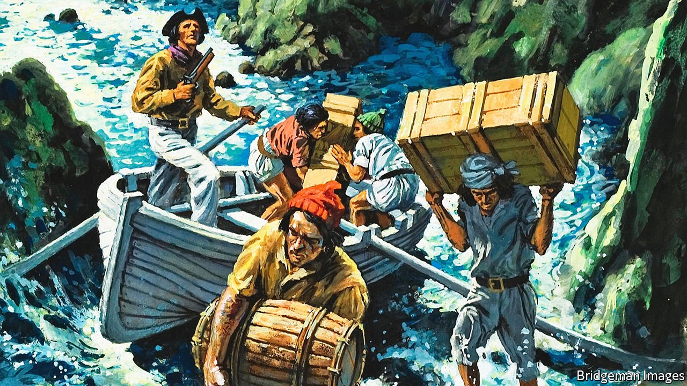

###### British fiction

# A swashbuckling smuggler’s tale 

##### “Winchelsea” is a pastiche of a pastiche, told with exhilarating colour and flair 

 

> Mar 17th 2022 

Winchelsea. By Alex Preston. Canongate Books; 352 pages; £14.99

IN 18TH-CENTURY ENGLAND, free trade meant a high-stakes gamble against the laws and forces of the state. Well-armed and merciless, gangs of smugglers cowed, or recruited, seafaring communities along the southern coasts. These “free traders” outwitted excise collectors to land and sell untaxed cargoes of wine, spirits, tea or luxury fabrics brought secretly from France and the Low Countries. Their deeds, often sanitised, passed into folklore, thence into the swashbuckling genre of Victorian fiction that Alex Preston’s new novel enjoyably revives.


Until its final acts, his ingenious and entertaining yarn unfolds in the 1740s around Winchelsea in Sussex—now a picturesque village, then a decayed port, honeycombed beneath with contraband-friendly caves. Mr Preston bows to his literary ancestors, such as J. Meade Falkner and Robert Louis Stevenson, but pulls the smugglers’ tale up to date. Goody Brown, his intrepid if conscience-stricken protagonist, yearns for a “full and unconstrained” life, free of the shackles of her sex. Through galloping, cross-dressing adventures she does justice to an “inner self” that, gender-wise, feels “neither one thing nor another”.

When her father is murdered by his fellow brigands after a suspected betrayal, Goody and her brother Francis opt to join an even more formidable local power, the Hawkhurst Gang—drawn from history, as is its bloody downfall. Adopted, like his sister, Francis has been rescued by a lucky shipwreck from a life of slavery. In smuggling exploits on land and sea, the siblings press thrillingly close to “the dangerous edge of things” (a favourite phrase of Graham Greene’s). Yet for all her bravado in scraps with hapless troopers, or on “guinea runs” to pilfer foreign gold, Goody’s gnawing unease about her behaviour grows. Her guilt complicates and darkens a story packed with well-crafted action scenes.

The tale is told with exhilarating colour, flair and pace. If Goody’s “mongrel record of a hybrid life” edges close to realism—in episodes of pregnancy and childbirth, or its unblinking eye on the cruelty of smuggling clans—it soon sets sail again on the high seas of romance. On one level “Winchelsea” is a pastiche of a pastiche: a tribute to century-old revivals of Georgian prose. But Goody’s “wondrous and fantastical” story takes readers into unexpected territory, including a foray to the Scottish Highlands, the doomed rebellion of 1745 and a neighbouring literary genre, the Jacobite adventure romp. Mr Preston wears his tricorne hat with panache. ■

