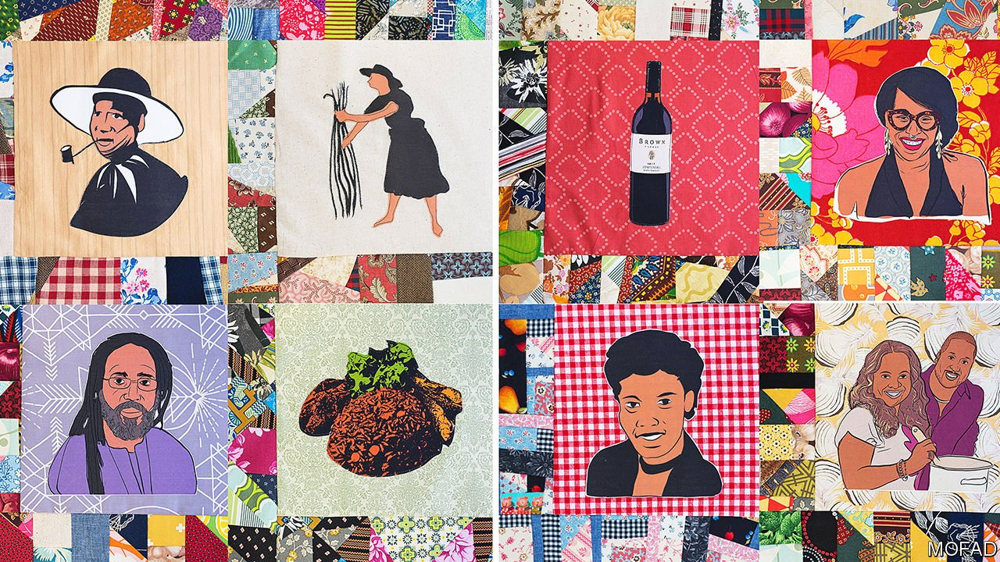

###### World in a dish

# African-Americans have shaped American cuisine in surprising ways 

##### A new exhibition celebrates the ingenuity of inventors, chefs, brewers, writers and others 

 

> Mar 19th 2022 

THE MOST visually striking things on display at “African/American: Making the Nation’s Table”, an exhibition at the Africa Centre in Harlem, are a quilt and a kitchen. The quilt (pictured) is made up of 406 squares, each depicting an African-American contribution or contributor to American cuisine. It invites study: working out who is who, and what each cookie or tankard represents. The test kitchen for Ebony magazine, rescued from demolition in Chicago, is a paragon of psychedelic chic, with multicoloured whorls covering the walls, cabinets and even the dishwasher, along with pea-green countertops and a dark orange refrigerator.

But the most revealing artefacts may be the most prosaic: an ice-cream scoop and a photograph of a man standing in front of a truck. Alfred Cralle invented the scoop with a built-in scraper, turning what had been a laborious task usually requiring two hands and at least two implements (frozen ice-cream is hard and slippery) into a simple one. And Frederick McKinley Jones invented the first portable refrigerated unit, allowing perishable food to be shipped more widely. These two objects, now so commonplace as to be unremarkable, changed how and what the world eats.


They embody the exhibition’s stated premise. In the words of Jessica Harris, an author, culinary historian and the show’s lead curator: “African-American food is American food.” Americans, along with the rest of the world, can eat strawberries in February and Cape Cod oysters far from Massachusetts because of Jones’s invention. Ice-cream enthusiasts everywhere can enjoy their dessert with ease, and less risk of covering themselves in frozen goo, thanks to Cralle’s.

Cralle’s invention also signifies the exhibition’s tacit idea: that African-Americans have never received the credit they deserve for their influence on American cuisine. Cralle patented his invention but never profited from it. Nearest Green, an enslaved distiller born around 1820, is not nearly as well known as the white man he taught to make and filter whisky—a fellow named Jack Daniel. In coastal Georgia and South Carolina enslaved West Africans turned immense malarial swamps into productive rice fields but never enjoyed the riches that their labour produced. Thomas Jefferson is renowned as a gourmet and oenophile, but his enslaved cook, James Hemings, made the food (including a “macaroni pie”) that won the Founding Father culinary fame.

This is a valuable corrective. The feeling visitors are left with at the end is admiration at the ingenuity of the brewers, chefs, distillers, farmers, restaurateurs, writers and others who persevered through unimaginable hardship and who showed far more faith in their country than their country showed in them. And the taste they’re left with is sweet: everyone who comes gets a cellophane-wrapped pair of benne cookies as they leave (benne is a Bantu word for sesame). The dessert has roots in Africa, but is also—in its softness, comforting delicacy and nifty packaging—thoroughly American. ■

