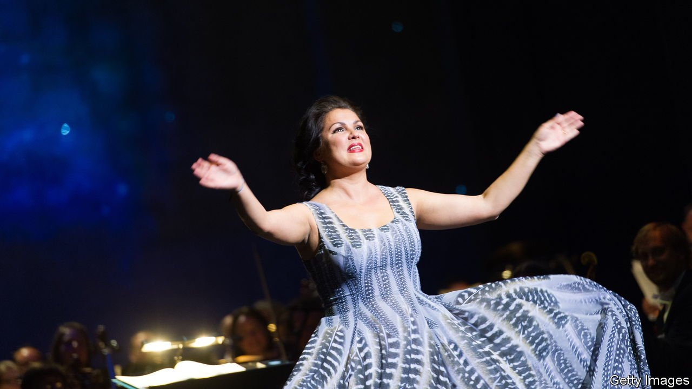

###### Back Story

# Disavow some Russian artists. Don’t cancel Russian art 

##### Shunning the country’s back catalogue means giving up a guide to the darkness, and out of it 

 

> Mar 19th 2022 

“ART AND politics should have nothing to do with each other.” So says Wilhelm Furtwängler in “Taking Sides”, a play by Ronald Harwood that imagines an interrogation of the German maestro in 1946. In real life Furtwängler never joined the Nazi party and saved Jewish musicians, but he stayed in the Reich and performed for Hitler’s birthday. “I believe in music,” the character says. His is a popular tune. “I am an artist,” protests Anna Netrebko (pictured), a superstar Russian soprano who has repudiated the war in Ukraine but not Vladimir Putin. “My purpose is to unite people across political divides.”

They would say that, wouldn’t they? In reality art is deeply political, as are artists—and not just agitprop merchants and radical poseurs, or those who serve, advertently or otherwise, as ambassadors for their countries. The avowed aims of art sound transcendent but are loaded with value judgments: eliciting sympathy and compassion for strangers (risky in Russia if the strangers are Ukrainian); honouring personal feelings (treasonous if the Kremlin says so); expressing emotions that are widely shared (except by “fascists”). Escapism is political, if politics is what you are escaping. Amid a drift to dictatorship, and above all in a time of war, what could be more political than uniting people across divides?


So it is not illogical for Russian artists to be caught in the backlash against the invasion. In some cases, it is just. Valery Gergiev rebuilt the Mariinsky Theatre in St Petersburg, making it and himself world-famous—with Mr Putin’s backing. The conductor duly played victory gigs for his patron in South Ossetia in 2008 and Syria in 2016. After he refused to condemn the latest war, Western concert halls have cut Mr Gergiev loose (as some have Ms Netrebko). The sound of shelling will always rumble in his music. Rightly, links with state-controlled institutions like the Bolshoi Theatre and the Hermitage Museum have also been suspended.

In a country where the state’s influence is broad and tentacular, association with it can be hard to avoid altogether. Most Russian artists, however, are neither power-brokers nor propagandists. Anyone calling (from the comfort of a Western keyboard) for them to denounce their president might read Isaiah Berlin’s account of a visit made by Shostakovich to Oxford in 1958. At any mention of current events, the composer fell into a “terrified silence”, Berlin wrote. “I have never seen anyone so frightened and crushed in all my life.” Such is the fear a totalitarian regime can instil in a genius, especially if his family is stuck at home.

Many Russian artists have spoken out anyway. Conductors, directors, rappers, dancers, actors and film-makers have heroically signed anti-war petitions, published passionate denunciations, expressed their shame, and withdrawn from appearances or exhibitions in self-cancelling protest. Many have fled abroad. Despite their bravery, some have been tainted, and rejected, by association. For instance, Canadian venues have retracted their invitations to Alexander Malofeev, a piano prodigy who wrote on Facebook that “every Russian will feel guilty for decades because of the terrible and bloody decision that none of us could influence and predict.”

That treatment is myopic and wrong. Freethinkers in Russia need and deserve solidarity. But remember: this too is Mr Putin’s fault. Because of his bloodlust, arts administrators are facing dizzying pressures from their sponsors, performers, audiences and consciences. Not surprisingly, some are miscalculating. War wrecks lives and spreads suffering far beyond the battlefield.

Inevitable as they are, though, these emergency measures should carry two important provisos. One concerns the future. Precisely because art is political, and can reach across divides, emphasise commonalities and foster understanding, in most cases the boycotts and cancellations should be temporary. Even Mr Putin will not last for ever.

The other proviso involves the past. Today’s Russian artists are one thing; Russian art is another. Shunning the country’s back catalogue means giving up a guide to the darkness, and out of it. Cancel Dostoyevsky, as an Italian university threatened to, and you miss peerless insights into nihilism and violence. Blacklist Tchaikovsky—or Shostakovich—and you silence a beauty wrenched from the chokehold of repression. Turn away from Malevich’s paintings, and you forgo his urgent vision of a world cracked open. Banishing Tolstoy means losing a timeless prophet of peace.

Read more from Back Story, our column on culture: (Mar 5th) (Feb 19th) (Feb 5th)

Read more of our recent coverage of the 

