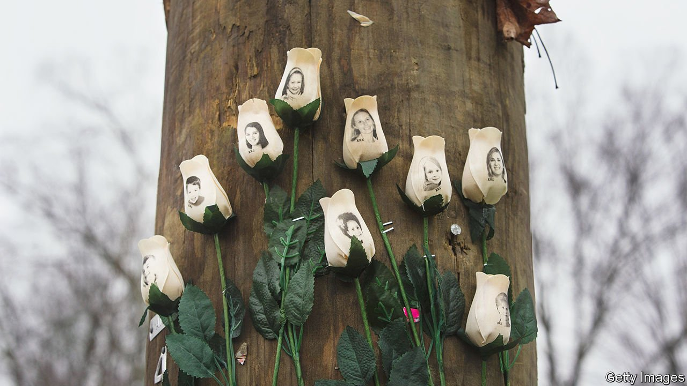

###### Fake news

# Sandy Hook was a turning-point in America’s battle over truth 

##### A new book about the massacre looks at how conspiracy theories go mainstream 

 

> Mar 19th 2022 

Sandy Hook: An American Tragedy and the Battle for Truth. By Elizabeth Williamson. Dutton; 496 pages; $28

THEY WERE hiding in a bathroom when he arrived. On December 14th 2012, 20-year-old Adam Lanza fired more than 80 bullets through the door, killing 15 children while he laughed. When the medical examiner arrived to retrieve the bodies, crayon drawings of the first-graders’ “future selves” hung on a board labelled “Hopes and Dreams” inside the classroom.


December will mark ten years since Lanza murdered 20 children and six staff members at Sandy Hook Elementary School in Newtown, Connecticut. Over the past decade the scope of the tragedy has grown, not diminished. Today the words “Sandy Hook” evoke not just the massacre, but also a turning-point in America’s long flirtation with conspiracy theories.

A new book by Elizabeth Williamson, a journalist at the New York Times, describes the collective delusion and malice of conspiracists who denied that the shooting happened or asserted that it was a government plot to stoke anti-gun sentiment. Parents who lost their children were stalked by people who called them liars; who argued that their children never existed; who demanded that their bodies should be exhumed for proof. “Sandy Hook: An American Tragedy and the Battle for Truth” also shows how these hoaxers, and the platforms that helped them, created a “conspiratorial-industrial complex” that has eroded American democracy.

America is no stranger to conspiracy theories. Some believe the footage of the moon landing was faked, Lyndon Johnson was involved in President John F. Kennedy’s assassination, and the twin towers were brought down on September 11th 2001 by explosives rather than hijacked planes. But until relatively recently these ideas swirled at the fringes of society. Ms Williamson convincingly argues that no one person epitomises conspiracism’s leakage into the mainstream more than Alex Jones, the right-wing conspiracy-monger and creator of Infowars, a website.

Mr Jones was a local eccentric in the 1990s, a creature of radio and public-access television in Austin, Texas. As the internet took off, social media and audio streaming catapulted him to national fame and, later, into the orbit of Donald Trump, then a presidential candidate, who was interviewed by Mr Jones for Infowars in 2015. In the middle of Mr Jones’s rise was Sandy Hook. For years, beginning on the very day of the shooting, Mr Jones variously asserted that the massacre was a government plot, that it never happened and that grieving parents were “crisis actors”.

Mr Jones’s culpability is clear. He has lost several defamation lawsuits by default after refusing to hand over documents required by the courts. Late last year judges in Texas and Connecticut ruled that he and Infowars are liable to pay damages to the families of ten victims. David McCraw, a lawyer for the New York Times, told Ms Williamson that the legal proceedings were tantamount to “fake news on trial”.

The author nudges readers to think broadly about who is responsible for perpetuating the idea that Sandy Hook was a hoax. There are three kinds of villains in the story. The first is the shooter himself, who killed his mother, 26 people and finally himself. The second are conspiracists such as Mr Jones, who either truly doubted that the massacre happened, or used the episode to gain money and influence (Mr Jones’s riches come from peddling diet supplements on Infowars). Third are the social-media platforms, whose algorithms facilitated the spread of outrageous and hateful content because those posts boost engagement. If outrage begets clicks, and clicks beget influence and money, then hucksters including Mr Jones are incentivised to follow their worst impulses.

One of the book’s most revealing conclusions is not about the massacre at all, but conspiracism’s place in America today. Some of Mr Jones’s associates are members of the Oath Keepers or Proud Boys, far-right groups that stormed the United States Capitol building on January 6th 2021. Many of the same websites and conspiracists that spewed nonsense about Sandy Hook abandoned truth in service of the “Big Lie” that Mr Trump actually won the presidential election of 2020.

Truth be known

Perhaps the most eloquent voice in Ms Williamson’s account of Sandy Hook is Veronique De La Rosa, whose six-year-old son, Noah Pozner, was killed in the shooting. Near the end of the book, Ms De La Rosa compares conspiracism to a virus. It is constantly mutating, becoming endemic in a society that deals in “alternative facts”. Combating conspiracy theories is like a game of whack-a-mole: debunk one person, take down one post, and five more pop up in its place. Infowars’ tagline says: “There’s a war on for your mind.” About that, if nothing else, the website is right. ■

