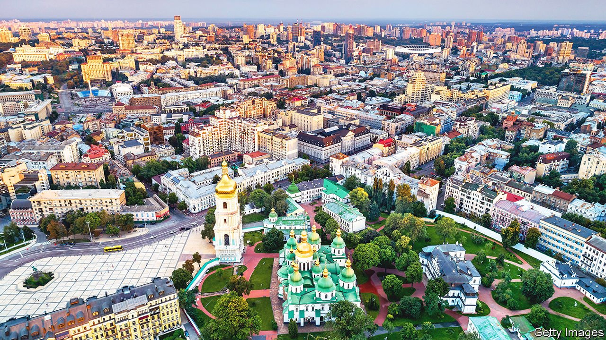

###### A Ukrainian reading list

# Six books that explain the history and culture of Ukraine 

##### From gangsters in Odessa to paramilitaries in the Donbas 

 

> Mar 19th 2022 

The Gates of Europe: A History of Ukraine. By Serhii Plokhy. Basic Books; 395 pages; $29.99. Allen Lane; £25

The author is the most distinguished historian of Ukraine writing in English. “Chernobyl”, his book on the nuclear disaster of 1986, is a masterful account of its causes and consequences. This one covers the many centuries in which the territory of Ukraine was plundered and invaded by powers from all points of the compass. Mr Plokhy shows how Ukrainian language, culture and identity flourished in adversity—which helps explain why, though they achieved a modern state of their own only 30 years ago, Ukrainians are fighting heroically to defend it.


Borderland: A Journey Through the History of Ukraine. By Anna Reid. Basic Books; 368 pages; $18.99.  Weidenfeld &amp; Nicolson; £10.99

Once a writer for The Economist in Kyiv, the author first published this blend of memoir, travelogue and history in 1997, but updated it in 2015. She ranges from Lviv in the west to Donetsk in the east, and from the capital to the Black Sea coast. Her narrative takes in portraits of fascinating Ukrainians, bygone and contemporary, including Taras Shevchenko, the national poet, and Bohdan Khmelnytsky, a 17th-century Cossack hetman. Ms Reid does not avoid the horrors of the country’s past, with its genocide, deportations and famine; but she also finds room for hope.

The Ukrainian Night: An Intimate History of Revolution By Marci Shore. Yale University Press; 320 pages;  $26 and £25

The title comes from a poem by Vladimir Mayakovsky, and the book is a fragmentary, cerebral account of the pro-democracy uprising in Ukraine in 2013-14 and its aftermath. The author captures the feelings of people swept up in the tumult in Kyiv—the sense of solidarity, and of moral imperative—and the motives of those who headed east to fight the Russian-backed separatists in the Donbas. She describes the bizarre mash-up of atavistic ideology and modern technology at work in the Kremlin’s meddling, and the implications of Ukraine’s fate for the future of Europe.

Red Famine: Stalin’s War on Ukraine. By Anne Applebaum. Doubleday; 496 pages; $35. Allen Lane; £25

The famine that Stalin inflicted on Ukraine in 1932-33 killed around 4m people. Especially after the Soviet Union collapsed and Ukraine won independence, the Holodomor, as the catastrophe is known, became an essential part of Ukrainian historiography and identity. Anne Applebaum, a Pulitzer-prizewinning author who wrote for The Economist in the 1980s and 1990s, evokes the awfulness of the episode and its lingering psychological legacy. Starvation, she argues convincingly, was used to suppress Ukrainian nationalism. She draws out the similarities between the subterfuge and criminality of Bolshevik methods in Ukraine and the tactics employed more recently by Vladimir Putin.

Death and the Penguin. By Andrey Kurkov. Translated by George Bird. Vintage; 240 pages; £9.99

The lurid realities of post-Soviet life in Ukraine (and elsewhere) were a gift to satirists, but also a challenge. Novelists struggled to compete with the grotesquerie all around them. Andrey Kurkov—who is chronicling the current war for 1843, our sister publication—managed to in this story, first published in 1996. Viktor, the hero, is a down-on-his-luck writer in Kyiv. He is employed by a newspaper to prepare the obituaries of living people—who before long fall victim to clan violence. Meanwhile Viktor keeps an ailing penguin as a pet. A memorable portrait of lawlessness and cynicism, but also of endurance and the elementary need for affection.

Odessa Stories. By Isaac Babel. Translated by Boris Dralyuk.  Pushkin Press; 192 pages; £10.99

Isaac Babel is one of many feted offspring of Odessa, a place with a unique cosmopolitan atmosphere and glorious cultural history—whose lovely boulevards and Italianate architecture are now threatened by invading Russian forces. In the stories he set in the Polish-Soviet war of 1919-21, Babel captured the brutality of conflict in piercing details. By contrast, these tales of Odessa’s pre-revolutionary Jewish gangsters feature a narrator with “glasses on [his] nose and autumn in [his] heart” and the dauntless Benya Krik, the city’s mobster king. “Everyone makes mistakes,” Benya tells the mother of a man shot by one of his henchmen. “Even God.” ■

Read more of our recent coverage of the 

