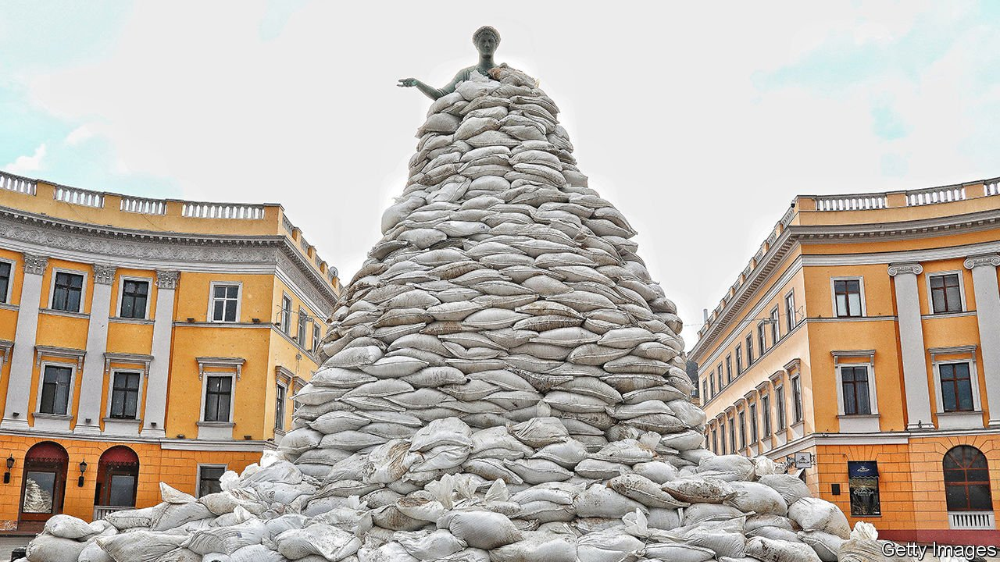

###### In the line of fire

# Vladimir Putin’s war endangers Ukraine’s cultural heritage 

##### The loss of museums, exquisite architecture and valuable archives is awful to contemplate 

 

> Mar 19th 2022 

TWO YEARS ago the Khanenko Museum in Kyiv celebrated the return of a long-lost painting. “The Amorous Couple” by Pierre Goudreaux, an 18th-century French artist, was looted by the Nazis during the second world war. It had come up for sale at an auction in New York in 2013 and finally found its way home. Now the amorous couple are back in a packing-case, hidden away not from German occupying forces this time, but Russian ones.

Overlooked amid the appalling human tragedy is the threat Vladimir Putin’s war poses to Ukraine’s cultural legacy. Besides the obvious jewels—Kyiv, Lviv and Odessa—the country boasts a wealth of pretty and characterful smaller cities and towns. Ukraine has many lovely and interesting buildings, from the brick Byzantine churches of the early medieval Slav princedoms to the futuristic Soviet-era bus stops and housing projects. (Kyiv’s central crematorium, a fantasia in concrete that looks like a satellite dish crossed with a pair of elephants’ ears, is a particular wonder.) Two locally loved buildings recently destroyed include a boxy yet charming wooden church in Zhytomyr province and a pink-and-cream neo-Gothic children’s library in besieged Chernihiv.


Mourned by all are around 25 paintings by Maria Prymachenko, a folk artist whose cheerful hybrid beasts—an orange horse with clawed feet and wings; a blue pig with antlers and shark fins—adorned many a Ukrainian child’s bedroom wall. The artworks were destroyed on the fourth day of the war, when shelling set fire to a small museum near her home village.

Apart from the port of Mariupol, the city most damaged to date is Kharkiv, near the Russian border, which has been heavily shelled since the assault began. A boomtown during the Russian empire’s tardy industrial revolution, it has a feast of Art Nouveau buildings in its old centre. Kharkiv is most famous for a complex of oddly elegant Constructivist government offices built during the 1920s and early 1930s, when it was briefly the capital of the Ukrainian Soviet Socialist Republic. The city’s leading architectural historian (since relatives are still there, she dare not let her name be printed) says that, in both the old and new centres, nearly every building has been damaged. “Sometimes it’s just one rocket, one hit. But bombed buildings usually then catch fire, and their interiors burn out…How will they survive if they have no roof, and their interiors are gone?” she asks. “Our Kharkiv is a new Warsaw, a new Dresden, a new Rotterdam.”

Kharkiv’s Fine Arts Museum is now windowless; photos show tattered blinds and floors scattered with broken glass. Among its prized possessions are 11 canvases by Ilya Repin, a 19th-century Realist who was born nearby but made his name in St Petersburg. “The irony”, a curator observes, “is that we are having to save Russian artists’ work from Russians.” Like Ukrainians in general, in the run-up to the invasion she and her colleagues were lulled into a false sense of security by Volodymyr Zelensky’s urging that life should carry on as normal, and by the inaction of the Ministry of Culture. “It was all, ‘Don’t mention the war’,” says another art historian; “basically, they screwed up.” As a result, when the blasts hit, many pictures were still hanging on the walls. Amazingly, none was visibly damaged.

In cities farther from the border, museums similarly stayed open right up until the invasion. They have had more time to prepare. Odessa has sent some of its treasures to Lviv, but institutions there are scrambling to safeguard their own collections and suitable storage is limited. (Art is sensitive to changes in temperature and moisture and cannot safely stay in damp cellars for long.) Lviv itself may soon be in the line of fire: on March 13th a missile targeted a nearby military base. Though several European museums have said they will whisk art abroad, the Ministry of Culture has not yet taken them up on the offer. In the meantime, curators are appealing to foreign colleagues for specialist packing and conservation materials.

Next in line for bombardment, probably, is Kyiv. At the time of writing, its historic centre is untouched and the fighting to date has been concentrated in the outer suburbs. The potential losses are awful to contemplate. They include St Sophia’s Cathedral, whose blue-and-white bell tower appears over broadcasters’ shoulders as they film from the rooftop bar of the InterContinental hotel across the square. Inside St Sophia’s central dome, preserved through nine centuries of warfare and revolution, is a mosaic of the Virgin, hands upraised against a gold background.

Since Mr Putin makes much of the early medieval kingdom known as Kievan Rus, from which the cathedral dates and both Russia and Ukraine are descended, Ukrainians hope that he might spare her. Judging by his treatment of new mothers in Mariupol, whose maternity hospital was destroyed on March 9th, this may be wishful thinking. Opposite St Sophia’s stands an equally fine monastery, St Michael’s of the Golden Domes. Razed to the ground by Joseph Stalin in the 1930s, it was rebuilt, complete with soft, earth-toned frescoes, in the late 1990s. Now Moscow may destroy it all over again.

Another threat to Ukraine’s heritage is the potential loss of archives and libraries. Over the past 15 years or so, Russia has closed its most sensitive archives to all but a small coterie of approved researchers. Ukraine’s institutions, by contrast, were open, making it a centre for the study not only of Ukrainian history but of that of the whole Soviet Union. Not knowing when or if they will be accessible again is a blow to scholars worldwide. The even bigger fear is that Russian occupiers will destroy archives or purge them of material that does not fit Mr Putin’s view of the world. In the words of the Kharkiv architectural historian: “They want to deconstruct not just buildings, not just infrastructure, not just the Ukrainian state. They want to deconstruct us, the Ukrainian people.” ■

Read more of our recent coverage of the 

