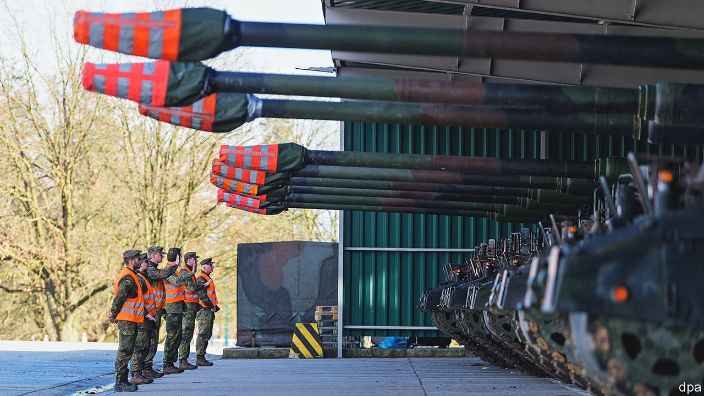
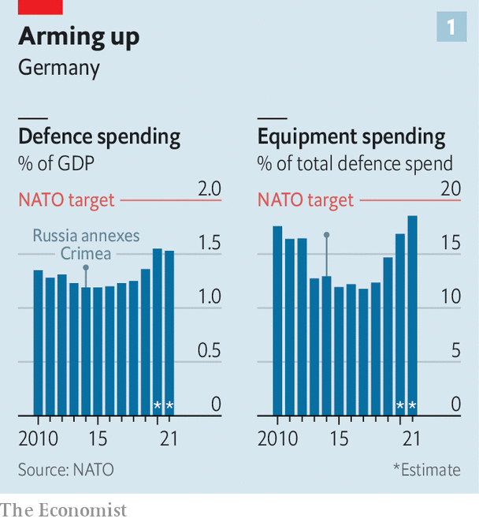
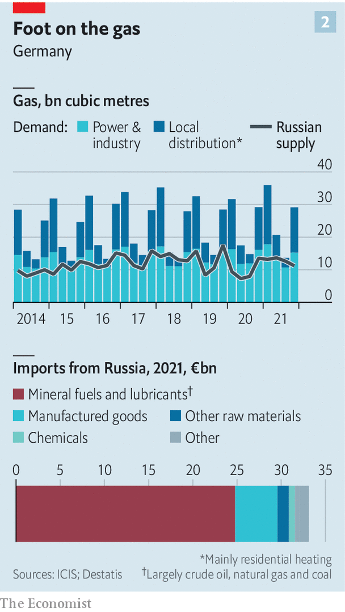
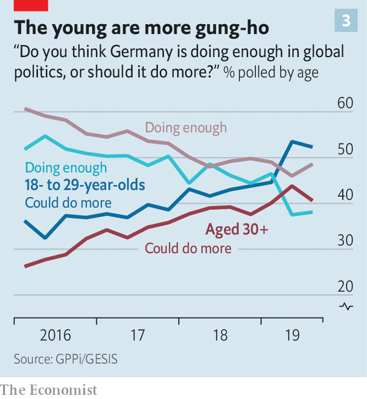
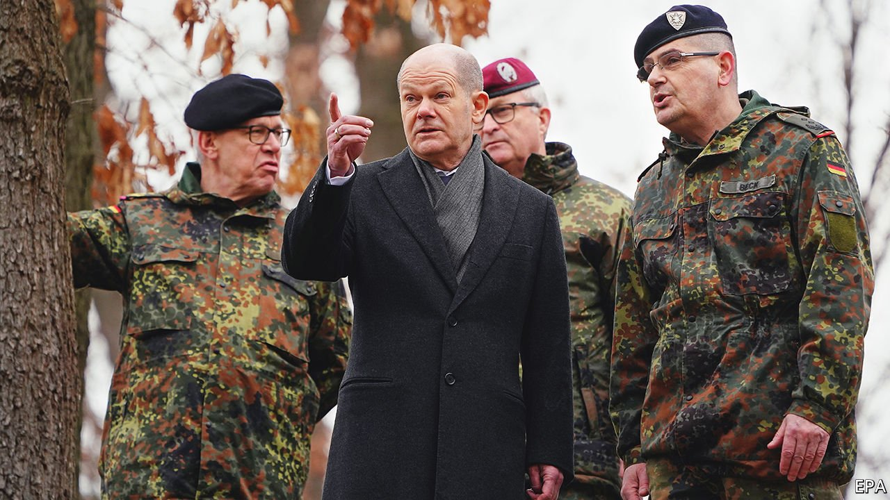

###### Ploughshares to swords

# A risk-averse Germany enters an age of confrontation 

##### Vladimir Putin has made it take security seriously 

 

> Mar 19th 2022 

VLADIMIR PUTIN’S war feels close in Berlin. Take the escalator in the Hauptbahnhof (main train station) down one level, cross the floor and you find its victims: hundreds of refugees seeking a room for the night or a ticket for onward travel. On some days over 10,000 Ukrainians reach Germany’s capital. Reception centres are struggling. But the volunteers swarming the concourse have been heroic. The extent of their organisation is “almost shocking”, beams Zeren Yildirim, a volunteer with the International Rescue Committee.

No less shocking has been the foreign-policy switch engineered just across the river Spree in Germany’s chancellery. On February 27th Olaf Scholz delivered a speech to the Bundestag that will be recalled as one of the defining moments of his still-young chancellorship. Mr Putin’s unprovoked invasion of Ukraine marked a Zeitenwende (“turning-point,” or “watershed”), Mr Scholz said. The term has come to stand for what may become one of the biggest ruptures in German foreign and security policy since the second world war.


In just under half an hour Mr Scholz reeled off a head-spinning list of announcements. Germany would lift defence spending to the NATO target of 2% of GDP (up from 1.5% in 2021). It would establish a €100bn ($110bn) fund for the Bundeswehr (the German armed forces) and place it in the constitution to elude Germany’s deficit-limiting “debt brake”. To reduce dependence on Russian energy it would make good on long-discussed plans to build two liquefied natural gas (LNG) terminals. Mr Scholz vowed to work with France to build combat jets, to equip the Bundeswehr with armed drones and to replace the ageing Tornado planes used to carry American nuclear weapons stationed in Germany.

If the policies turned heads, so did Mr Scholz’s language. Vowing to “defend every square metre of NATO territory”, the chancellor linked Germany’s investment in military capabilities to its values of freedom and democracy. He said Germany must act for its own sake, rather than just helping allies. He jabbed at his country’s instinct to place negotiation above everything else in the diplomatic toolbox. “Not being naive means not talking simply for the sake of talking,” he said. Germans are not used to hearing their leaders speak like this.

As so often in German politics, the dam had broken with dizzying speed. A few days before his speech Mr Scholz in effect killed Nord Stream 2, a Russian gas pipeline that allies had long argued would entrench German reliance on the Kremlin. Germany succumbed to partners’ entreaties to eject some Russian banks from the SWIFT international-payments system. Most difficult for some, the government swallowed its objections to arming Ukraine, and agreed to send 1,000 anti-tank weapons and 500 surface-to-air missiles, among other things. More is promised.

Mr Scholz had shared the full details of his plans with only a small coterie of advisers. Few expected a chancellor known for caution to react so decisively—and to consult so narrowly. Some MPs were put out. “In my understanding of our constitutional republic, things like this should be discussed in parliament and inside the coalition before being decided,” says Sara Nanni, parliamentary spokeswoman on security for the Greens, who govern with Mr Scholz’s Social Democrats (SPD).

Yet it was the specific commitments that set Mr Scholz’s speech apart. This marked a sharp contrast with Angela Merkel, his predecessor, whose eloquent geopolitical orations typically stopped short of policy prescriptions. Mr Scholz evidently aims to entrench his Zeitenwende in German political culture. Whether he can do so depends on three things: successfully implementing his plans; embedding them in a broader strategic philosophy; and sustaining support among German voters.

 


Start with implementation. After a long decline Germany’s military budget started climbing after Russia’s first bite at Ukraine in 2014 (see chart 1). But a sprawling bureaucracy and high spending on running costs like buildings and pensions have left the Bundeswehr with under-equipped troops and helicopters unable to take off. On the day Mr Putin rolled his tanks into Ukraine, the head of Germany’s army declared on LinkedIn that the Bundeswehr had been left “more or less bare”.

How to spend it?

A priority is to fill gaps in ammunition and spare parts. Just replenishing stockpiles of such things could gobble up €20bn. Germany’s long-suffering troops need rifles that fire and radios that work. Voters, says Sophia Besch at the Centre for European Reform, simply want “a Bundeswehr they’re not embarrassed about”.

Beyond that lies a long shopping list. Some of it has already been ticked off: on March 14th the government said it would buy 35 American F-35 fighters to replace its Tornados, and 15 Eurofighter jets to conduct electronic warfare. Germany must meet NATO obligations on tactical air defence, infantry and cyber capabilities. Heavy-lift helicopters are sorely needed.

Big budgets attract lobbyists. German arms firms such as Rheinmetall and Hensoldt, enjoying surging share prices, are pushing for early disbursements of the loot; MPs with manufacturers in their constituencies spy chances for pork. The government must resist all this, says Roderich Kiesewetter, an MP from the opposition Christian Democrats and a former soldier. Defence wonks hope for a slow disbursement of the €100bn fund to suit planning and long procurement cycles. The finance ministry, which wants to avoid overburdening the regular defence budget in reaching the 2% target, will push for speedier spending, perhaps over four years. That would test the Bundeswehr’s absorption capacities, themselves damaged by years of neglect. If spent badly there is a huge risk of the money falling into a “black hole”, says Christian Mölling of the German Council on Foreign Relations.

Nor is money the only problem. Germany’s defence-procurement agency is a byword for risk-averse dysfunction. In the defence ministry lines of authority are blurred, staffing bloated and a love of pettifogging detail so entrenched that military planners splurge on bespoke helmets because off-the-shelf ones fasten in the wrong direction. (“As if German soldiers’ heads are different from everyone else’s,” sighs one official.) Fixing these problems will fall to Christine Lambrecht, the defence minister. Ms Lambrecht is a skilled administrator and close to Mr Scholz. But she had no defence experience before taking the job last December, and has failed to impress German securocrats since.

 


Tackling Germany’s energy needs is, if anything, more pressing. Germany is quitting nuclear power—the last three plants will close this year—and aims to stop burning coal in 2030. Now it faces the challenge of weaning itself off Gazprom, Russia’s state gas giant. Russia supplies over half the gas that heats German homes and powers its industry (see chart 2); gas was named as a “bridge” fuel to a renewable future in the coalition deal signed in November. “I say this with great regret: Germany is dependent on Russian energy imports,” said Robert Habeck, the Green climate and economy minister, recently.

One challenge is to cope with demands that Germany go cold turkey on imports from its biggest supplier. Germans must “freeze for freedom”, cried Joachim Gauck, an ex-president. Some economists argue that Germany could cope with an immediate cut-off. Officials who have crunched the numbers angrily disagree. A sudden stop to Russian imports would mean “moving to a war economy”, says Kirsten Westphal at H2Global Foundation, a lobby group. But the Kremlin itself could follow through on threats to turn off the taps.

Germany is drawing up contingency plans to cope with such a supply shock, from restarting mothballed coal plants to negotiating fresh LNG supplies via Europe’s existing terminals. It will legislate to ensure higher levels of gas storage before next winter; last year Gazprom ran down stocks in the facilities it was inexplicably allowed to buy a decade ago. And, should it come to it, the country has drawn up a priority list for demand management: industrial concerns will have to cut usage first, pensioners last. “Then we will see how patriotic Germans really are,” says a minister.

In the medium term, help should come from the LNG terminals officials say will be constructed at “Tesla-speed”, with a nod to the Gigafactory that Elon Musk has built outside Berlin. The government’s plans to accelerate renewables, already dauntingly ambitious, have become yet more urgent. So have those for the green hydrogen those LNG terminals will eventually be able to receive. Just as it has had to accept a role for the military in its diplomacy, Germany is quickly learning that security of supply must be a cornerstone of energy policy.

Beyond equipping its army and guaranteeing its energy supply, Germany must begin to ask what it wants from its foreign and security policy. Money creates options, and presumably Germany does not simply want to become a larger France or Britain without nukes. But these are unfamiliar questions for a country not yet at peace with the tools of war. “The French have spent money on an army they want to use, we have spent it on one we don’t want to use,” says an exasperated official.

Priorities must be identified and trade-offs accepted. Should Germany worry less about joining French adventures in Africa and more about supporting allies in eastern Europe? How should it hedge for the prospect of a return of Donald Trump in 2025? More broadly, can it embrace the idea of force as a tool of statecraft? A proposed national-security strategy offers a chance for ideas, but the debate will matter as much as the answers. “Our passive foreign policy, waiting for partners to decide and then taking a stance, is not appropriate for a country the size of Germany,” says Carlo Masala at the Bundeswehr University in Munich. “It comes close to cowardice.”

Polls find majorities for all of Mr Scholz’s proposals, and then some: 61% believe Germany should cut off Russian energy imports, and nearly half want to reintroduce conscription. But Mr Putin’s brutal war has shocked Germans, and the moment will surely fade. For the Zeitenwende to fulfil its “transformative potential”, says Sergey Lagodinsky, a Green MEP, a sustained debate must be led from the top.

Persuade, and then persuade again

German politicians have long been nervous about leading such discussions. Yet Sönke Neitzel, a military historian, says they drew the wrong lesson from Afghanistan in 2011, after the Bundeswehr had been drawn away from peacekeeping into messy shooting battles. The problem, he says, is not that voters disliked German troops being sent into combat. It is that politicians had not prepared them for it.

 


Analysis of polling data by the Global Public Policy Institute, a research outfit, provides tentative support. Since 2016 a growing share of Germans, especially younger ones, have said the country must take a greater leadership role rather than hew to the status quo (see chart 3). And support for more military spending has long belied Germany’s reputation for pacifism. There is political space here, should the country’s leaders choose to occupy it.

For now, such is the unifying power of Mr Putin’s war that few expect Mr Scholz’s immediate plans to unravel. Indeed, some spy a Nixon-to-China effect of a left-leaning government telling Germany it must rearm. “It needed a war, and it needed the SPD and the Greens in power,” says Claudia Major at SWP, a think-tank in Berlin. Bigwigs such as Lars Klingbeil, the SPD’s co-leader, have conducted discreet talks with security experts on how to establish a more enduring revision to foreign policy.

But there is unease in both parties. Sceptical MPs will seek compensation in favoured areas in the coming budget negotiations. Some Greens insist the new defence fund must not be spent exclusively on military hardware. “Our members are certainly not falling into a state of euphoria over the Zeitenwende,” says Kevin Kühnert, the SPD’s general secretary and a hero of the party’s left. “But Putin’s brutal aggression is forcing us to make decisions that I personally rejected a few weeks ago.”

Certain shibboleths are gone. They include the old Ostpolitik idea that establishing energy interdependence—Russia as essential supplier, Germany as indispensable customer—helps build peace. Now politicians see how hard it has become to stop financing Mr Putin’s war with gas money. Nor can Germany’s remaining Putinversteher (Putin apologists) expect much of an audience for their pleas to respect Russia’s “legitimate” security interests. Indeed, most have publicly recanted.

 


Germany’s Zeitenwende will have application beyond Russia. In the EU the government has no time for what officials dismiss as Franco-Italian wheezes on debt-funded investment pools for defence or energy or rewriting fiscal rules. But as the world’s third-biggest military spender Germany will have a crucial role in shaping Europe’s nascent common defence and industrial policy. It will enjoy added heft in discussions, now made much more urgent, over NATO’s direction—including the “Strategic Concept” to be adopted at a summit in June. And Germany’s belated conversion to the 2% target has removed an alibi for other European penny-pinchers, several of which have declared their own plans to ramp up military spending.

Then there is Germany’s largest trading partner. Parts of the business and political elite have been growing cold on China for years. Now, as Xi Jinping cosies up to Mr Putin, the wind has turned icier. Chemical and car companies with long-term investments in China have been nervously eyeing the alacrity with which Russia has become an economic pariah. One test of whether Germany’s Zeitenwende is worthy of the name, argues an official, will be if German exporters begin to tap markets in developing countries beyond China; and if politicians encourage them to do so in service of a geopolitically savvy trade policy. Another is German alertness to the ownership of its critical infrastructure, from telecoms networks to gas-storage units.

For many Germans, all this requires a painful rejection of recent history. After the end of the cold war enabled its reunification, Germany aspired to build a free, whole and secure Europe with space for its historic Russian adversary. Diplomatic relations were buttressed by a thicket of commercial, cultural and academic links that penetrated deep into German society. Mr Putin’s growing aggression dampened but did not kill those hopes. Now those bonds are shattered, and an era of confrontation looms. Accepting that is a step towards ensuring, as Mr Scholz put it, that the peace and security enjoyed by Germany in the past three decades remain “more than a historical exception”. ■

Read more of our recent coverage of the 

