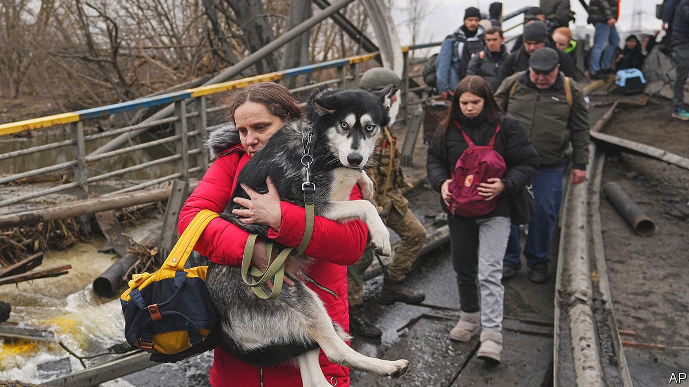

###### The cats and dogs of war

# Europe is bending immigration rules for pets from Ukraine 

##### Many refugees are bringing their best friends 

 

> Mar 19th 2022 

AFTER A 12-hour train journey from Mykolayiv, a town on Ukraine’s south coast, Tatiana is ready to take her family into Poland. She stands outside the station in Lviv, a Ukrainian city 80km from the border, next to a pile of suit cases, her eight-year-old daughter and Gucci, a tiny dog whose camouflage-coloured coat is too thin to stop him shivering. “It was a simple decision” to bring Gucci, says Tatiana. “He is part of the family.” The EU has helped by relaxing the paperwork for refugees’ pets, as well as for the refugees themselves.

Ukrainians fleeing Mr Putin’s war are bringing cats in carriers and dogs on leashes. As families break up, with fathers staying to fight, many see no reason to compound the children’s distress by leaving their pets behind.


This marks a change from previous conflicts. When the second world war dawned in London, owners rushed to kill their pets. The British government, mindful of looming food shortages, set up euthanasia clinics and told owners that it was “kindest to have them destroyed”, to spare them the horror of war. So many cats and dogs were put down that some vets ran out of chloroform. Attitudes have softened since then. Westerners now treat pets almost like people. Four-fifths of Ukrainian pet-owners see them as family members.

During the previous big wave of refugees into Europe, in 2015, hardly any Syrians or Afghans brought pets. This was partly because the journey was long, and space was limited on leaky boats across the Mediterranean. But it was also because most Muslim societies do not think of pets as little people, notes John Bradshaw, a retired anthrozoologist.

Many pets remain in Ukraine. Kyiv’s metro stations—now bomb shelters—are full of dogs and cats, often snuggling quietly with their owners. One such pet in Dorohozhychi station is a white rabbit, tucked inside Taria Blazhevych’s backpack next to a laptop. Ms Blazhevych, a software engineer, explains that “Fluffy Steve” gets scared on his own, especially when bombs are falling. Citizens in the metro are getting enough food, she adds, but Fluffy Steve’s supply of grass and carrots is running low.

Some unlucky pets have been separated from their owners, often because they were out of town when the invasion began. A few have found refuge at the boutique Dog City hotel, in Kyiv’s south. Sandra Ischenko, the director, counts in her menagerie not only dogs and cats but also a budgie and Simon the hedgehog, who spends his day running from the Russians on a spinning wheel. Owners need not call to check on their pets, says Ms Ischenko, “because they can see for themselves 24/7 via our webcams”.

Read more of our recent coverage of the 

