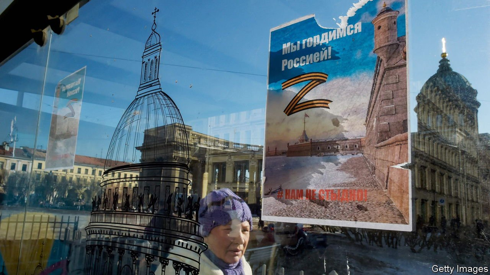

###### The Z factor

# Russian propagandists turn on pro-Western “traitors” 

##### But dissenting voices continue to make themselves heard 

 

> Mar 19th 2022 

THE E-MAIL was anonymous and written entirely in capitals. “TRAITORS!!! SHUT UP!! SHUT YOUR UGLY MOUTHS WITH YOUR LETTERS, YOU PACFICISTS!!! BITCHES, PROSTITUTES, BASTARDS. DON’T DIRTY RUSSIA WITH YOUR PRESENCE, NOBODY IS KEEPING YOU HERE!!!” It was part of the barrage of hate mail sent to Marina Davydova, one of Russia’s best-known theatre critics and the organiser of a prominent festival, who on the day that Russia attacked Ukraine published an open letter against the war.

Then on March 4th Ms Davydova found a giant Z painted on the door of her flat in Moscow. On the same day, the same letter appeared on the door of Anton Dolin, a film critic who had also published a statement decrying the war. The symbol, which initially served as an identifying mark on invading Russian tanks and has been seized on by Russia’s propagandists, now stands for Vladimir Putin’s invasion. Mr Dolin and his family were on their way to the train station to leave Russia when they saw the sign. “I felt disgusted, as though I’d stepped in a pile of shit,” he said.


After hours of interrogation, Mr Dolin and Ms Davydova were let out of Russia. Ms Davydova says she was asked questions like, “Where are you going? Why? Have you attended protests? What do you think of the special military operation? Don’t you feel sorry for the children of Donbas?“

Mr Dolin and Ms Davydova were not targeted only for their political views. Thousands of Russians have come out in protest against the war, but few have been subjected to such harassment. What links them is culture. The hostility towards Ms Davydova and Mr Dolin reflects a hostility towards the artistic world they represent—the modern Western art that the two critics see as a natural part of Russia’s cultural life.

The idea behind the hounding of prominent figures in the arts is to reject Western influence as alien. One of the most public faces of this campaign is Margarita Simonyan, the boss of the state-run RT television station. As she said in one of her recent talk shows, “We must all consolidate, grip our will in our fists, establish exceptional order in education, culture and information, and rid the country of truants, idiots and traitors.” In a speech on March 16th, Vladimir Putin said such people would be “spat out”.

Several new websites have sprung up to help identify such “traitors”. One such is provokatoru.net, which is Russian for “No to provocateurs”. It displays names and pictures of more than 200 artists, writers, actors and journalists who have spoken out against the war. “At a time when our soldiers are fighting the brown chimera” (a reference to the Nazi monsters who supposedly run Ukraine) “and our volunteers are supporting the suppressed people of Ukraine, these [traitors] are openly opposing our people, our government and our president,” an opening statement on the site says. It invites “the people” to add names, photographs and descriptions of more such fifth-columnists, to be reported to the authorities.

Meanwhile, the disquieting Z symbol is everywhere. Ever since RT advertised a black T-shirt with a Z in the middle on February 26th, Z-themed flash mobs, videos and billboards have appeared across the country. Hospital patients and factory workers are being ordered to form human ZS to be photographed from the air. In the city of Kazan youths dressed in identical white hoodies marked with the Z can be seen on videos throwing up their arms and chanting “Russia forward”. TikTok, a Chinese-owned video-sharing app, has been flooded with Z-themed content featuring attractive young women. One video shows a woman emerging from an ice-hole, to the accompaniment of an uplifting Russian song, wrapped in the Russian flag, and with a Z painted on her forehead. Displaying a Z is beginning to be seen as a test of loyalty to Mr Putin.

The purpose of all this is to fan resentment and hatred towards the West, and to create an illusion of unity in the face of growing economic pain and mounting casualties. But the more pervasive the propaganda, the more noticeable the defiant voices against the war, few though they are. Probably none has been as widely heard as that of Marina Ovsyannikova, a television producer who on March 14th interrupted a live broadcast of a news bulletin on state-owned Channel One holding a sign that said, “Don’t believe the propaganda. They are lying to you here.” Her act of defiance will not stop the war. But it was a brave protest against totalitarianism. ■

Read more of our recent coverage of the 

