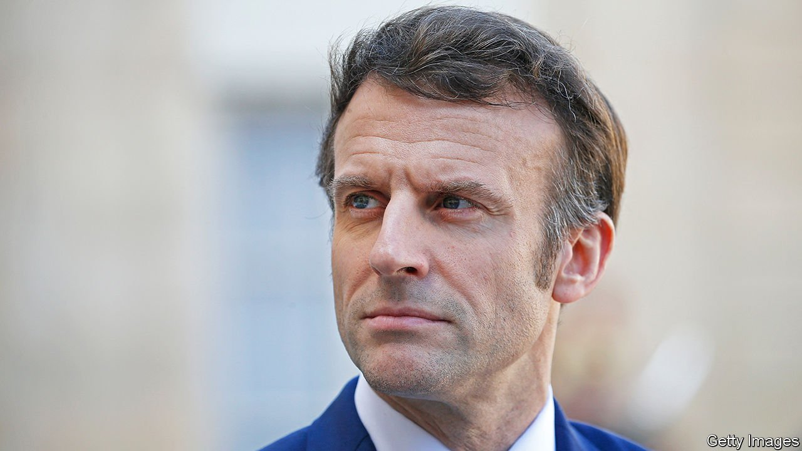

###### Unassailable

# The invasion of Ukraine has helped entrench Emmanuel Macron 

##### The mood of the campaign for next month’s election has darkened 

 

> Mar 19th 2022 

THERE WAS no bass beat to pump up the audience, nor banked rows of flag-waving supporters. Emmanuel Macron’s first campaign event since he declared formally on March 3rd that he is running for re-election as president next month was a low-key affair. In a municipal hall (and former vaccination centre) in the town of Poissy, west of Paris, he took mostly friendly questions from a modest audience of some 250 people. The first two raised a matter of great concern during this campaign: Russia’s war in Ukraine.

Anxiety about the war has turned Mr Macron’s campaign for re-election, at a two-round vote on April 10th and 24th, into what increasingly looks like a foregone conclusion. By March 15th The Economist’s  put his chances of winning at 97%. Even as a candidate, he is spending more time telephoning world leaders than shaking hands on the campaign trail. Rivals are struggling to find the right tone to criticise his leadership. “He’s hanging over this campaign at such a height that it’s very difficult to get at him,” grumbles a member of a rival team.


Mr Macron certainly knows how to make the most of this. “Before coming here I was on the phone with President Biden,” he dropped casually into the conversation in Poissy; “tomorrow I will be [on a call] with President Xi Jinping.” On March 14th a French television channel organised an entire evening event with eight of the 12 candidates entitled “France faced with war”. Most of the aspirants tried hard to show that they have what it takes to serve as head of state and the armed forces; Mr Macron recounted his conversations with Vladimir Putin.

In some ways, it is unsurprising that war has strengthened the sitting president’s hand. Voters are seeking some form of stability at a time of fear, and Mr Macron is often at his best in a crisis. The war has exposed the contradictions of his three main rivals on the hard left and the hard right, who have all scrambled to deny or withdraw past sympathy for Mr Putin. The mainstream contenders, who have real differences with Mr Macron on matters such as taxation or nuclear energy, see little option but to applaud, broadly, his diplomatic efforts.

Moreover, Mr Putin’s war has shifted the debate in Europe in Mr Macron’s direction. The muscular talk about “strategic sovereignty”, and Germany’s decision massively to increase its defence spending, reinforce what he has been saying for years. Before he was elected in 2017, Mr Macron warned that “war and conflict are not behind us” in Europe. Shortly after taking office, in a speech at the Sorbonne, he urged Europe to think in terms of “European sovereignty”, a phrase that at the time seemed as abstract as the ambition felt far-fetched. Yet at a summit in Versailles on March 10th and 11th, EU leaders promised precisely to build “European sovereignty”: to take more joint responsibility for defence, and work towards greater autonomy in energy, medicines and food.

Mr Macron’s diplomacy has its critics. Abroad, especially in eastern Europe, he was seen as a loose cannon and even as an appeaser when he first tried to court Mr Putin with talk of a new European security architecture. Last month, after his shuttle diplomacy to Moscow failed to prevent the war, he was regarded by some as naive. French diplomats had been persuaded that, in all likelihood, Mr Putin would not be reckless enough to invade. General Thierry Burkhard, France’s most senior soldier, conceded as much to Le Monde. “The Americans said that the Russians would attack—they were right,” the general said. “Our services thought, rather, that the conquest of Ukraine would have a monstrous cost and the Russians had other options” to bring down the Ukrainian regime.

Yet, as Célia Belin of the Brookings Institution points out, Mr Macron has managed to present his dialogue with Mr Putin as clear-eyed statesmanship: that he engaged in talks precisely because he had perceived how serious Russia’s threats were. “It’s not entirely false,” she says, “and it’s certainly working for him.” Since December the French president has held calls with (or met) Mr Putin 16 times, and Ukraine’s president, Volodymyr Zelensky, 24 times. A poll says 59% think Mr Macron has “risen to the challenge” over the war.

In short, Mr Macron’s efforts are applauded, despite the lack of results. Fully 65% of the French back arms deliveries to Ukraine, which France is carrying out quietly, and 80% support taking in refugees. At a visit this week to a centre to welcome those fleeing Ukraine, Mr Macron promised that France would take in at least 100,000. The war has turned the campaign into a sombre affair. But Mr Macron will have few complaints if, as seems likely, that helps him keep his job. ■

For more coverage of the French election, visit our dedicated 

