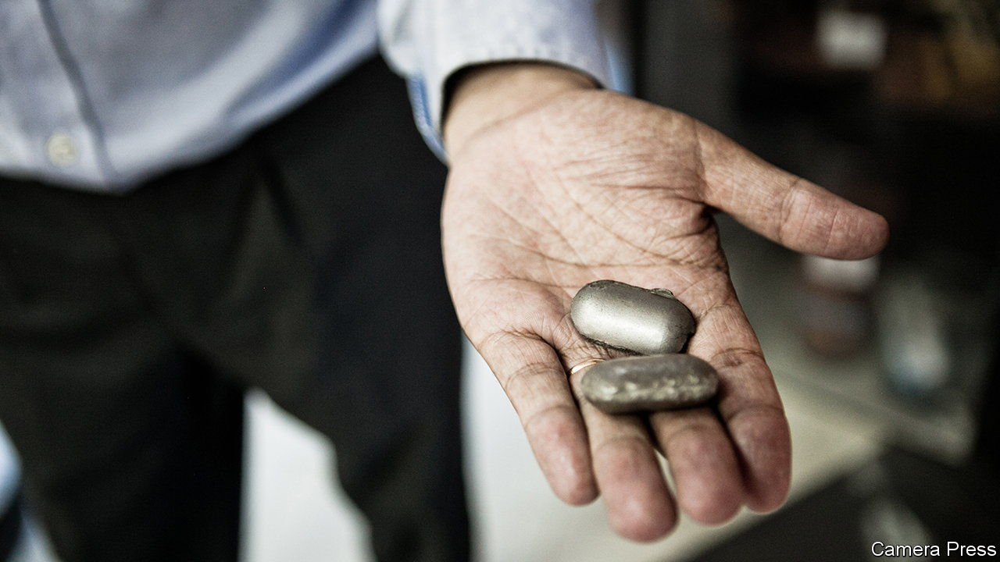

###### When China met the free market

# A nickel-trading fiasco raises three big questions 

##### London’s freewheeling metals exchange is under scrutiny 

 

> Mar 19th 2022 

THE TRADING of commodities is an arcane activity that makes it into the public eye only at times of extreme hubris. That is when names like the Hunt brothers, who tried to corner the silver market in 1980, and Hamanaka Yasuo, or “Mr Copper”, who in 1996 produced huge losses for Sumitomo, a Japanese trading house, became household ones. Xiang Guangda, a Chinese tycoon known as “Big Shot”, vaulted into the news this month by taking a position on nickel that went badly wrong. The result has been one of the biggest tremors in the 145-year history of the London Metal Exchange (LME). It has also brought China, which is keen to exert more power over the trading of commodities, face to face with free markets gone mad.

In the cloistered world of the LME, some facts about the affair are clear. One is that nickel prices, already hot before Russia’s invasion of Ukraine, surged after the West imposed sanctions on Russia. Another is that Mr Xiang’s firm, Tsingshan, had exposure to short positions on the LME of about 180,000 tonnes of nickel, which were supposed to benefit if prices went down. They didn’t, as a short-covering scramble for nickel briefly pushed prices above $100,000 a tonne on March 8th, putting Tsingshan’s potential losses into the billions of dollars. At that point the LME suspended nickel trading, cancelling all trades that took place overnight. When the suspension was lifted on March 16th, a sharp drop in nickel prices forced the LME to suspend trading again, adding to the chaos.


Three big questions remain. How important is Tsingshan’s role in the debacle? Did its troubles provoke interference from China? And has the LME bungled its response? All will be the subject of scrutiny.

In media reports, Tsingshan has the lead role in the drama. There is debate about whether its short-selling represented the normal activity of one of the world’s largest nickel producers hedging its output, or a speculator making a rash bet. What appears clear is that the nickel it produces is not the type of metallic nickel that is traded on the LME, meaning there was a mismatch between its shorts and longs. As its losses increased, its brokers forced it to provide more cash, or “margin”. The size of its position meant that they also faced big margin calls, making it as much their problem as Tsingshan’s. On March 15th Tsingshan said it had reached a standstill agreement with its creditors until it reduces its positions in an orderly way.

In the market, rumours abound that China may have influenced the LME’s activities, partly because Hong Kong Exchanges and Clearing (HKEX) owns the exchange, and also because Tsingshan is strategically important to the country, because its nickel goes into electric-vehicle batteries. The LME denies receiving pressure from HKEX. It granted extra time on March 7th to CCBI Global, a Chinese broker for Tsingshan that is a member of the LME, to raise funds from its state-owned parent, China Construction Bank, to cover margin calls. That may have been a prudent thing to do. It knew the wealthy bank could provide the funds. Some traders wonder whether it would have been as tolerant with a non-Chinese entity. In the aftermath, Chinese authorities are said to have fought hard to stop Tsingshan’s nickel assets falling into the hands of non-Chinese speculators.

The most intense scrutiny may fall on the LME itself, specifically the timing of its decision to suspend nickel trading and the cancelling of overnight trades that were rumoured to be in the billions of dollars. It said it halted trading in the early hours of March 8th when it reckoned the nickel market had become disorderly. It added that its decision to cancel that day’s trades was because the big price moves had created a systemic risk to the market, raising concerns of multiple defaults by member-brokers struggling to meet margin calls.

That latter decision is the biggest bone of contention. Critics say it favoured those with short positions, such as physical producers and their banks, over those with long positions that could be sold at a big profit. They ask why it stepped in to protect brokers when the LME has a default fund that its members can get access to in times of trouble. “The decision to erase the trades…will undermine long-term confidence in the LME,” says Yao Hua Ooi of AQR, an asset manager that had trades cancelled on March 8th. “If you want the AQRs of this world [in the market], you cannot intervene when they make money and it hurts your brokers.” He said the firm was exploring all options against the LME.

The LME has since set daily limits on price moves (which were exceeded on March 16th when it briefly reopened nickel trading). That is another sign of intervention by an exchange that used to pride itself on its free-market nature. Its owner in Hong Kong, with China looking over its shoulder, would no doubt approve. ■

