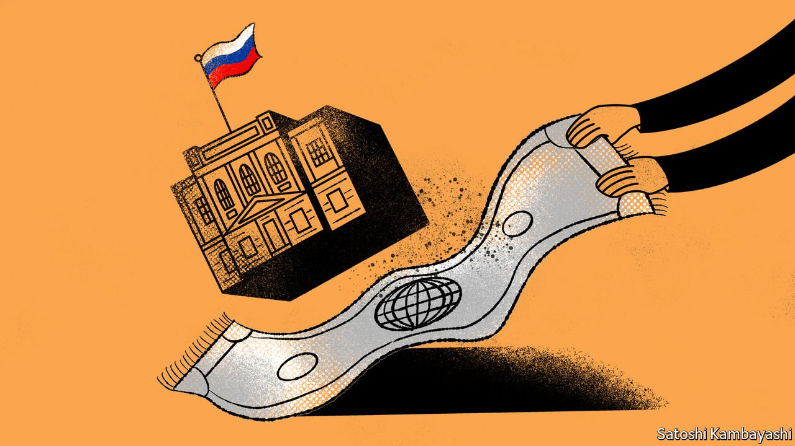

###### Buttonwood

# Can foreign-currency reserves be sanctions-proofed? 

##### The war will be as formative for reserve managers as the Asian financial crisis was 

 

> Mar 19th 2022 

CRYPTO INVESTORS sometimes say they have been “rugged” when the developers of a coin vanish, along with the capital that has been allocated to it, pulling the rug out from under them. Foreign-exchange reserve managers might never have expected to recognise the feeling. But almost as soon as Russia invaded Ukraine, American and European authorities froze the assets of the Central Bank of Russia. As others followed, the country’s first line of financial defence was obliterated. According to the Russian government, $300bn of its $630bn in reserves are now unusable.

The managers of the $13.7trn in global foreign-exchange reserves are a conservative breed. They care about liquidity and safety above all else, largely to the exclusion of profits. Much of their thinking was shaped by the Asian financial crisis of 1997-98, when currencies collapsed in the face of huge capital outflows. The lesson learned was that reserves needed to be plentiful and liquid.


Watching a big chunk of Russia’s reserves being made functionally useless is likely to be just as formative, even for those who face no immediate prospect of a terminal rift with the world’s financial superpowers. That is particularly true for the State Administration of Foreign Exchange (SAFE), the agency in charge of China’s $3.4trn in reserves. India and Saudi Arabia, with $632bn and $441bn in reserves, respectively, may also be paying close attention.

Barry Eichengreen, an economic historian, has described the choice of the composition of foreign-exchange reserves as being guided by either a “Mercury” or a “Mars” principle. The Mercurial approach bases reserves on commercial links; the currencies being held are largely determined by their usefulness for trade and finance. A Martian strategy bases the composition more on factors like security and geopolitical alliances.

Mars seems to be in the ascendant. Central banks are bound to take into account which countries will and will not replicate sanctions against them. In 2020 Guan Tao, a former SAFE official now at Bank of China International, laid out a range of ways that China could guard against the risk of sanctions. In extremis, he suggested that the dollar could stop being used as the anchor currency for foreign-exchange management and be replaced by a basket of currencies.

Even that option, which might have sounded extreme a month ago, now falls short of what a Martian central bank would need, given the degree of co-operation with American sanctions. There are few, if any, jurisdictions with large, liquid capital markets denominated in currencies that are useful in an emergency, but which do not pose a risk from a sanctions perspective. Some worried central banks might start increasing their holdings of yuan assets (which currently make up less than 3% of the global total). But that is no solution for China itself.

Why not go back to basics? Gold, the original reserve asset, is a large liquid market outside any one jurisdiction’s control. Researchers at Citigroup, a bank, estimate that most of the reserves that Russia can currently marshal are in gold and the Chinese yuan. Yet the West’s sanctions are so expansive that they prohibit many potential buyers from purchasing the assets Russia has accumulated over the years. Even a would-be counterparty in a neutral or friendly country will think twice about transacting with a central bank under sanctions, if it risks their own access to the financial plumbing of the dollar system.

There has been more adventurous speculation, too. Zoltan Pozsar of Credit Suisse, a bank, has suggested that China sell Treasuries in order to lease ships and buy up Russian commodities, arguing that the global monetary system is shifting from one backed by government bonds to one that is backed by commodities. Bold as the forecast is, it is also emblematic of the few conventional options available to reserve managers.

And that lack of good solutions points to another drastic approach: that countries limit their use of reserves for their financial defence altogether. Various tools of autarky, such as tighter capital controls, could become more attractive. Governments also typically rely on reserves as the last guarantee that they can service foreign-currency debts. But if that guarantee is no longer absolute, then they are less likely to be comfortable issuing dollar- and euro-denominated bonds at all. Private companies may be prodded to de-dollarise, too. If you don’t invest in the first place, you won’t be rugged.

Read more from Buttonwood, our columnist on financial markets:

 (Mar 12th)

 (Mar 5th) (Feb 26th)

For more expert analysis of the biggest stories in economics, business and markets, , our weekly newsletter.

