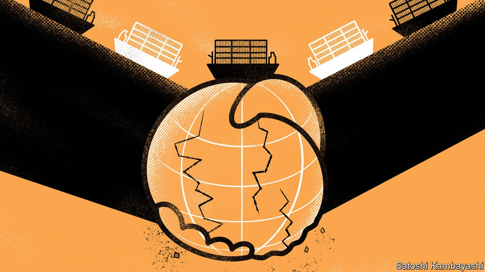

###### Economic freedom v political freedom

# Globalisation and autocracy are locked together. For how much longer? 

##### Disentangling the two will be hard, and costly 

 

> Mar 19th 2022 

THE WORLD’S supply chains have taken a knock yet again. Russia’s invasion of Ukraine provoked the biggest commodity shock since 1973, and one of the worst disruptions to wheat supplies in a century. Countries from Hungary to Indonesia are banning food exports to ensure supply at home. The West has issued sanctions against Russia, depriving it of all sorts of parts and technologies.

The strain on globalisation comes on top of the effects of the financial crisis of 2007-09, Brexit, President Donald Trump and the pandemic. For years measures of global integration have gone south. Between 2008 and 2019 world trade, relative to global GDP, fell by about five percentage points. Tariffs and other barriers to trade are piling up. Global flows of long-term investment fell by half between 2016 and 2019. Immigration is lower too, and not just because of border closures.


The war in Ukraine stands to accelerate another profound shift in global trade flows, by pitting large autocracies against liberal democracies. Such confrontation happened during the cold war, too. But this time autocracies are bigger, richer and more technologically sophisticated. Their share in global output, trade and innovation has risen, and they are key links in many supply chains. Attempts to drift apart, therefore, will bring new consequences, and costs, for the world economy.

After the second world war democracies ruled the economic roost. In 1960 America, Britain, Canada, France, Italy and Japan accounted for about 40% of global exports. Autocracies, by contrast, were economically unimportant on the world stage. The Soviet Union accounted for 4% of global trade; China barely featured in the statistics. Average GDP per head across the communist bloc was a tenth of America’s. The West was locked in a fierce ideological battle with communist countries, filled with proxy wars and nuclear scares. But in economic terms there was no contest.

Their economies were also largely unintegrated. One observer in the late 1950s reckoned that trade between the USSR and America was so small that a big shipment could double the total from one month to another. The exceptions in east-west trade—a bit of Russian gas to Europe; a wheat deal in 1972; a vodka-for-Pepsi swap from 1974—were few. A study published by the IMF days before the Soviet Union fell said that “foreign direct investment in the USSR has been minimal to date”.

The communist bloc played by its own rules. Soviet external economic activity largely took place within COMECON, a group of sympathetic countries (China and the USSR barely traded with each other from the late 1950s, having fallen out). Trade in COMECON took place not via money-for-stuff, but in the form of a peculiar system of barter—oil for manufactured goods, say—agreed by governments.

From the late 1970s onwards, autocratic regimes began to open up. In part this was the result of an ideological change, first apparent in China. The death of Chairman Mao in 1976 allowed hitherto heretical views to emerge. “Unless it could expand and modernise its economy more rapidly than it had done in previous decades, China would remain poor, weak and vulnerable,” wrote Aaron Friedberg of Princeton University in a paper published in 2018, describing the ideas of Deng Xiaoping, the leader who spearheaded China’s opening up in the 1980s. A focus on class struggle gave way to a desire for modernisation and development. Further momentum for globalisation came from the fall of the Soviet Union in 1991.

The West, on the whole, welcomed and encouraged economic liberalisation, believing that it could be a force for good (and for large profits). By bringing countries into the global trading system it would be possible to raise living standards, as well as foster democracy and freedom. A globalised world would also be a more peaceful one, the argument went.

In the 1990s globalisation took off. Trade boomed. Annual global flows of foreign direct investment (FDI, including purchases of companies and the construction of new factories) rose by a factor of six. In 1990 Russia’s first McDonald’s opened, in Moscow; KFC set up shop a few years later. Russian oil companies began directing their exports towards the West. Between 1985 and 2015 Chinese goods exports to America rose by a factor of 125.

Living standards certainly went up. The number of people living in extreme poverty has fallen by 60% since 1990. Some formerly closed countries have utterly changed. The average Estonian is now only marginally poorer than the average Italian.

The other hoped-for benefit of globalisation—political liberalisation—has faltered, however. Our World in Data, a research organisation, puts countries into four groups, ranging from most to least free: “liberal democracies”, such as America and Japan; more flawed “electoral democracies”, such as Poland and Sri Lanka; “electoral autocracies”, such as Turkey and Hungary; and “closed autocracies”, such as China and Vietnam, where citizens have no real choice over their leader.

Classifying political regimes is not an exact science, and involves making assumptions and judgments. Our World In Data counts India as an electoral autocracy since 2019, for instance, which some other sources do not agree with. Nonetheless, it helps give an idea of a broader trend: the waning might of liberal democracies.

 


The share of political regimes that were liberal democracies rose from 11% in 1970 to 23% in 2010. But democracy has retrenched since. Most of the 1.9bn people living in closed autocracies now reside in just one country: China. But lesser forms of autocracy are on the rise, such as in Turkey, where President Recep Tayyip Erdogan has consolidated power during his two decades in office (see chart 1).

Using data from the World Bank, the IMF and elsewhere, we divide the global economy into two. We estimate that today the autocratic world (ie, closed and electoral autocracies) accounts for over 30% of global GDP, more than double its share at the end of the cold war. Its share of global exports has soared over that period. The combined market value of its listed firms represented just 3% of the global total in 1989. Now it represents 30% (see chart 2).

 


China is by far the biggest non-democracy in economic terms, with a dollar GDP roughly two-thirds of America’s, making up over half of our group of autocracies. But others, such as Turkey, the United Arab Emirates and Vietnam, have also gained in economic clout over the past 30 years.

Autocracies are now an especially serious rival to democracies when it comes to investment and innovation. In 2020 their governments and firms invested $9trn in everything from machinery and equipment to the construction of roads and railways. Democracies invested $12trn. Autocracies received more FDI than democracies between 2018 and 2020. And since the mid-1990s their share of patent applications has gone from 5% to over 60%. China dominates patenting, but on almost all our other measures the economic power of autocracies has soared even after China is excluded from our calculations.

Many autocracies have remained steadfastly mercantilist. China, for instance, opened its domestic markets where it suited it, but kept whole sectors closed off to allow domestic champions to rise. Nonetheless autocracies have become integrated with democracies to an extent that would have been unthinkable during the cold war. Vietnam, which has been ruled by a single party for decades, for instance, has become a pivotal link in the global manufacturing supply chain. The kingdoms and emirates of the Middle East are vital sources of oil and gas.

We estimate that roughly one-third of democracies’ goods imports come from other political regimes. The codependency in some markets is clear. Democracies produce about two-thirds of the oil necessary to meet their daily needs. The rest must come from somewhere else. Half of the coffee that fills Europeans’ cups comes from places where people have weak political rights. And that is before getting to precious metals and rare earths.

Integration goes far beyond trade. American multinationals employ 3m people outside democracies, a rise of 90% in the past decade (their total foreign employment has increased by a third). Investors from democracies hold over a third of the autocratic world’s total stock of inward FDI. Autocracies have built up huge foreign reserves, now worth more than $7trn and often denominated in “free” currencies like the dollar and the euro.

Broken dream

This intimacy is now under threat as a third, darker period comes into view. Even before the war in Ukraine, powerful countries were losing interest in a truly global presence. Instead they were seeking to rely more on themselves or to dominate their immediate geographical area. Their new thinking is becoming increasingly enshrined in strategy and policy.

The waning appetite for globalisation has a few causes. One relates to greater consumer awareness in the West about human-rights abuses in places such as China and Vietnam. Polls in Western countries regularly find that a high share of respondents support boycotting Chinese goods (whether they would actually do so is another matter). Western companies are being pressed to source goods elsewhere. Concerns over the national-security implications of trade and investment, including industrial espionage, have also risen.

Autocracies have their own worries. One is that too much integration can cause Western culture to seep across borders, weakening autocratic rule. Deng himself identified the dilemma: “If you open the window for fresh air, you have to expect some flies to blow in.”

Another, bigger worry relates to power. Being part of global supply chains means being vulnerable to sanctions. This was clear from an early stage. In 1989 China faced sanctions after the crackdown in Tiananmen Square. The next year America placed Cuba, El Salvador, Jordan, Kenya, Romania and Yemen under sanctions for various infractions. Several rounds of Western sanctions on Russia, first in 2014 and then again today, bring the message home still more forcefully.

Already there is evidence of a crude decoupling. In 2014 America banned Huawei, a Chinese tech firm, from bidding on American government contracts. In 2018 Mr Trump started a trade war with China, with the goal of forcing it to make changes to what America said were “unfair trade practices”, including the theft of intellectual property. FDI flows between China and America are now just $5bn a year, down from nearly $30bn five years ago.

Recent policy announcements and trade deals shed some light on the probable direction of globalisation as the world’s most powerful democracies and autocracies turn away from each other. Countries are signing smaller, regional trade deals instead; democracies are banding together, as are autocracies; and many countries are also seeking greater self-reliance.

Begin with regional trade deals, the number of which is booming. In 2020 China signed an agreement with 14 other Asian countries, mostly non-democracies. In that year the ASEAN group of South-East Asian countries became China’s biggest trading partner, replacing the EU. In Africa, meanwhile, most countries have ratified the African Continental Free Trade Area.

Countries with shared political systems are also coming closer. The CoRe Partnership, an agreement between America and Japan, launched last year and is designed to promote co-operation in new technologies from mobile networks to biotech. The US-EU Trade and Technology Council, the pointed ambition of which is to promote “the spread of democratic, market-oriented values”, is working on climate change and strengthening supply chains.

Autocracies are also forming their own blocs. The stock of long-term investment from the autocratic world into China rose by over a fifth in 2020, even as the amount of investment from autocracies into America barely budged. Saudi Arabia is reportedly mulling selling oil to China in yuan, rather than dollars. Long-term investment from autocracies into increasingly illiberal India rose by 29% in 2020.

Large countries in particular, meanwhile, are also turning inward. A big focus of President Joe Biden’s administration, for instance, is “supply-chain resilience”, which in part involves efforts to encourage domestic production. China’s turn in 2020 towards a “dual circulation” strategy includes an attempt to rely less on global suppliers. It wants to release its rivals’ grip on “chokehold” industries, such as chipmaking equipment, which it fears could be used to strangle its rise. India, too, has turned towards self-reliance.

Many of these efforts could come at a price. Autocracies are notoriously prone to pursuing their own self-interests, rather than banding together. History shows that withdrawing from global trade and investment networks carries huge costs. In 1808 America came close to autarky as a result of a self-imposed embargo on international shipping. Research by Douglas Irwin of Dartmouth College suggests that the ban cost about 8% of America’s gross national product. More recently, many studies have found that it was primarily American firms that paid for Mr Trump’s tariffs. Brexit has slowed growth and investment in Britain.

Russia’s attempt at self-reliance, by pursuing import substitution on a large scale, building up foreign-exchange reserves and developing parallel technological networks, shows just how hard it is to cut yourself off from the global economy.  by the West rendered much of its reserves useless overnight. The economy was struggling even before the war, and has since gone off a cliff. Unemployment is likely to soar as foreign firms leave the country.

The risk, though, is that countries draw the opposite lesson from Russia: that less integration, rather than more, is the best way to protect themselves from economic pain. The world would become more fractured and mutually suspicious—not to mention poorer than it could have been. ■


Read more of our recent coverage of the 

