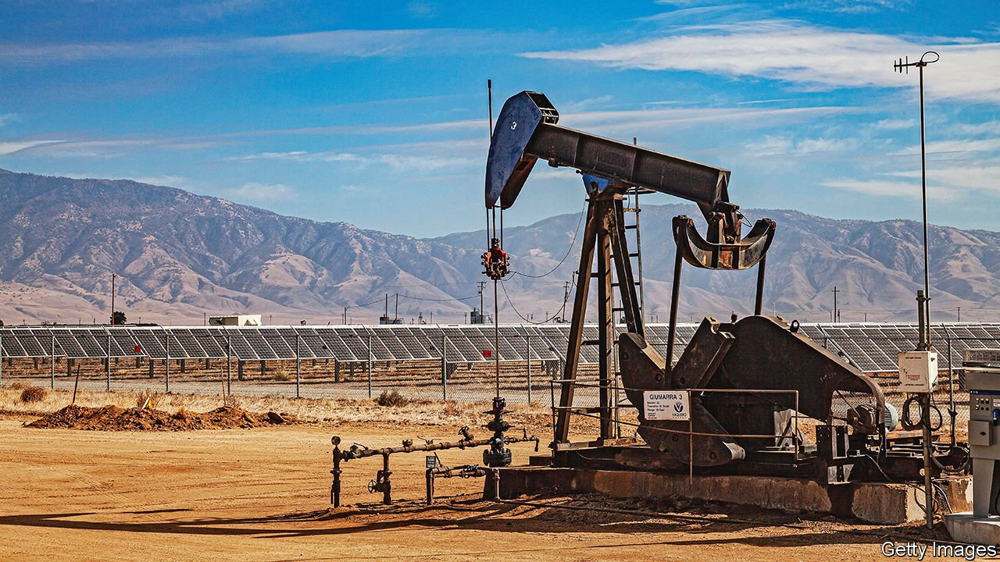

###### Power grab

# Governments are proposing windfall taxes on energy firms 

##### The taxes are tempting on paper, but tricky in practice 

 

> Mar 19th 2022 

ON MARCH 8th, the day the price of a barrel of Brent crude oil spiked above $127, the European Commission unveiled its grand plan to fight stratospheric living costs. Claiming that the “crisis situation” warranted exceptional measures, it recommended that member states levy a one-off tax on electricity-generating firms. The revenues raised could then be used to keep households’ bills down. The next day Elizabeth Warren, a senator from Massachusetts, tweeted that she and other legislators were working on a tax on the “war-fuelled profits” accruing to American oil majors. The proposal is now making its way through the House of Representatives.

Politicians have reached for such “windfall” taxes before. Bulgaria, Italy, Romania and Spain have imposed them on power generators in recent months, as benchmark energy prices have risen. In 1980 America announced that it would begin taxing oil producers in six years’ time, hoping to cash in on profits that were expected to be made after prices were deregulated. Britain’s new Labour government taxed utilities in 1997, after the Conservative government had sold them off cheaply.


The levies are understandably tempting for the taxman. Big windfalls mean big receipts. The usual worry with a tax is that it might change companies’ behaviour, say by encouraging them to lower investment in order to bring down future tax bills. But the event causing the windfall is meant to be a one-off, unconnected to investment. They are “extremely efficient ways to raise revenue”, says Helen Miller of the Institute for Fiscal Studies, a think-tank in London. At least, in theory.

Britain’s tax probably fitted the ideal better than most. It had a clear rationale: that excess gains had come from the underpricing of shares when firms were privatised. Post-privatisation profits were multiplied by a price-to-earnings ratio; a 23% tax was levied on what was left over once public proceeds from privatisation were subtracted. Even then, however, the tax failed to target the beneficiaries of excess gains. British Telecom, the first utility to be privatised, had listed in 1984. Many early punters had come and gone, leaving shareholders in 1997 bearing the burden.

Levies elsewhere have faced other hurdles. In 2006 Mongolia introduced a 68% charge on profits from copper and gold sales, hoping to cash in on a new mine during a commodity-price boom. Instead, investors withheld funds for the project until regulators agreed to drop the tax. America’s tax did distort firms’ behaviour, by some estimates reducing oil production between 1980 and 1986 by up to 4.8%.

The European Commission’s plan has its flaws. It does not explain why the current situation warrants a one-off tax, adding uncertainty about when such levies might be used again. Furthermore, the energy industry buys and sells power using long-term contracts, making the link between today’s prices and tomorrow’s profits fuzzy. And prices can fall as quickly as they rise. By March 16th, for instance, the oil price was back to about $100 a barrel.

Recent experiments offer scant grounds for optimism. Romania, Italy and Spain are targeting renewable-power generators, which have not experienced the same increase in costs as generators that use fossil fuels. Richard Howard of Aurora Energy, a consultancy, says that this raises the “risk premium” of investing in renewables—exactly what legislators want to avoid. Peter Styles of the European Federation of Energy Traders, a trade body, notes that Spain’s scheme stops green-energy generators accruing excess profits to begin with, which will distort the way prices are set in the market.

Their momentum across Europe also creates a fiscal opening that may be hard to close. The commission recommends that all windfall taxes should be wound down by the end of June. But Spain has already extended its clawbacks once. And Italy’s measures will last until December. ■

For more coverage of climate change, register for , our fortnightly newsletter, or visit our 

