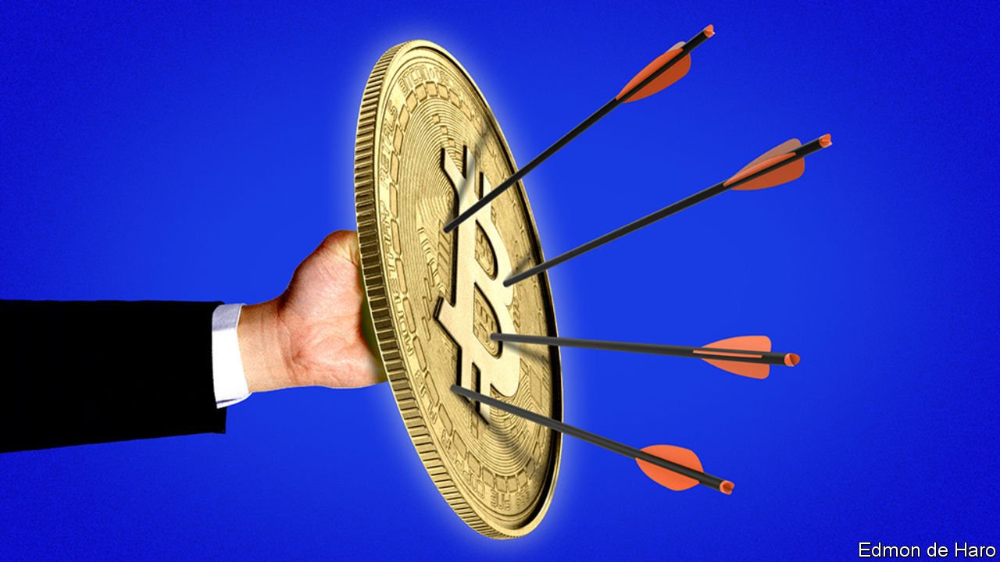
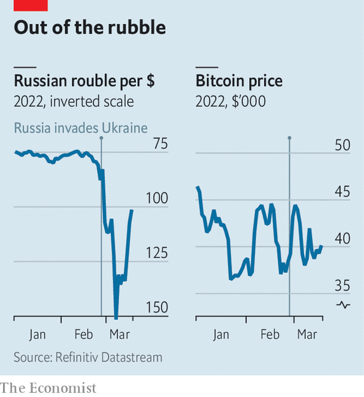

###### Russian roulette

# Sanctions-dodgers hoping to use crypto to evade detection are likely to be disappointed 

##### It may have more going for it as a tool to help Ukraine’s fundraising efforts 

 

> Mar 19th 2022 

TO THEIR CHAMPIONS, cryptocurrencies are supposed to be a libertarian Utopia. Because tokens are created and moved by loose,  of individual computers based in dozens of countries, cross-border transactions can be quick and in theory are free from control by intermediaries, such as banks, which can be regulated by national governments. Critics of crypto-finance have long looked askance at the same system. To statists, it represents the tyranny of techno-anarchy.

Russia’s invasion of Ukraine and the West’s subsequent sanctions on Russian banks, companies and elites appears to turn on its head the debate about whom crypto helps and hurts. Though politicians and regulators in America and Europe at first feared that people and entities hit with  would use cryptocurrencies to dodge the restrictions, little evidence of such activity has materialised. Instead, crypto institutions appear to be under the thumb of governments, too. And there has been a huge surge in crypto donations to help the government in Ukraine.


Crypto’s decentralised network is supposed to be supranational and its users are meant to be anonymous. This makes it seem like a useful tool for sanctions-dodging. Certainly, there is evidence that Russians have been buying more crypto. But this may stem from a desire to hold an asset that is not plunging in value. The rouble has tumbled by about 25% against the dollar since February 23rd, whereas bitcoin has risen against the greenback. For oligarchs looking to dodge sanctions, though, crypto has three main flaws.

 


The first is that the infrastructure, such as large exchanges, does not really exist in Russia. “Had the Russians wanted to use blockchain infrastructure for sanctions evasion, they would have had to have taken a very different regulatory approach,” says Tomicah Tillemann, a former staffer for President Joe Biden, who now advises Katie Haun, a crypto-focused venture capitalist. “Russia, along with a number of other authoritarian societies, has been pretty hostile to digital assets.” Thus Russians’ ability to convert significant amounts of wealth into crypto is limited.

The second flaw is that it is not possible to buy most everyday items or financial assets with crypto, which means that a sanctions-dodger must at some point leave the crypto-sphere. “Ultimately what they really need to do is get access to some form of fiat currency, which becomes more challenging,” said Christopher Wray, the head of the FBI, in a US Senate hearing on the Russian invasion on March 10th. That requires interacting with a crypto-exchange.

Though early iterations of some exchanges resisted the need to implement “know your customer” (KYC) anti-money-laundering measures, many have acquiesced as they have become regulated institutions. Some are publicly listed. Most have a presence in America and Europe. Binance, the largest exchange, implemented a KYC policy in 2021, requiring those using it to identify themselves to the firm.

The message from regulators to exchanges has been unanimous. America’s Treasury has stressed that its sanctions apply “whether a transaction is denominated in traditional fiat currency or virtual currency”, a message reinforced by an executive order on digital currency from Mr Biden on March 9th. The White House has also issued a statement with the leaders of other G7 countries and the EU, vowing to “impose costs on illicit Russian actors using digital assets to enhance and transfer their wealth”. The crypto industry has rushed to accommodate these requests. Coinbase, another large exchange, has frozen 25,000 Russian accounts. Binance has said it will freeze the assets of people who have been targeted with sanctions.

The third problem is that moving money around in crypto is not as private as is widely thought. Government sleuths have invested time and energy in trying to link supposedly anonymous wallets with real people, with some success. And as blockchain transactions are public, once identified, it is easy to trace the history of funds. In December the FBI managed to seize $3.6bn-worth of crypto-assets related to a theft from an exchange in 2016.

Crypto may turn out to be far more useful to those looking to move in the open, rather than in the shadows. On February 26th the official Ukrainian Twitter account published digital-wallet addresses through which it is accepting bitcoin, ether and other tokens. Donations quickly flooded in. “Crypto really helped during the first few days because we were able to cover some immediate needs,” says Alex Bornyakov, Ukraine’s deputy minister for digital transformation. Nearly $100m-worth of tokens has since been donated to those and other wallets set up by private initiatives.

Getting money to war zones is notoriously hard. In 2008 Mr Tillemann visited Tbilisi in Georgia with Mr Biden, then a senator, in the middle of Russia’s invasion of the country. “It became very obvious that we were going to have real challenges getting in resources,” he says. Donors were forced to ship pallets of $100 bills into war zones in Iraq and Afghanistan.

Moving money out of war zones to buy supplies can be just as difficult. In the chaos of the war, it became increasingly difficult to pay in dollars or euros, especially abroad. “So we needed a tool to quickly perform those transactions. And crypto was our first choice,” says Mr Bornyakov. Although most suppliers did not operate in crypto, they agreed to accept it, he says. Ukraine has spent some $30m on things like bulletproof vests, night-vision goggles and medicines. Around a fifth of that was spent directly in crypto.

The war has made it clear that there are serious uses for crypto. But it is now policed seriously, too. ■

For more expert analysis of the biggest stories in economics, business and markets, , our weekly newsletter.

 This article has been updated since it was first published.

Our recent coverage of the Ukraine crisis can be found 

