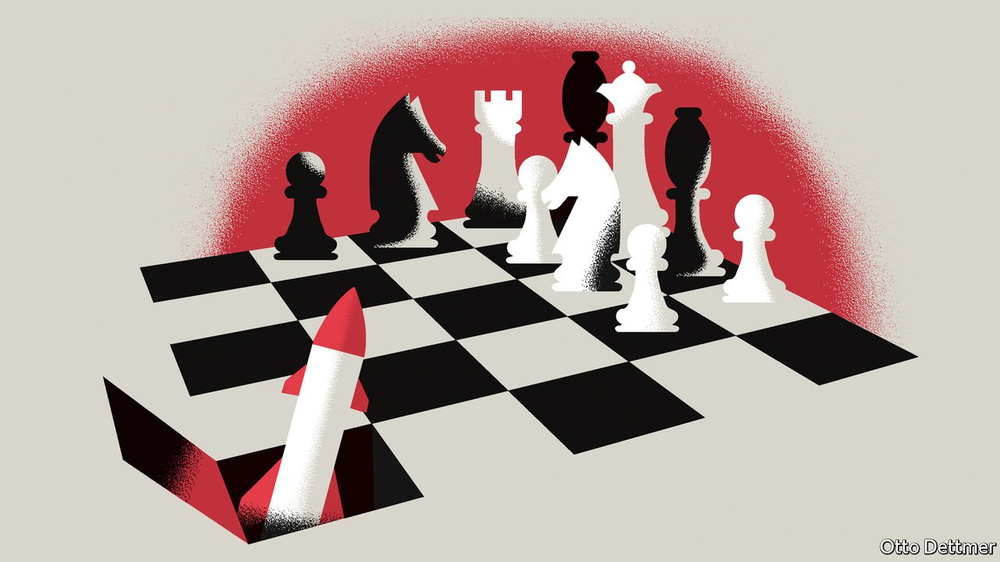

###### Free exchange

# The disturbing new relevance of theories of nuclear deterrence 

##### Lessons from the work of Thomas Schelling 

 

> Mar 19th 2022 

SIXTY YEARS ago, a dispute over the placement of Soviet missiles in Cuba pushed Washington and Moscow perilously close to all-out war. The crisis provided history’s most extreme example yet of nuclear brinkmanship, situations in which governments repeatedly escalate a very dangerous situation in an attempt to get their way. It also demonstrated the extraordinary value of the work of Thomas Schelling, an economist then at Harvard University, who used the relatively new tools of game theory to analyse the strategy of war. The war in Ukraine has made Schelling’s work, for which he shared the economics Nobel prize in 2005, more relevant than ever.

Game theory came into its own in the 1940s and 1950s, thanks to the efforts of scholars like John von Neumann and John Nash, who used mathematics to analyse the strategies available to participants in various sorts of formal interactions. Schelling used game theory as a prism through which to better understand war. He considered conflict as an outcome of a strategic showdown between rational decision-makers who weighed up the costs and benefits of their choices. If a would-be attacker expects to gain more from aggression than any cost his adversary can impose on him, then he is likely to go through with the aggressive act.


For a government hoping to deter an aggressor, the effectiveness of its deterrence strategy thus depends in part on the size of the retaliatory costs it can inflict on its attacker. But this is not an exact science. Both sides may have incomplete information about the relative costs they can expect to bear. When Vladimir Putin, Russia’s president, was preparing his invasion of Ukraine, for example, Western democracies threatened to impose stiff sanctions. Just how tough the sanctions could be was not necessarily knowable to either side beforehand, because the details needed to be negotiated with allies.

The credibility of retaliatory threats matters, as well; both sides of a potential conflict may issue grave threats, but if they ring hollow they may be ignored. The threat of stiff sanctions by Western democracies—clearly a powerful tool in hindsight—might well have been weakened by doubts that governments were prepared to expose their citizens to soaring oil and gas prices. Governments deploy a range of tools to bolster the credibility of their threats. An American promise to defend an ally may be strengthened by the placement of American troops within the ally’s borders, in harm’s way, for instance; an American president would presumably find it more difficult to back down in the face of an attack that claimed American lives. Schelling, for his part, noted that credibility can sometimes be enhanced by taking costly actions or limiting your own options. A general’s promise to fight to the bitter end if an enemy does not withdraw becomes more credible if he burns the bridges that provide his own avenue of retreat.

The problem of credibility becomes far more complicated in a showdown between nuclear-armed powers, which both have sufficient weaponry to retaliate against any first strike with a devastating attack of their own. If the first use of nuclear weapons is all but assured to bring ruin on one’s own country as well, then efforts to use the threat of nuclear attack to extract concessions are likelier to fail. Wars may nonetheless occur. The invasion of Ukraine could be seen as an example of the stability-instability paradox: because the threat of a nuclear war is too terrible to contemplate, smaller or proxy conflicts become “safer”, because rival superpowers feel confident that neither side will allow the fight to escalate too much. Some scholars reckon this helps to account for the many smaller wars that occurred during the cold war.

And yet the cold war also threatened to turn hot at times, as in 1962. Schelling helped explain why. He noted that the threat of a nuclear attack could be made credible, even in the context of mutually assured destruction, if some element of that threat was left to chance. As a showdown between nuclear powers becomes more intense, Schelling observed, the risk that unexpected and perhaps undesired developments cause the situation to spiral out of control rises. (When nuclear forces are on high alert, for instance, false alarms become far more dangerous.) The upper hand, in such a situation, is thus maintained by the side that is more willing to tolerate this heightened risk of all-out nuclear war.

This is the essence of brinkmanship. It is not merely a matter of ratcheting up the tension in the hope of outbluffing the other side. It is also a test of resolve—where resolve is defined as a willingness to bear the risk of a catastrophe. Mr Putin’s move to increase the readiness of his nuclear forces may represent an attempt to demonstrate such resolve (over and above the message sent by the invasion itself). President Joe Biden’s refusal to escalate in kind could be seen as an acknowledgment of the conspicuous fact that an autocrat embroiled in a pointless war has less to lose than the rich democracy to which Mr Biden is accountable.

The only winning move

It could be, however, that Mr Biden had something else in mind. In his Nobel lecture, Schelling wondered at the fact that nuclear weapons had not been used over the 60 years that had elapsed since the end of the second world war. While he chalked up the absence of nuclear use between superpowers to deterrence, he reckoned that in other wars and confrontations restraint was best understood as resulting from a taboo: a social convention that stayed belligerents’ hands when they might otherwise have deemed it strategically sensible to deploy nuclear weapons.

Russia’s aggression has shattered another taboo, against territorial aggrandisement through violence. And though the governments of the West feel compelled to respond to limit the damage that has caused, they are no doubt also keen to restore the old convention—to demonstrate that the world has moved beyond an age where the mighty take by force whatever they want. ■

Read more from Free Exchange, our column on economics: (Mar 12th)

 (Mar 5th)

 (Feb 26th)


Read more of our recent coverage of the 

