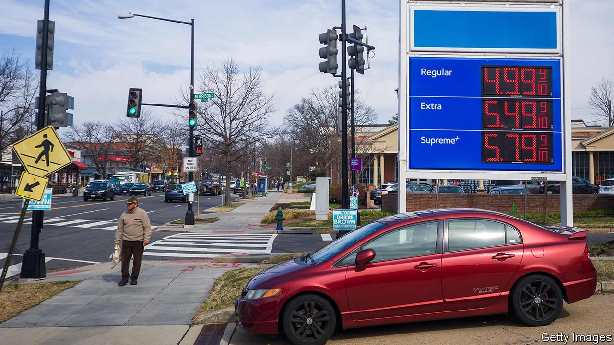
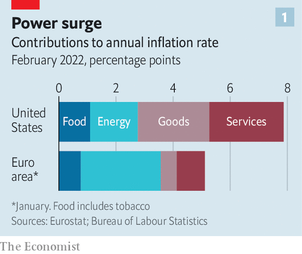
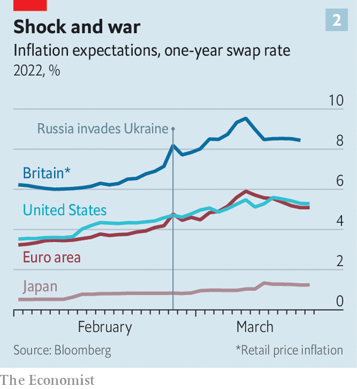

###### Everywhere, a Russian phenomenon

# The inflationary consequences of Russia’s war will spread 

##### Inflation, already high, will go higher still. What will central banks do? 

 

> Mar 19th 2022 

LAST SUMMER, amid mounting alarm about inflation in America, economic advisers in the White House penned a blog post in which they examined historical parallels. Although the press was full of comparisons with , they wrote that a nearer relative was the dislocation after the second world war, when supply shortages interacted with pent-up demand. It was a well-reasoned argument. But the surge in commodity prices over the past month, in the wake of Russia’s invasion of Ukraine, gives rise to an unsettling question: is the global economy now seeing a 1970s-style price shock on top of a late-1940s-style supply crunch?

To be sure, no serious economist expects inflation in the rich world to reach the giddy double-digit heights of those episodes. On March 16th the Federal Reserve raised interest rates for the first time since 2018, kicking off a tightening cycle that it expects to continue well into next year. Moreover, the retreat in oil markets in recent days could offer relief.


Nevertheless, surging prices for everything from wheat to nickel threaten to add to inflation. And rolling lockdowns in parts of China could exacerbate strains on global supply chains. Consumer-price inflation in America already stood at a 40-year high in February, at 7.9% year on year; the rate in the euro area, meanwhile, exceeded 5%.

 


Investors are still far from persuaded that central bankers are on top of the problem. The most striking evidence is the inflation expectations that can be found in fixed-income markets in America. ICE, a financial firm, distils a few different numbers, including yields on inflation-protected bonds and interest-rate swaps, into short-term and long-term indices for gauging expectations. In late January the expected rate of inflation over the next year was 3.5%. On March 15th it stood at 5.4%. Expectations in the euro area have seen similar, if slightly steeper, trends. The one-year inflation swap rate rose to 5.9% on March 8th (see chart 2).

 


Markets are inherently volatile, so deriving inflation predictions from bond yields should be taken with a pinch of salt. But the shift in prices is broadly in line with what economists are forecasting. Last week Bank of America raised its inflation forecasts for much of the world. In America it now expects inflation over 2022 as a whole to average 7%, up from its prior forecast of 6.3%. In the euro zone it sees an even bigger increase, with inflation averaging 6% this year, well above its previous forecast of 4.4%. The challenge is greater for Europe because of its , which supplies about 45% of its gas imports.

In an indication of just how pervasive the pressures are likely to be, economists are even ratcheting up their inflation forecasts for Japan, where deflation has long been the bigger threat. On March 8th S&amp;P, a rating agency, said that Japanese inflation would average 2% this year, more than double its previous prediction. So far forecasters expect a relatively modest increase in overall inflation in emerging markets. But rising food costs will be especially damaging for their poorest citizens.

Two related questions emerge from these forecasts. The first is whether the rise in commodity prices today will feed through into lofty inflation in the longer run. There is, in fact, reason for cautious optimism. A large body of research shows that the pass-through from higher oil prices into non-energy inflation is quite limited. For instance, Goldman Sachs, a bank, calculates that a 10% increase in crude-oil prices leads to a jump of nearly three-tenths of a percentage point in headline inflation in America, but to an increase of just about three-hundredths of a percentage point in core inflation (stripping out food and energy prices). That helps explain why market expectations of longer-term price trends remain more subdued: pricing for inflation five years from now is close to the Fed’s goal of keeping inflation to an average of 2%.

The follow-up is what central bankers choose to do about rising commodity prices. The received wisdom of the past few decades is that policymakers should avoid over-tightening in the face of oil shocks. Indeed, surging energy prices can act as a drag on consumption, which is a particular concern for Europe.

But with real interest rates deeply negative in both America and Europe, central banks still have a long way to go to rein in inflation, whatever happens to commodity prices. On March 10th the European Central Bank surprised markets by announcing that it would wind down its bond-buying more quickly. And according to the Fed’s projections, its quarter-point rate increase is likely to be the first of seven this year. Central banks are, for now, sticking to their pre-war plans. ■

For more expert analysis of the biggest stories in economics, business and markets, , our weekly newsletter.

Read more of our recent coverage of the 

