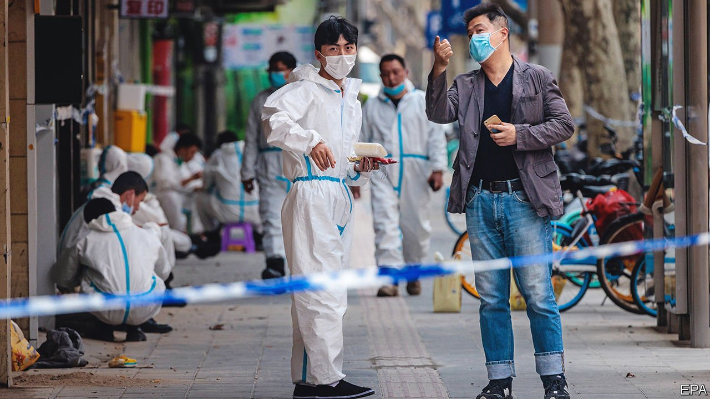

###### A deep ditch

# Will China’s covid lockdowns add to strains on supply chains? 

##### The government’s fight against the disease has extended to Shanghai and Shenzhen 

 

> Mar 19th 2022 

WHEN CHINA’S government said on March 5th that it would aim for economic growth of 5.5% this year, the target looked demanding. Now it looks almost fanciful. On March 14th China recorded 5,370 new cases of . That would be a negligible number in many countries. But in China it is an intolerable threat to its cherished zero-covid policy. The bulk of the cases are in the north-eastern province of Jilin, which has gone into a full lockdown. But lockdowns of varying severity have also been imposed in Shanghai and Shenzhen, two cities that account for more than 16% of China’s exports.

In Shanghai, anyone wanting to leave the city has to show a negative result on a nucleic-acid test taken in the previous 48 hours. Parks and entertainment venues have been closed. Entire blocks of flats are locked down if anyone living in them is suspected of exposure to the virus.


The restrictions in Shenzhen go further. People have been allowed to stock up on groceries, but must now hunker down for a week while they undergo three rounds of compulsory tests. Everyone must work from home or not at all, unless they help supply essential goods and services to the city, or to Hong Kong next door.

The lockdowns pose an obvious threat to the world’s supply chains. Shenzhen (the name of which can be translated loosely as “deep ditch”) accounts for almost 16% of China’s high-tech exports. Foxconn, which makes iPhones for Apple, has suspended operations at its plants in the area for at least the first half of the week, according to Reuters. Other links in the tech supply chain have also paused production. And the wholesale electronics markets in the Huaqiangbei neighbourhood, landmarks of “low-end globalisation”, bustle no more.

Shenzhen is also home to Yantian port, one of the world’s busiest. After a covid outbreak in May last year, it briefly had to operate at only 30% of its capacity. That contributed to long queues of ships out at sea and high towers of containers on the docks. This time “the shockwaves will be felt across America…and almost everywhere in the world,” warns Johannes Schlingmeier of Container XChange, a platform for leasing containers.

Still, China’s supply chain is some way from snapping. Foxconn, for example, has some room for manoeuvre. It has over 40 plants in China and does much of its iPhone production outside Shenzhen. March is also not a peak delivery season for many of the things Shenzhen makes, point out Helen Qiao of Bank of America and colleagues. And China’s manufacturers will go to great lengths to keep production running. In Shanghai, for example, a car-parts maker has asked essential workers to live and sleep on the factory premises when conditions allow, according to LatePost, a Chinese media outlet. Some factories in Shenzhen will be allowed to operate in this kind of bubble, too.

The more certain economic threat posed by the latest outbreak is to Chinese consumption. The country’s retail sales had recently shown signs of life: they rose by 4.9% (adjusted for inflation) in January and February, compared with the same two months a year earlier. But Nomura, a bank, thinks retail sales, in real terms, could shrink again in the months ahead.

The outbreak has also delayed any relaxation of China’s zero-covid policy. In recent weeks, there had been some signs of a softening. Prominent public-health experts had begun to talk about a path to coexistence with the virus. China Meheco, a state-owned firm, signed a deal to supply Pfizer’s Paxlovid pill, which helps protect infected people against serious disease. But the latest outbreak has been met with more hawkish rhetoric. On a visit to Jilin on March 13th Sun Chunlan, one of the country’s four deputy prime ministers, said China’s provinces should follow their zero-covid strategy without compromise.

That relentlessness may, however, require compromise on other goals. Morgan Stanley, a bank, has cut its forecast for China’s economic growth this year from 5.3% to 5.1%. It thinks GDP may not grow at all in the first quarter, compared with the previous three months. The economy may yet rebound later in the year. But if China is to come close to its growth target, it will first have to clamber out of its ditch. ■

Dig deeper

All our stories relating to the pandemic can be found on our . You can also find trackers showing ,  and the virus’s spread across .

