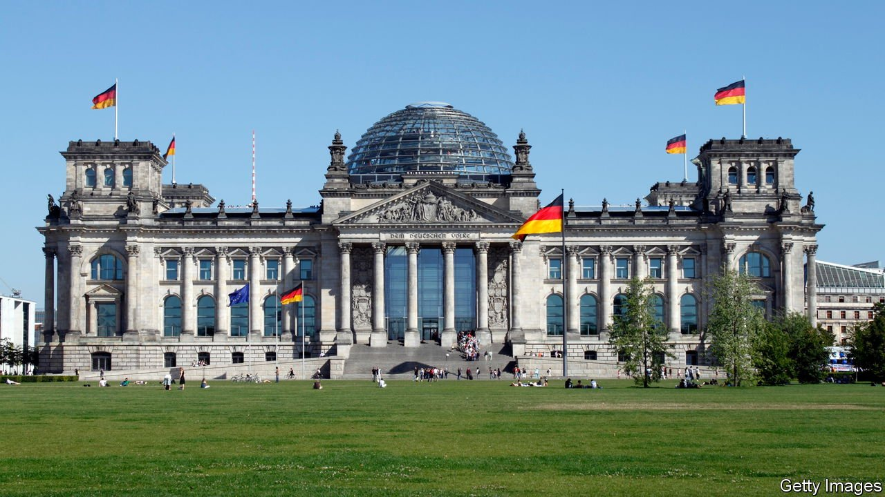
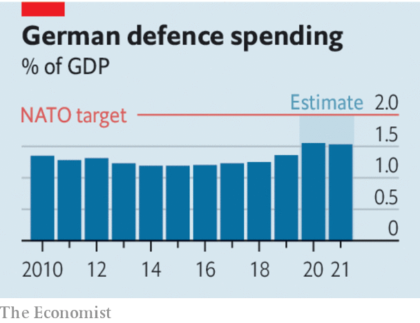

###### Pacifist no more

# A big defence budget shows Germany has woken up 

##### Olaf Scholz is serious about helping Europe face down Vladimir Putin 

 

> Mar 19th 2022 

GERMANY’S POST-WAR pacifism was once comforting to its neighbours and to Germans themselves. Yet, with the passing of the generations, attitudes have shifted. Sensible Europeans long ago stopped seeing Germany as a threat. On the contrary, the passivity of its foreign policy has in recent years posed more of a danger, by encouraging aggressors such as Vladimir Putin. At last Mr Putin’s unprovoked invasion of Ukraine has convinced Germans to take security seriously. As Olaf Scholz‘s first budget makes clear, Germany is preparing to pull its weight. The task for Germany’s new chancellor is to make sure that the effort is sustained, effective and encompasses risk-sharing as well as just cash-splurging.

The budget presented to Germany’s coalition cabinet on March 16th was accompanied by a proposed law creating a special defence fund worth €100bn ($110bn). This will be used to boost German defence spending from around 1.5% of GDP to at least 2%, the level that NATO members are supposed to meet but Germany has consistently missed. The cash should be enough to bridge the gap for the next four or five years if officials decide to spend it that quickly. It would have been better to increase the regular defence budget, rather than relying on a one-off top-up fund, so that the change would be harder to reverse. But still, Germany will for now become the world’s third-biggest military spender.


Just as significant was the decision, announced on February 26th, two days after the war began, to allow the export of German weapons to Ukraine. Previously, Germany had not only refused to send arms into war zones, but insisted on stopping third-country buyers of German kit from re-exporting it to such places, even to help the victims of aggression defend themselves.

 


 will achieve more if the money is used shrewdly. But its record is poor in this regard. Too much goes on fat pensions and plush offices, not enough on planes and submarines. On the day the war began, the head of the German army complained that his army had been left “more or less bare”. NATO is not directly engaged in Ukraine, and rightly so: if it were to shoot down Russian planes, the war might spill well beyond Ukraine. But the NATO countries that border Russia need to be defended, and this task should not fall so heavily on America. Europe must step up, and Germany should play its part with properly equipped combat forces.

Russia is the biggest threat to Europe and will be for years to come. But there are other security challenges. The Balkans may one day reignite. To Europe’s south is an arc of instability across the Sahel, in which Russian mercenaries now meddle. France and Britain have often sent troops to help stabilise trouble spots, with mixed success. They would appreciate more help. Given its size and wealth, Germany should play a leading role.

Mr Scholz’s transformation of German foreign policy goes beyond defence. The war in Ukraine has exposed the folly of the energy strategy he inherited from Angela Merkel and her predecessor, Gerhard Schröder, who disgracefully still sits on the board of Rosneft, Russia’s state oil giant. By scrapping nuclear power and smiling on east-west pipelines, they allowed Germany to become dependent on Russian hydrocarbons, and therefore on the goodwill of Mr Putin. Mr Scholz, with the support of his Green partners, is hugely increasing the share of renewables in Germany’s energy mix and diversifying its supplies of gas away from Russia, in part by building new terminals to handle liquefied natural gas from farther afield. The details, though, are still lacking. A supplementary budget is expected, and the transition will be judged on that.

A new, more assertive Germany is just what Europe needs to help it face down the menace in Moscow. It is a shame it took a war to wake Europe’s sleeping giant. But better late than never. ■

Our recent coverage of the Ukraine crisis can be found 

