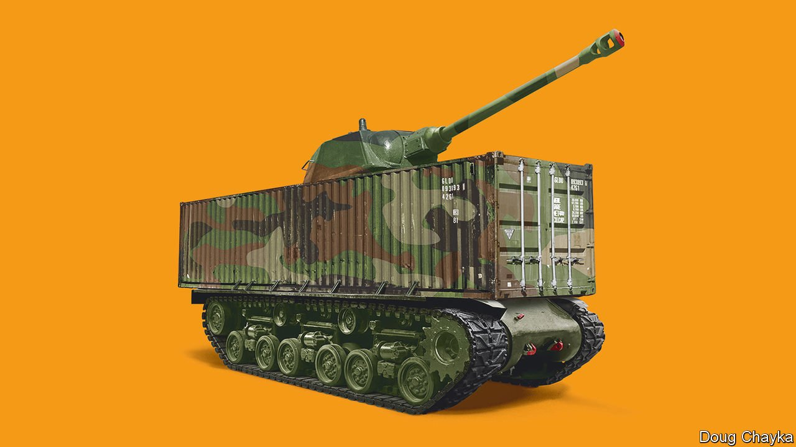

###### The world economy

# Confronting Russia shows the tension between free trade and freedom 

##### Liberal governments need to find a new path that combines openness and security 

 

> Mar 19th 2022 

THE INVASION of Ukraine is the third big blow to globalisation in a decade. First came President Donald Trump’s trade wars. Next was a pandemic in which cross-border flows of capital, goods and people almost stopped. Now armed conflict in Europe’s breadbasket, besieged Black Sea ports and sanctions on Russia have triggered a supply shock that is ripping through the world economy. Wheat prices have risen by 40%, Europeans may face gas shortages later this year, and there is a squeeze on nickel, used in batteries, including for electric cars. Around the world many firms and consumers are grappling with supply chains that have proved too fragile to depend on—yet again.

If you look beyond the chaos, Vladimir Putin’s warmongering also raises a question about  that is uncomfortable for free-traders such as The Economist. Is it prudent for open societies to conduct normal economic relations with autocratic ones, such as Russia and China, that abuse human rights, endanger security and grow more threatening the richer they get? In principle, the answer is simple: democracies should seek to maximise trade without compromising national security. In practice, that is a hard line to draw. Russia’s war shows that a surgical redesign of supply chains is needed to prevent autocratic countries from bullying liberal ones. What the world does not need is a dangerous lurch towards self-sufficiency.


For most of the past few decades, it has been clear how to trade with the enemy. In the cold war the West and the totalitarian Soviet bloc conducted trade in energy and grain but had a low overall level of interlinking. After the Berlin Wall fell, it was widely assumed that free trade and freedom would conquer the world together, reinforcing each other. And for a while they did. In the 1990s the share of countries with democratic rule rose as tariffs fell and more container ships crossed the oceans. Russians got their first taste of Big Macs and the ballot box within an 18-month spell. Bill Clinton welcomed China’s entry into the global trading system in 2000, predicting that it would have “a profound impact on human rights and political liberty” there.

But in the past decade and a half liberty has retreated, with the share of people living in democracies falling below 50%. In many autocratic places, including China and the Middle East, political reform appears unlikely. The result is a globalised economy in which autocracies account for 31% of GDP, or 14% excluding China. Unlike the USSR, these autocracies are economically intertwined with liberal societies. A third of democracies’ goods imports are from them, and a third of multinational investment in autocracies is from democracies. Open societies trade over $15bn a day with closed ones, buying Chinese-made PCs and Saudi oil, and selling Bulgari and Boeings.

Russia’s invasion has shown the West the perils of trading with adversaries. One concern is moral. All those deals for Urals crude and Black Sea wheat bankrolled Mr Putin’s repression and his rapidly increasing military spending. Another is security, with Europe addicted to Russian gas and many industries reliant on inputs including fertilisers and metals. Such dependency may make autocracies stronger, weaken democracies’ resolve and expose them to retaliation in a war. No country embodies this Faustian pact more than gas-dependent Germany.

This tension between the logic of free trade and support for political liberalism will create deeper fissures. Already the world has faced years of what The Economist has called slowbalisation, with trade and capital flows falling relative to GDP. Some autocracies may now seek to decouple further from the West. China views the collapse of Russia’s fortress economy in the face of Western sanctions as a botched experiment from which to learn before it considers going to war over Taiwan. Saudi Arabia is cosying up to China. The world’s autocracies have too little in common to form a cohesive economic bloc, but they are united in their desire to reduce the influence the West has over them, in areas from tech to .

The temptation in the West, meanwhile, is to pivot towards a more limited kind of trade with military allies, or even to outright self-reliance. Consider President Joe Biden’s recent state-of-the-union address which included a promise that “everything from the deck of an aircraft-carrier to the steel on highway guardrails is made in America from beginning to end. All of it.”

A retreat by the West to cold-war spheres of influence or self-reliance would be a mistake. The costs would be vast. Roughly $3trn of investment would be written off for less efficient production that fuels inflation and hurts living standards. It would be morally dubious: globalisation has helped over a billion people raise themselves from poverty, and trade and information links with the middle classes in autocracies sustain the cause of liberalism. It would not even boost democracies’ security. Supply chains get stronger through diversification, not concentration. And by walling themselves off, rich democracies would alienate countries that do not want to pick sides between the West, Russia and China—countries that account for a fifth of world GDP and two-thirds of its people.

How then should globalisation be reconfigured? In war, severing economic relations makes sense. In peace the goal should be to limit exports of only the most sensitive technologies to illiberal regimes. When autocracies have the power to intimidate, as Russia has with gas, the aim should not be national self-sufficiency, but rather to require firms to diversify their suppliers, in turn stimulating investment in new sources of supply from energy to electronics. These choke-points make up about a tenth of global trade, based on the export earnings of authoritarian powers from goods where they have a leading market share of over 10% and where it is hard to find substitutes.

Interdependence day

Mr Putin has given a harsh lesson that in these areas democracies must change their posture. The war is a tragedy, but it is also a moment of clarity. The vision of the 1990s, that free trade and freedom would go hand in hand, has fractured. Liberal governments need to find a new path that combines openness and security, and prevents the dream of globalisation turning sour. ■

Read more of our recent coverage of the 

