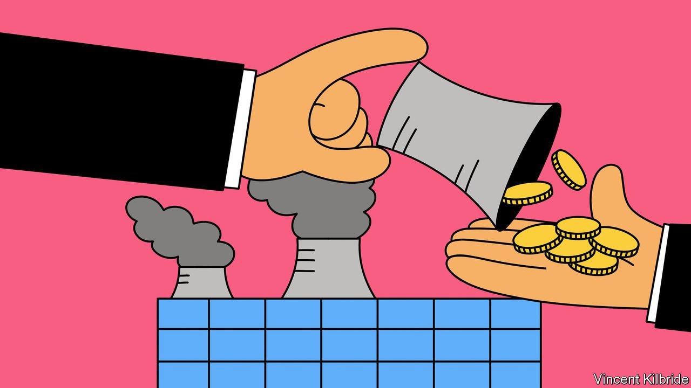

###### Tilting at windfalls

# Windfall taxes on energy companies are a bad idea 

##### Governments should not seize the energy industry’s profits 

 

> Mar 19th 2022 

WHENEVER OIL and gas are expensive, politicians’ eyes turn greedily to the profits of energy firms. Since energy prices began to surge last year Bulgaria, Italy, Romania and Spain have introduced new taxes on the industry. On March 8th the European Commission recommended that governments try to “capture a part of the returns” made by electricity generators. And in America 12 Democratic senators including Elizabeth Warren, a one-time presidential candidate, have proposed a tax on every barrel of oil big firms produce or import, equal to half the difference between the current oil price and the 2015-19 average.

The impulse to levy “” is particularly strong today because Russia’s invasion of Ukraine has caused oil and natural-gas prices to rocket and then to gyrate wildly, giving the perception that firms are profiting from bloodshed. Governments, having run up enormous debts during the pandemic, must now find more cash to protect poor consumers from soaring energy bills and to boost defence spending. And the typical argument against windfall taxes—that even when they are retroactive, they risk deterring future investment—has become less powerful now that most of the world is trying to phase out the burning of fossil fuels.


Imposing windfall taxes is nevertheless a mistake. Start with the fact that energy markets go through cycles of boom and bust. The years Ms Warren has chosen as a benchmark were not good ones: in two of them, 2015 and 2016, the net operating margin of the global listed energy industry was negative. There was an other year of operating losses in 2020, during which the oil price briefly fell below zero owing to the pandemic. If companies must endure the bad times but find chunks of their profits are seized when prices rise, their businesses lose viability.

That may sound appealing to those climate activists who want to drive out of business firms like BP, whose boss recently said that high prices had turned the firm into a “cash machine”. But today’s energy crisis shows that the world needs a carefully managed phase-out of carbon emissions, not a sudden halt in fossil-fuel investment, especially if Europe is to wean itself off Russian gas. Renewable energy cannot immediately replace gas for some tasks, such as heating homes with gas boilers. Even if the infrastructure to run entire economies on electricity were in place, battery storage remains unable to plug gaps when the wind does not blow and the sun does not shine. Nuclear power plants provide a constant supply but take years to build.

The European Commission says that renewable producers, which are also benefiting from high prices, should pay up too. This is doubly misguided. If even clean-energy companies have their profits seized during periods of shortages then the incentive to solve renewables’ intermittency problem, for example by making batteries better or by storing energy as hydrogen, will be blunted. And it is not just power shortages that need to be plugged as economies move to net zero. The private sector will need to find ways around shortages of everything from the minerals used in electric cars to the balsa wood used in wind turbines. It is a fantasy to think that the vast investments that are necessary will happen if the most innovative firms worry that their profits could be seized when their bets pay off.

The thorniest argument is that companies are benefiting from war. Windfall taxes live up to their name when firms have profited not from wise decisions, but from unforeseeable events that are unrelated to their investment choices. Yet geopolitics is a top concern of big energy firms, which must lay pipelines that cross borders and anticipate global energy needs far in advance. There is nothing unusual about a conflict affecting their profits, and the risks posed to Europe from Russian gas have been obvious for years. Hiving off the rewards that are on offer for supplying energy during today’s shortage will only make the next supply crunch—even a predictable one—all the worse. ■

For more coverage of climate change, register for , our fortnightly newsletter, or visit our 

