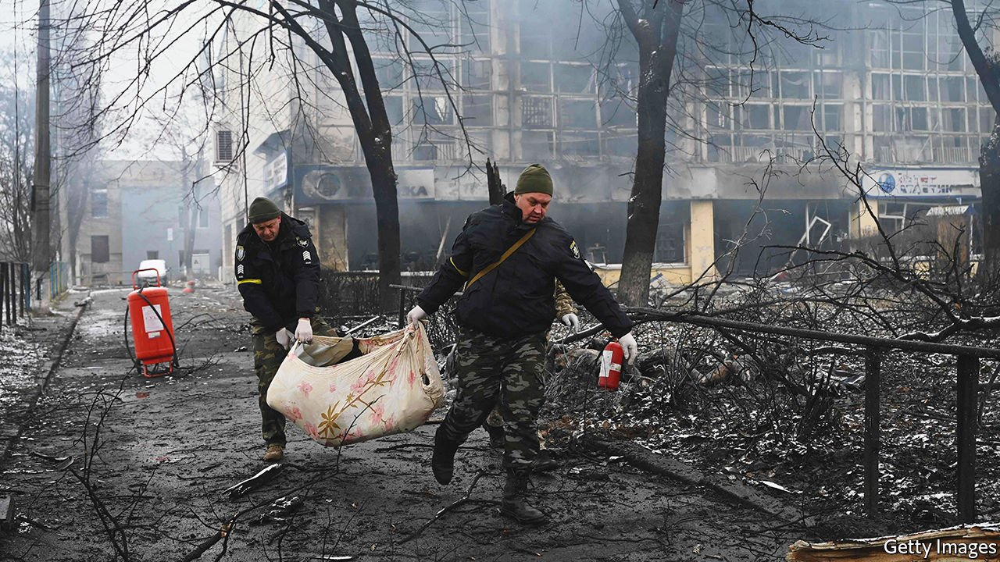
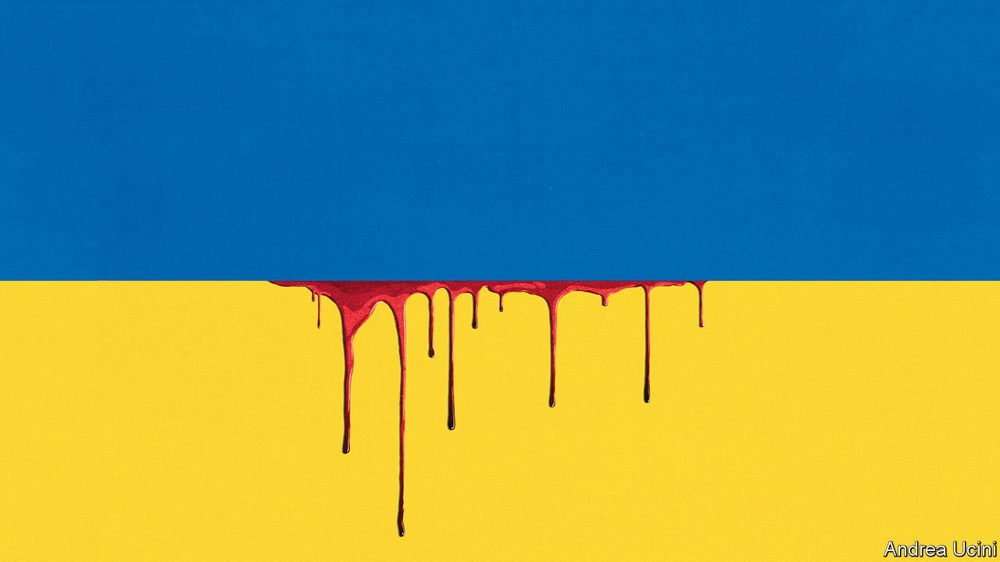
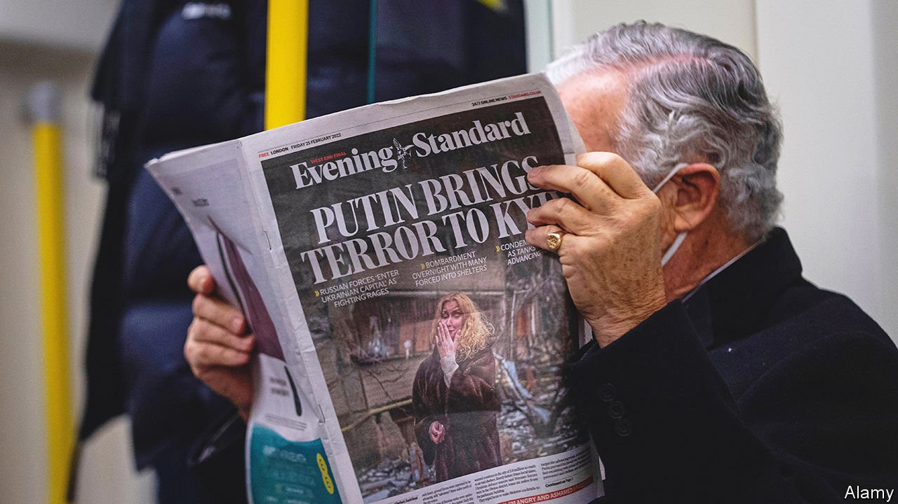
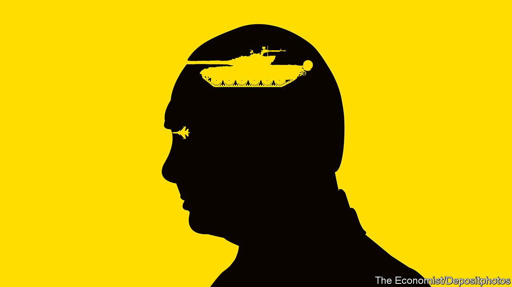
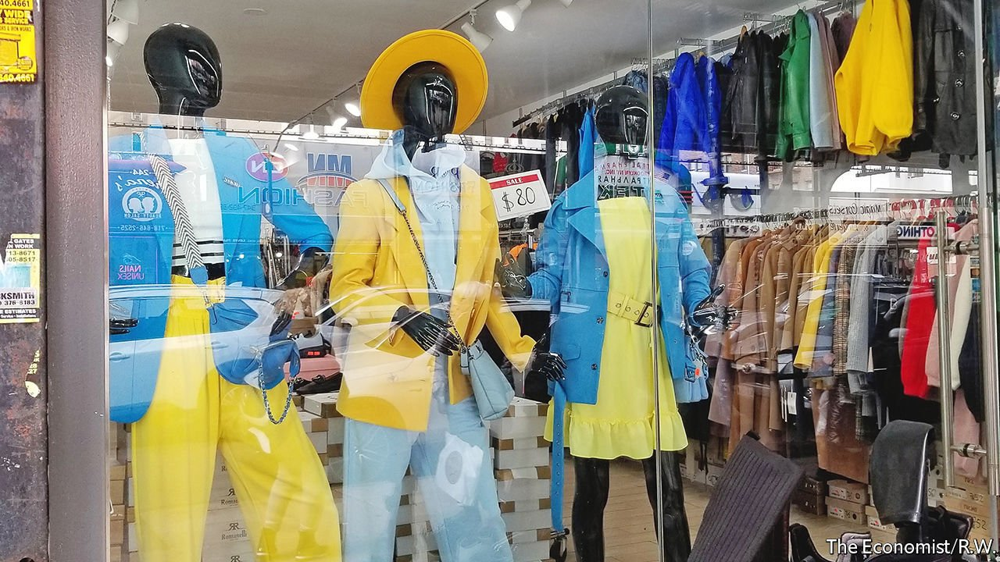
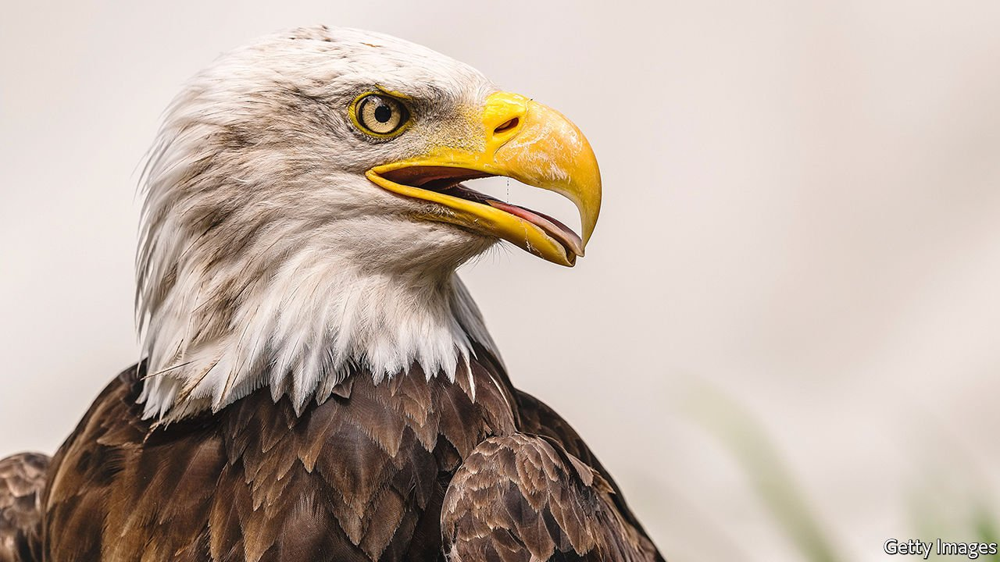
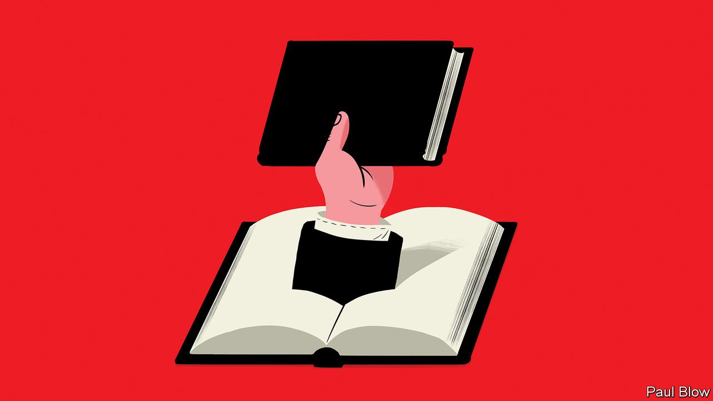

###### On the war in Ukraine, bald eagles, leadership

# Letters to the editor 

##### A selection of correspondence 

 

> Mar 19th 2022 


Views on the war

I want to thank The Economist for making a clear distinction between Vladimir Putin’s regime and common Russians (“”, March 5th). Many Russians don’t believe that the government is capable of saving the economy when they see queues growing at cash machines. Thousands of Russians have been buying drugs and other medication to cope with the stress. I know five people who have started using anti depressants. Thousands more leave the country every day.


For others, accepting the war as a “special military operation” is a coping mechanism. Many Russians are confused and shocked. Some accept the truth, others hide behind government propaganda. “Ukrainians deserved it”, “We had no choice”; these words are used by some to accept events they have no control over. No one supports this war wholeheartedly, except for the siloviks (strongmen).

It is painful to see Ukrainians, not Russians, fighting for Russia’s future. One day that should change, hopefully sooner rather than later.

EGOR (LAST NAME WITHHELD)

St Petersburg

 


By removing Mr Putin “Russia will get a fresh start” (“”, March 5th). This would clearly be the best scen ario. The increased repression in Russia is a sign that his support is weakening. Therefore it is time to give Russia a hope for normality without Mr Putin by offering a path to membership in the European Union and NATO. A Russia that is truly free, democratic and prosperous would make Russia, Europe and the rest of the world a safer and better place.

With a normal Russia there would be no war in Ukraine. There would be no dictator in Belarus. There would be no conflict in Georgia. Other neighbouring countries (the “stans”) and farther apart (Syria) would also gain a path to democracy and prosperity. It could also prevent a much larger confrontation in the strait of Taiwan.

Besides all the sticks of sanctions and delivering weapons to Ukraine we should do all we can to encourage a palace coup, rid the Kremlin of its leadership and provide a route to prosperity for all Russians. We need to bring an end to Russian aggression. The time is now.

JORGE RIBEIRO

Mechelen, Belgium

 


One can only suspect that the Church of England has a tick-off sheet of increasingly evil acts (“”, March 5th) and that Russian state poisoning on foreign soil, shooting down a civilian airliner, annexing part of a country (Crimea), invading another (Georgia), and arresting and torturing protesters are not quite evil enough to disinvest.

The question is at what point will the church decide to disinvest in China, or any of the other despotic dictatorships lacking human rights. After all this is not any ordinary investor, it is a religiously inspired one, supposedly driven by human kindness.

JEREMY WELTMAN

Northwich, Cheshire

 


“” (February 26th) portrayed the Russia-Ukraine crisis as totally unprovoked. An alternative question could be “Where will NATO stop?” After the Warsaw Treaty Organisation (Warsaw Pact) was dissolved in 1991, NATO, an American-led military organisation, expanded eastward four times, inching closer and closer to Russia’s border.

In 1999 NATO invited the Czech Republic, Hungary and Poland to join, which they did two months later. In 2004 the Baltic states, Romania and three other eastern European countries joined NATO. At a summit in 2008 NATO invited Albania and Croatia to start accession procedures; the two countries joined in 2009. At the same meeting NATO welcomed the aspirations of Ukraine and Georgia to join. At its invitation, Montenegro and North Macedonia joined in 2017 and 2020, over Russia’s strong expression of security reservations.

To further stoke Russian insecurity, in June 2021 a British destroyer, HMS Defender, conducted a freedom of navigation patrol in disputed Crimean waters, apparently in a calculated move to show support for Ukraine. The display of force was followed in October by a pair of American strategic bombers flying over the Black Sea. They had to be escorted away from the Russian border by Russian jets.

Is it really fair to say that the Russia-Ukraine conflict was totally unprovoked, and NATO played no part in fuelling Russian aggression?

REGINA IP

Member of the Legislative Council

Hong Kong

Pepsi was not the “first Western product made and sold behind the Iron Curtain” in 1974 (“”, March 5th). In 1965 Coca-Cola was bottled and sold in Bulgaria in co-operation with Texim, a Bulgarian conglomerate founded by my grandfather, Georgi Naydenov, that worked under market principles in 1960s communist Bulgaria.

Texim thrived using the market as its model, becoming superior to companies working under the planned economy. Unfortunately, it became too successful, leading to the jailing and repression of the innocent people involved and the eventual destruction of the company itself. A valuable lesson akin to Russia’s aggression in Ukraine. And Coca-Cola beat Pepsi.

GEORGI DANTCHEV-NAYDENOV

Executive director

Texim Holding

Sofia

 


You wrote about New York’s population of Ukrainian descent (“”, March 5th). Actually, Canada is home to 1.4m people of Ukrainian heritage, the largest number outside Ukraine and Russia. Canadians have contributed generously to humanitarian relief in the war. Canada will also benefit from sanctions on the Russian economy. We are reliable alternative suppliers for many Russian exports, such as aluminium, nickel, wheat, potash, petroleum, cobalt, liquid cooking oils and wood products.

We even produce vodka, including popular brands such as Stolichnaya, Smirnoff and Absolut. Mixologists of the world need not fear.

PETER BURSZTYN

Barrie, Canada

 


What it means to be bald

The bald eagle “is not bald” you say, “its head is covered with white feathers” (“”, March 5th). One old, less-used alternative meaning of “bald” is “marked with white”, which “the symbol of America” most certainly is. This old meaning is still seen in connection with horses, mountains, and yes, eagles.

HENRY SPENCER

Toronto

 


Management advice

guide for wannabe leadership gurus (February 19th) reminded me of my early days as a company leader. I apologise unreservedly for the group hugs, customary high fives and chants of inspirational quotes. In my defence that was over 30 years ago. Things have changed since then, haven’t they?

A quick search on the web for “leadership in 30 minutes” or “leadership from the comfort of your loo” provides some excellent advice. Once leadership has been mastered there is also team-building, but I have no time to comment on that, as I need to finish writing “Raft-building For Resilience” and “Spaghetti Towers To Success”.

NICK FEWINGS

Bournemouth, Dorset

