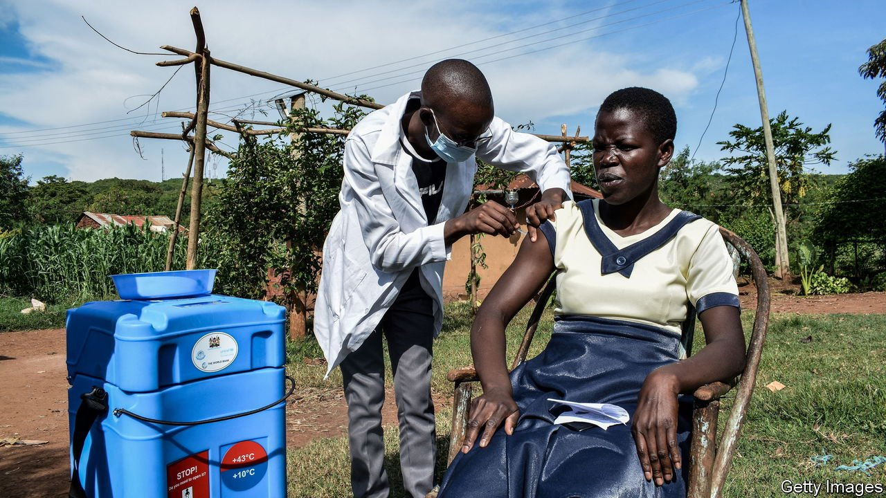
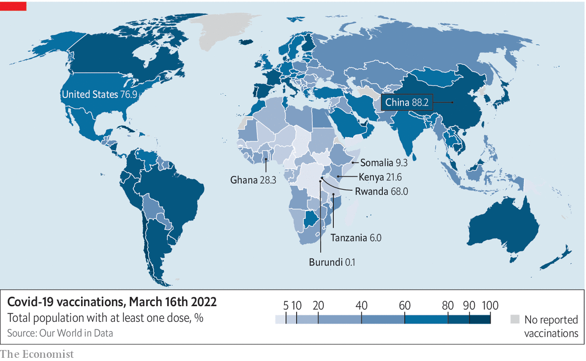

###### Behind by a country vial

# Africa has plenty of covid doses, but it lags in jabs 

##### Blame distribution problems and a lack of zeal 

 

> Mar 17th 2022 

IT IS LITTLE over a year since the first doses of life-saving vaccines were delivered to Africa under the Covid-19 vaccines Global Access Facility (COVAX), a scheme aimed at helping poorer countries get inoculated. Yet what should have been a celebration of the region’s fastest-ever vaccine rollout—with 400m doses jabbed into waiting arms—was instead marred by disappointment at how much more could have been achieved.

As of March 15th, no less than 57% of world’s population has been fully vaccinated against covid. Yet in Africa that share falls to 13%, according to Africa CDC, the continent’s main public-health body. A year ago many African countries rightly complained that they had been pushed to the back of the queue as richer countries bought up most of the world’s vaccines and producing countries banned exports.


Now supplies are no longer a constraint. In January COVAX had 436m doses to allocate, but received requests for just 100m doses, the first time that supply has outstripped demand. It has also stepped up its deliveries. According to the World Health Organisation (WHO), the number of doses shipped every month to Africa doubled between November and January.

 


Instead of complaining about not getting vaccines, some countries are now protesting that they are being drowned in a deluge of the stuff and are unable to use it all. Last month Africa CDC appealed to donors to stagger the supply of their shots. “We have not asked them to pause the donations, but to co-ordinate with us so that the new donations arrive in a way so that countries can use them,” said John Nkengasong, the director of Africa CDC.

Increased deliveries are exposing logistical defects in distribution within countries, while weak health-care systems have been unable to jab doses into arms as fast as they get them. Across Africa as a whole just 62% of delivered vaccines have been administered and 29 countries have used less than half of their supplies, says the WHO. Among the worst laggards are the Democratic Republic of Congo, which has used 15% of its consignments and jabbed less than 2% of its eligible population, and Burundi, which has used less than 2%.

Also hidden in the averages are big gaps in vaccination rates between cities and the countryside. Although continent-wide data are not available, Githinji Gitahi, the chief executive officer of Amref Health Africa, an NGO, says this trend is clear across many countries, including Ghana, Kenya, Rwanda and Tanzania. In Kenya 51% of adults in Nairobi, the capital, had been fully vaccinated by March 16th. But in Mandera county, a poor semi-arid region next to the border with Somalia, only 10% had been fully jabbed.

Part of the reason is logistical. Freezers for storing vaccines are in short supply. But this should be surmountable. Take Uganda. By November just 14% of its eligible population had received their first dose. But in a push supported by donors including the American government, it bumped that rate up to 47% in just six weeks. In Ivory Coast, where many people were nervous about the jab, the government bumped up the vaccination rate from 22% to 36% in the month of December by running radio campaigns to allay people’s fears. These speedy successes suggest that in many places the biggest shortage is not of freezers or nurses, but of zeal on the part of the authorities to go out and get injecting. ■

Dig deeper

All our stories relating to the pandemic can be found on our . You can also find trackers showing ,  and the virus’s spread across .

