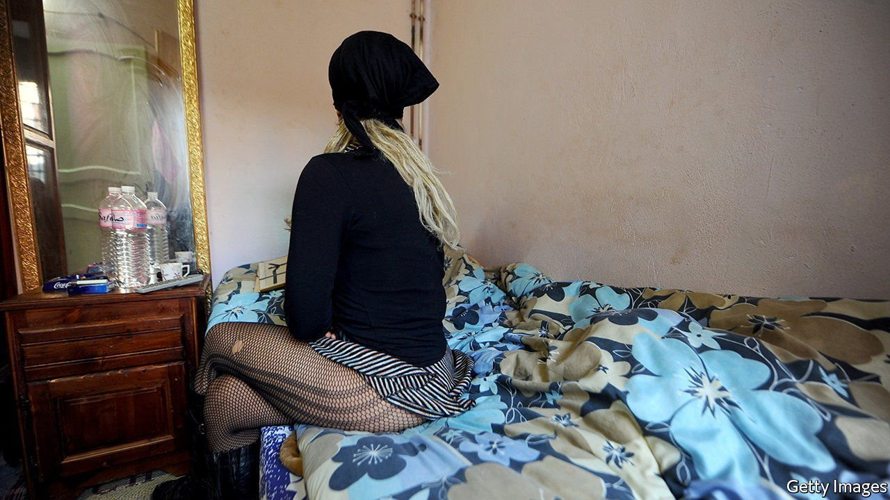

###### Game over

# Tunisia bans sex work, endangering sex workers 

##### The end of licensed prostitution drives the trade underground 

 

> Mar 17th 2022 

STATE-LICENSED prostitution in Tunisia dates back at least as far as the Ottoman conquest nearly half a millennium ago—and has persisted to the present day. In 2011 at least 300 sex workers were operating legally under the government’s auspices. Almost every big city had a licensed brothel, regulated by the interior ministry’s bureau of morals. Prostitutes could be registered as fonctionnaires—civil servants. The system, however, is being phased out—much to the detriment of the prostitutes.

The first setback was the overthrow of the authoritarian but largely secular government in 2011, since it empowered Islamists with puritanical attitudes. Most brothels were forced to close. Only two well-known ones are thought to have survived the Islamist purge: one in the city of Sfax, the other in Sidi Abdallah Guech, the red-light district of Tunis, the capital.


The sex business was buffeted even more fiercely in 2020 when a wholesale lockdown in the face of covid-19 meant that the remaining brothels had to close. Women who worked in them were forced to ply their trade illicitly, in public parks and hotels. They often became prey to exploitation, extortion and violence at the hands of police, pimps and criminals.

“There were reasons why we preferred working with the government,” says a prostitute from Sfax. Even if the pay was less generous in a licensed brothel, where the going rate was 10.5 Tunisian dinars ($3.60) per client, it was preferable to the 30 dinars you might make on your own, because it was safer. “At least in the brothel I had police protection. They could control the clients and make sure they used condoms,” she says.

With state oversight unclear, many Tunisian prostitutes now rely on voluntary associations to safeguard their health and welfare. “Rapes and attacks against women have risen since the brothels closed,” says Bouthayna Aoussaoui, who runs an organisation that helps the women. In 2018 a survey found that around 6% of Tunisia’s sex workers had HIV. By last year, after the brothels had closed, the figure had risen to 11%, she says. The puritans, predictably enough, had merely made matters worse.

