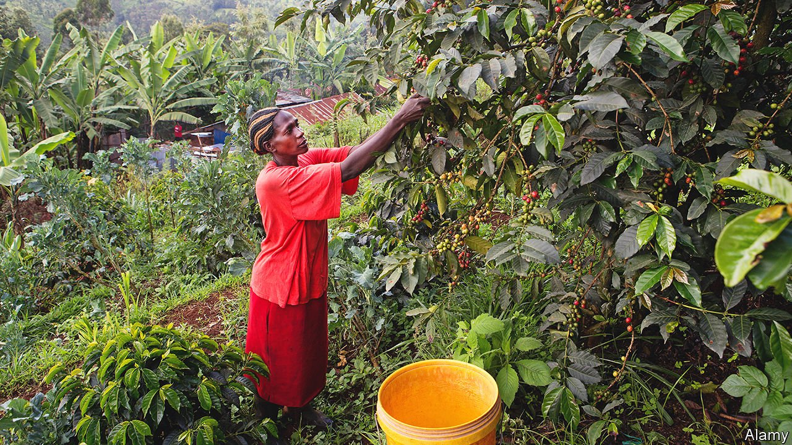
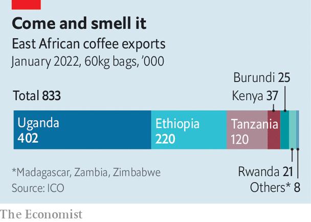

###### Hot coffee

# Why global warming threatens east African coffee 

##### Other cash crops including tea will also be affected 

 

> Mar 17th 2022 

JEREMIAH LETTING learned about coffee from his father. As a child in the late 1980s, he worked on his family’s one-acre (0.4 hectare) coffee farm in the hills of Nandi county, western Kenya. The cycle ran like clockwork: cultivate, plant, ripen, harvest and sell. “Every year was the same,” he says. “It was timely.”

No longer. As the chairman of a co-operative, he now represents 303 smallholder coffee farmers who are suffering from droughts, unpredictable rains and rising temperatures that bring pests and disease. Warming weather in east Africa, the birthplace of coffee, is already beginning to harm one of the region’s most important export crops, which is worth some $2bn a year (see chart). Overheating coffee shrubs also foreshadow the harm that may befall other vital crops such as tea, Kenya’s biggest export. And if coffee becomes more expensive or less tasty, it is not just farmers who will suffer, but the big chunk of humanity who together glug down some 3bn cups of the stuff a day, at a cost of about $200bn a year.


 


Some of the world’s best Coffea arabica is grown on the fertile slopes of Mount Kenya. This variety of the plant, which originated in the highlands of Ethiopia and Sudan, produces beans that are tastier (and more valuable) than those from its poor cousin, Coffea canephora (known as robusta), which often ends up in instant coffee granules. Arabica is also more finicky.

Global warming may shrink the total area that is most suited to growing arabica beans by about half by 2050, according to a recent peer-reviewed paper. Rising temperatures may make some new places suitable for cultivating coffee, because they will raise the maximum altitude at which the crop can be grown, but such spots are relatively small and generally given over to other crops already. Overall “trends are mainly negative,” says Roman Grüter, one of the authors of the paper.

Arabica plants, which account for roughly 60% of worldwide coffee production and more than 98% of Kenya’s, thrive at altitudes of 1,000-2,000 metres in equatorial regions and at temperatures between 18°C and 21°C. Over the past 60 years average temperatures in some of Kenya’s coffee regions have already risen by 1.1°C, reaching daytime highs of 25°C, says Patricia Nying’uro, a climate scientist at Kenya’s Meteorological Department.

Rosabella Langat, who owns a six-hectare estate with 15,000 coffee bushes in Nandi, woke one morning last year to find that the entire harvest of her most sought-after variety had turned from ripe red to deathly black from a fungus that festers in high humidity and warm temperatures. “It eats into our profitability,” she says. “We don’t get money to put back into that crop.”

Coughing it up

Although coffee is only Kenya’s fourth-largest export, it provides a lifeline in the countryside. The industry directly or indirectly provides an income for about 6m people, according to data from the Kenyan government. That is more than a tenth of the population of 54m. Smallholder farmers grow 65% of Kenya’s coffee on tiny plots averaging just 0.16 hectares.

Many barely scrape by as it is. Mr Letting has about 500 coffee plants on his plot. Last year their beans fetched 174,000 Kenyan shillings ($1,500). “That was a good price,” he says, laughing. “It was an improvement from the other years.” Mr Letting supplements his income by working as an accountant. Most of the farmers in his co-operative cannot to do so because they never went to school. “People are not able to raise enough school fees,” he says. “People are not even able to have three meals a day. Sometimes two.”

Some farmers are trying to adapt to warming by moving uphill. Yet this pushes them into areas long used for growing tea. Not only is there less space higher up; the move highlights how warming also threatens to harm the tea crop, which brings in export earnings of about $1.2bn a year, and supports about 10% of Kenya’s population. Warmer weather will push tea itself higher up narrowing slopes.

Kenya’s government-funded Coffee Research Institute is trying to find other ways of helping farmers adapt, such as encouraging them to plant trees to shade their coffee bushes, or to switch to growing hardier robusta plants. It is also trying to breed a hybrid, Arabusta, which would combine the hardiness of robusta with the flavour of arabica. Coffee snobs may turn up their noses at it, but they may have little choice but to swallow it. “What else is left?” asks Efrem Fesaha, the owner of Boon Boona Coffee, an American roaster specialising in African beans. “If arabica is going to be gone, it’s going to be gone.”

In addition to a bitter taste, such adaptation may bring social costs. Many smallholder farmers are at risk of being pushed out of the industry altogether because they cannot afford the investments needed to protect their crops. This may lead to the concentration of production in bigger firms, which can adapt.

Sasini, one of Kenya’s largest publicly listed agricultural businesses, is also one of its biggest coffee-growers. The firm has installed drip-and-sprinkler irrigation on its coffee estates and is reviewing plans to move into new coffee-growing regions, including neighbouring countries. “It is very possible for us to expand our coffee business in a new area where we can start from scratch,” says Martin Ochieng, Sasini’s group managing director.

Another option may be entirely new varieties. Researchers at the Royal Botanic Gardens in Kew, in London, are investigating a wild type of coffee, Coffea stenophylla, first recorded by a Scottish botanist in 1834. It is delicious and can also take the heat. But it produces lower yields than existing commercial varieties and it may be years before it is widely grown. Without a breakthrough of some sort, caffeine addicts may face a future too ghastly to contemplate, warns Vern Long of World Coffee Research, an industry-funded body. “If we don’t have the innovation to respond to climate challenges,” she says, “we’re just going to be drinking synthetic coffee.” ■

For more coverage of climate change, register for , our fortnightly newsletter, or visit our 

