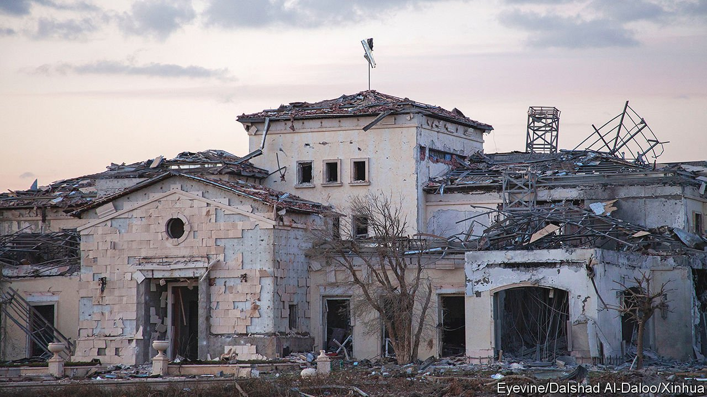

###### Message by missile

# With America distracted, Iran hits Iraq’s Kurds 

##### Iran fires 12 missiles at the safest and most pro-Western bit of Iraq 

 

> Mar 19th 2022 

ERBIL, THE capital of Iraq’s autonomous Kurdish region, has long been the country’s safest haven—and its friendliest to the West. But just after midnight on March 13th Iran hammered the city with 12 cruise missiles. The Islamic Revolutionary Guard Corps, Iran’s most punchy force, claimed responsibility. No one was reported to have been killed, but several buildings (pictured) were clobbered. Iraq’s government in Baghdad was shaken. The Kurds’ Western friends were shocked.

Iran’s generals say the target was a “strategic centre” of Israel’s spy agency, Mossad. Iraq’s Kurds have long had discreet links to Israel. In his younger days, Masoud Barzani, the ruling Kurdish family’s patriarch, once guided Jews escaping from Saddam Hussein’s clutches through Kurdistan’s mountain passes. More worrying for Iran, Kurdistan’s high ridges nowadays offer Israel listening posts into Iran. The ayatollahs say the region is a launchpad for covert Israeli operations. Today’s Kurds sell a lot of their oil to Israel and recently hosted a gathering where Iraq was urged to follow the example of other Arab states by normalising ties to the Jewish one.


In any event, an Israeli-Iranian ding-dong has long persisted. Last month Israel’s air force raided an Iranian base near the city of Kermanshah, destroying much of Iran’s drone fleet. Iran also blamed Israel for killing two senior Revolutionary Guards in a raid on Syria on March 7th.

Iran’s missile riposte sent a message to the Western-leaning Barzani dynasty. Some of the missiles hit a farm belonging to Baz Karim Barzinji, the region’s most prominent businessman, whose oil operations provide much of Kurdistan’s revenue. Another hit a television station owned by the Barzanis. Since Iraq’s election in October, the ruling Kurdish clan has infuriated Iran by working to exclude Iran’s political allies and their militias from government for the first time since Saddam Hussein was overthrown in 2003. The Kurds have set up a Sunni bloc with Sunni Arabs as a counter to Iran’s hitherto dominant Shia protégés. They have particularly annoyed Iran by allying with Muqtada al-Sadr, a gruff anti-Iranian Shia cleric who emerged as the front-runner after the election. One of his cousins has been tipped to become the next prime minister.

Iran’s men in Baghdad have bitten back. Last month Iraq’s Supreme Court, whose judges are close to Iran, ruled that it is illegal for Kurdistan to export its oil independently of the government in Baghdad. “Iraq is a core Iranian asset. Iran is not going to let the Barzanis prise it away,” says an Iraqi oil analyst.

The missiles had another purpose. Just as Western hopes of reviving the nuclear deal with Iran were waning, the ayatollahs were sending a signal to America: ignore us at your peril. In other times, America might have reacted forcefully. After all, the missiles nearly hit an American building on the edge of Erbil. Iran may reckon that, with Joe Biden’s administration distracted elsewhere, it has a chance to tighten its grip on Iraq. The Barzanis may yet fall back into line with Iran. The message from Iran’s rulers “is that Iraq is theirs”, says Hiwa Osman, a Kurdish analyst. “And neither America nor Israel can protect you.”

