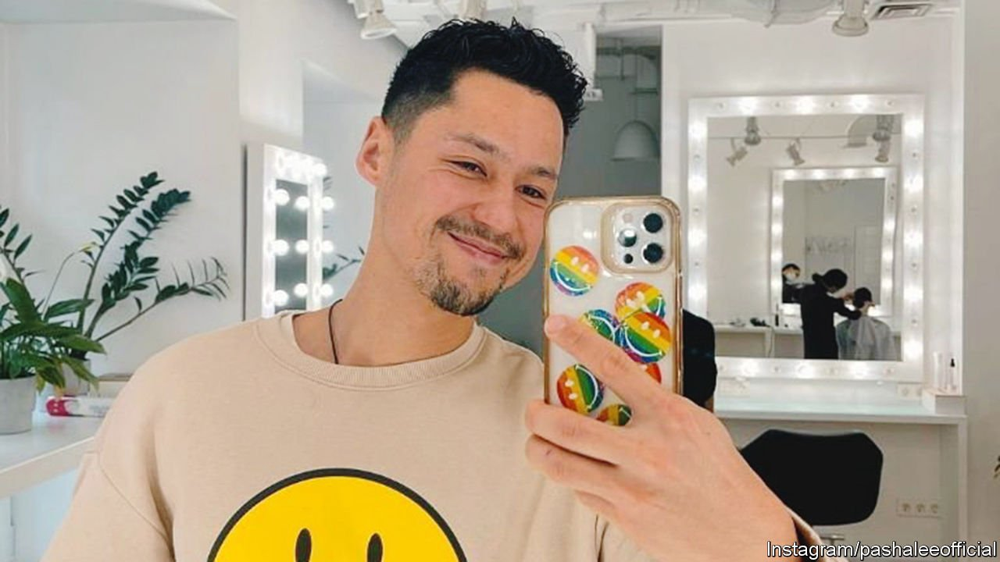

###### The star in a bulletproof vest

# Pasha Lee went from Ukrainian screen idol to volunteer 

##### He was killed near the bridge at Irpin on March 6th, aged 33 

 

> Mar 19th 2022 

ON THE VERY day that Russia invaded, February 24th, Pasha Lee left his job and went to enlist with the Territorial Defence Forces of Ukraine. He might well have been recognised as he signed up and took the oath to defend the motherland, because his face was famous. It was bright and handsome, with a quiff of well-gelled black hair and a delicate line of beard, and with an oriental cast from his half-Korean father.

His looks had turned him into a boy idol of a sort, and his Instagram page showed him living the dream: buffing his smooth, hard pecs at the gym, sipping coffee in bed in a luxury hotel, posing in sexy shades against backgrounds of soaring skyscrapers or foaming water, adjusting the cuffs of beautiful jackets. Even in more everyday gear, like his smiley-face sweatshirt, he was clearly in love with his phone and himself.


The job he had walked away from was as a presenter on the Dom (“Home”) TV channel—specifically, presenter of a popular new show called “Day at Home”, and glitzier bits of programming such as “Star Factory” and “X-Factor”. But through the neon and glitter there was also politics here. Dom had been set up in 2020 to broadcast in both Russian and Ukrainian to Russian-occupied Donetsk and Luhansk in the east, as well as to Crimea. “Do you want to know the truth?” shouted billboards and phones all over the country when they had their big audience drive; “Watch Dom TV.“ President Zelensky himself had said he wanted two or three more channels like Dom, to tell people cut off from their own country’s media, already at war for years, what was really going on.

This work struck a chord because Pasha was from Crimea himself, from Yevpatoriya, a resort town on the Black Sea famous for healing water and mud cures. But eventually, especially after the Russian annexation in 2014, it was healthier to leave. So at some point he moved to Irpin, a city just outside Kyiv to the north-west, across the Irpin river. This too sold itself as a health resort and a great place for sport; even better, it had an annual film festival and was really close to the capital, where he could pursue his acting. He became a regular performer at the Koleso theatre in Kyiv, a gem of a building recently rescued from being Soviet-era flats. It was tiny, with a company of 16 and space on the first floor for only 70 people, crammed almost up to the stage. On the ground floor was a space where the audience could take part in plays themselves, professionals and amateurs together.

Acting had bitten him early. At 17 he made his first film, a horror-thriller called “Shtolnya” (The Pit), in which a group of students uncovered a pit, left from the second world war, with terrible secrets at the bottom of it and no obvious means of escape. His more natural slot was in comedy-horror, where a few hapless students would be chasing girls one minute and devils the next. In “Unforgotten Shadows” (2013), an accident at a university released demons who would kill the whole campus unless he and his mates could find the Carpathian warlocks who had originally locked them up. Only slightly more seriously, in “#SelfieParty” (2016) he played a policeman trying to shut down a drunken orgy and find out, from four semi-conscious students, how a dead body had turned up next morning on the lawn. His most sober film was “The Fight Rules” (2016), in which a boxer, his friend, tried to resist the mobsters who were pressing him to throw a fight. “There’s a single rule in life and in the fight,” the boxer bravely told one villain: “you win or you lose.” “It’s not like that in life,” the villain sneered back.

Many Ukrainians knew his voice better than his face. He dubbed the Ukrainian versions of “The Hobbit” and the remake of “The Lion King”, both stories of reclaiming lost treasure and lost ancestral lands. In the Hobbit he was Bilbo Baggins, another confused and fearful character who steadily grew in courage and in the end defeated Smaug, a terrifying dragon who had ravaged the land with fire. Bilbo dreamed and sang of green meadows on his journey. Pasha’s profile picture, as the Russian threat drew nearer, was a yellow Ukrainian field.

In 2021 he had actually been making a war film, set in Luhansk and called “Mirny (Peace)-21”. When he turned up at the TDF office in Irpin he looked much less good at fighting. He had hardly ever handled weapons, unless you counted the baseball bat with which he whacked half-visible demons in mystical forests in “Shadows”, or his fake police pistol in “#SelfieParty”. Luckily, his main job would be to help the proper army behind the lines. With tens of thousands of others, housewives, lawyers, shopkeepers, footballers, he now spent his days learning basic first aid, how to make up emergency bags and the safe evacuation of buildings. He was also taught the basics of knife fighting and the use of RPG-7 anti-tank launchers, and did drills with wooden rifles in the snow. But as the publicity for “The Fight Rules” ran, “Your Spirit is your Weapon.” On Instagram he urged everyone to UNITE! And volunteer.

The lessons were needed quickly. Within days, the Russians began their bombardment of Irpin. On March 1st he posted a grim and resolute photo of himself in military gear, his hair flattened by aa army cap, with the Ukrainian flag folded before him. On March 4th, after 48 hours of shelling, he posted a merrier image and message. “We are smiling because we will manage!” he told his followers. “Everything will go Ukraine’s way. WE ARE WORKING!”

By then the city had been without heating, water or power for three days. Hundreds of citizens were streaming towards the bridge over the Irpin river, hoping to cross towards Kyiv. But Ukrainian forces had destroyed it to slow the Russian advance, rigging up instead a perilous crossing of narrow planks and ropes. As evacuees tried to cross in terrified groups, the Russians shelled them. His job was now to shield the evacuees and carry their loads, shepherding them out of danger and plunging back in again. When his body was found, seven days later, it emerged that he had taken off his bulletproof vest to give it to a child he was carrying.

It was an elementary mistake for a man in uniform to make. But then he had never meant to be a soldier. ■

Read more of our recent coverage of the 

