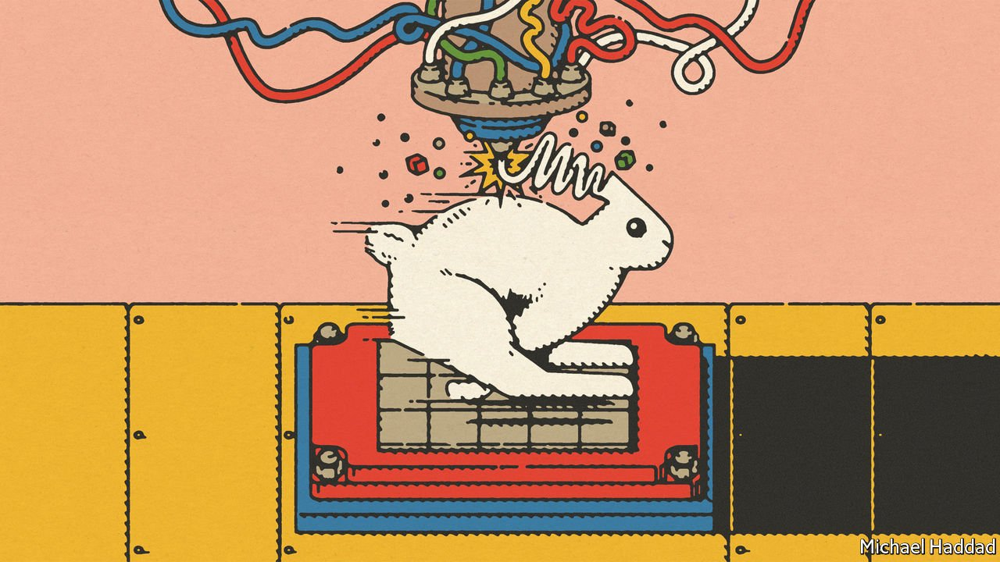

###### Additive manufacturing

# A new type of 3D printing may bring it into the mainstream 

##### It is to the old version as the printing press is to the pen 

 

> Mar 19th 2022 

EARLY FORMS of additive manufacturing, or 3D printing as it is popularly called, began to emerge in the 1980s. But it took more than a decade for the technology to start taking off. Initially, it was used to make prototypes. Now, intricate components are routinely 3D-printed in plastic and metal, for use in products ranging from jet engines and robots to cars.

Sales of 3D-printing services and machines grew by more than 17% in 2021, to reach around $15bn, according to preliminary estimates for a report by Wohlers Associates, a firm that tracks the industry. However, as useful as additive manufacturing has become, it struggles to compete on cost and speed with more established ways of making things, such as injecting molten plastic into moulds or stamping out metal parts with a giant press.


As a result, most manufacturers use 3D printers to produce low-volume, high-value parts. The extra time and expense this takes can be worth it for certain items. Making things additively produces objects layer by layer, so tricky internal structures can be incorporated more easily into a design. Shapes can also be optimised for strength and lightness, saving materials. But what if these advantages could be had at the speed and cost of conventional factory processes? A new form of additive manufacturing aims to do just that.

The origin of this process, trademarked “Area Printing”, goes back to 2009. That was when James DeMuth, having finished his master’s degree in mechanical engineering at Stanford University, started work at the National Ignition Facility, part of the American Department of Energy’s Lawrence Livermore National Laboratory (LLNL). This uses some of the world’s most powerful lasers to study nuclear fusion.

One of the challenges Mr DeMuth was given was to find a way to use a highly specialised type of steel to manufacture a 12-metre wide fusion chamber containing many complex features. He considered a form of 3D printing, called Laser Powder Bed Fusion (L-PBF), for the job. This employs a laser beam to weld together particles on a thin bed of powdered metal, to form the required shape of the object’s first layer. Then more powder is added and a second layer is welded on top of the first. And so on, until the item is complete.

The problem is that, as with most other forms of 3D printing, there is an inverse relationship between resolution, which governs the level of detail that can be printed, and the speed of the process. Hence, some large components with fine details can take days, if not months, to print. Producing the chamber looked as if it might take decades. L-PBF was clearly unfeasible for such an application.

This got Mr DeMuth and a group of colleagues thinking about how to speed things up without compromising quality. After some work, they started using a device called an optically addressed light valve, which had been developed at LLNL. This permits a pulsed infrared laser, with its beam shaped to have a square cross-section, to be patterned with a high-resolution image. Working a bit like a photographic negative, the image can block or pass light, creating millions of tiny laser spots, much like the pixels that make up a digital image.

When projected onto a bed of powder, this patterned laser light can weld a complete area in one go. Mr DeMuth likens the process to producing documents with a printing press instead of writing them out individually with a pen.

Not such a dotty idea

In 2015 Mr DeMuth co-founded Seurat Technologies, to commercialise the technology. This Massachusetts-based firm is named after Georges Seurat, a post-impressionist French artist who pioneered a painting style called pointillism that builds pictures up from dots. Several companies, including GM and Volkswagen, a pair of carmakers, Siemens Energy, a division of a large German group, and Denso, a big Japanese components firm, have partnered with Seurat to explore the use of its first prototype area-printing machine.

This prototype produces a series of small, patternable squares on the powder bed. Their size depends on the material. Aluminium requires 15mm squares. Titanium requires 13mm. Steel requires 10mm. Individually, these squares might seem small. But 40 of them can be printed adjacent to each other every second, so a large area can be covered quickly. The prototype was designed to work at this scale to keep the size of the laser and the amount of energy it consumes to a practical level.

With the equivalent of 2.4m pixels projected in each square, the machine can print parts with layers just 25 microns (millionths of a metre) thick at a rate of 3kg an hour. This is ten times faster than a typical L-PBF machine at such a fine resolution, says Mr DeMuth. Production versions of the area printer are now being built, and future generations of the machine should end up being 100 times faster.

All that, says Mr DeMuth, means area printing will be competitive with mass-production factory processes, such as machining, stamping and casting. As an example, he believes that by 2030 it will be possible to produce silverware (utensils that nowadays are made from stainless steel) for $25 a kilo. “That means we could actually print silverware cheaper than you could stamp them out,” he adds.

Other laser-based 3D printers are getting faster, too. L-PBF machines, for example, may be fitted with several beams—though the complexity involved could limit their number. And many non-laser ways to print things are improving as well, using all manner of materials to make items ranging from buildings to bridges to biscuits. One way or another, then, 3D printing seems at last to be ready to give traditional factories a run for their money. ■

To enjoy more of our mind-expanding science coverage, , our weekly newsletter.

