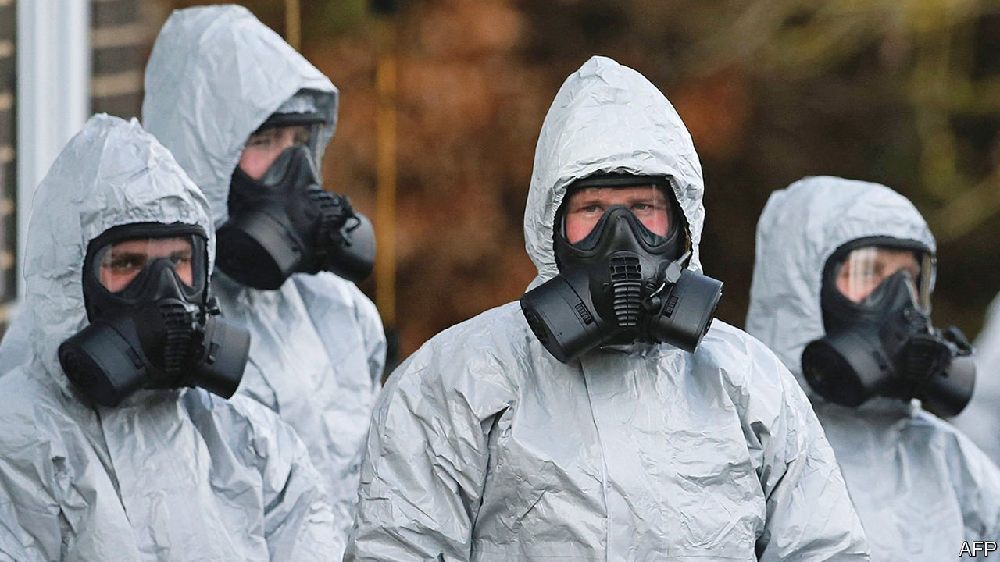

###### Chemical warfare

# How to tweak drug-design software to create chemical weapons 

##### Just ask the program to enhance, rather than reduce, toxicity 

 

> Mar 19th 2022 

SCIENTIFIC PAPERS are normally models of discreet understatement. They are also (or are at least supposed to be) loaded with the information needed for others to replicate their findings.

Not this one. “Dual use of artificial-intelligence-powered drug discovery”, just published in Nature Machine Intelligence, has clearly freaked its authors out. That comes over both in the tone of the text and the deliberate withholding of crucial information. For what Fabio Urbina and Sean Ekins of Collaborations Pharmaceuticals, in Raleigh, North Carolina, and their colleagues are reporting is a virtual machine that can be used to design new and nastier chemical weapons.


Hiding in plain sight

The story began in 2021, when Collaborations Pharmaceuticals, which uses computers to help its customers identify molecules that look like potential drugs, was invited to present a paper on how such drug-discovery technologies might be misused. The venue was a conference organised by the Spiez Laboratory, in Switzerland. This is a government-funded outfit that studies risks posed by nuclear, biological and chemical weapons. To prepare for the presentation some of Collaborations’ researchers carried out what they describe as a “thought exercise” that turned into a computational proof of concept for making biochemical weapons.

Their method was disturbingly simple. They took a piece of drug-discovery software, called MegaSyn (a piece of artificial intelligence, AI, which the company has developed for the purpose of putting virtual molecules together and then assessing their potential as medicines), and turned one of its functions upside down. Instead of penalising probable toxicity, as makes sense if a molecule is to be used medically, the modified version of MegaSyn prized it.

The result was terrifying. Trained on the chemical structures of a set of drug-like molecules (defined as substances easily synthesised and likely to be absorbed by the body) taken from a publicly available database, together with those molecules’ known toxicities, the modified software required a mere six hours to generate 40,000 virtual molecules that fell within the researchers’ predefined parameters for possible use as chemical weapons.

The list included many known nerve agents, notably VX, one of the most toxic. But the software also came up with not-yet-synthesised substances predicted to be deadlier still. Worryingly, some of them occupied parts of what chemists call “molecular property space” that were entirely separate from those inhabited by known neurotoxins. This suggests that whole, new classes of chemical weapons might be developed, if anyone wished to try.

Wisely, Dr Urbina and his colleagues went no further than that. They did not try to synthesise any of their putative discoveries and have certainly not published a list of them. Nor have they described the details of their method. But, in the wider scheme of things, it is not those details that matter. What matters is that they have shown this approach works in principle.

Moreover, as the authors themselves make clear, many people have the knowledge, if not the motive, to act on that fact. “We are but one very small company in a universe of many hundreds of companies using AI software for drug discovery and de novo design. How many of them have even considered repurposing, or misuse, possibilities?” They admit that, before being prompted by their role in the conference, they certainly had not considered them. “The thought had never previously struck us. We were vaguely aware of security concerns around work with pathogens or toxic chemicals, but that did not relate to us; we primarily operate in a virtual setting…Even our projects on Ebola and neurotoxins... had not set our alarm bells ringing.”

Such naivety is surely widespread in the industry, and the paper’s authors, who include Filippa Lentzos, an expert on biosecurity at King’s College, London—whose idea it was to write the article in the first place—and Cédric Invernizzi of the Spiez Laboratory, are open about this. As the paper observes, “Our own commercial tools, as well as open-source software tools and many datasets that populate public databases, are available with no oversight.”

As to dealing with the problem, the authors ask questions about harms both direct (should software downloads be monitored, or sales to certain groups restricted?) and indirect (will one result be restrictions and reduced investment in an area that has great medical potential?). But they offer few answers.

They do, though, draw an analogy with GPT-3, a natural-language generator with plenty of potential for abuse (for example, the creation of “deepfakes” purporting to be the words of real people). The inventors of this have so far kept its most crucial parts under wraps by employing what is known as an application-programming interface to stop outsiders prying. That might work for future software releases in the field of drug discovery, but will do little to deal with what is out there already.

In any case, even if no company has yet thought along the lines Dr Urbina and Dr Ekins have just opened up, governments probably will have done. And so, perhaps, will terrorist groups.

Governments in rich countries have, it is true, found little use for chemical weapons in regular combat since the first world war, and for good reason. They are no more deadly (and often less so) than high explosives, are easier to protect against, and are also harder to contain. Bombs, shells and rockets are simply more reliable. As agents of terror, though, whether delivered by dysfunctional states against rebel populations or by irregulars against civilians under the protection of their target governments, they are perfect. ■

To enjoy more of our mind-expanding science coverage, , our weekly newsletter.

