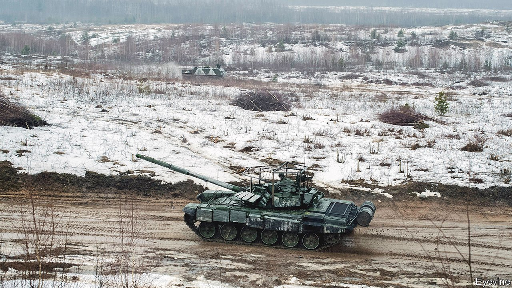

###### Armoured vehicles

# Russian tanks in Ukraine are sprouting cages 

##### But they seem to be pretty much useless 

 

> Mar 19th 2022 

A LOT OF Russian tanks involved in  have strange cages welded over the roofs of their turrets. Strange and apparently useless—for many pictures have emerged of destroyed vehicles surmounted by them. Sometimes the cage itself has been visibly damaged by an attack that went on to hit the tank beneath.

Stijn Mitzer, an independent analyst based in Amsterdam, has looked at hundreds of verified photographs of destroyed Russian vehicles. He thinks that, far from acting as protection, the cages have done nothing save add weight, make tanks easier to spot, and perhaps give a false and dangerous sense of security to the crew inside. They have thus been mockingly dubbed by some Western analysts as “emotional-support armour” or “cope cages”.


Superficially, they are an example of what is known in military circles as field-expedient armour—in other words, stuff that has been added to vehicles after they have entered service. Often, field expedients are sensible retrofits. Gareth Appleby-Thomas, head of the Centre for Defence Engineering at Cranfield University, in Britain, observes that they have ranged over the years from sandbags, via sheets of armour subsequently (and often crudely) attached to the outsides of tanks, to factory-made upgrade kits.

Cage fight

The new cages, the fitting of which seems to have begun late in 2021, appear to be a variant of so-called slat or bar armour. Such armour can provide effective lightweight protection if used correctly (as it is, for example, on American Stryker armoured personnel carriers). But in this case that seems not to have happened. They might thus be seen as symbols of Russia’s inadequate preparation for the campaign, as pertinent in their way as its failures to neutralise Ukraine’s air defences and to shoot down that country’s drones.

One of the main threats to armoured vehicles are HEAT (High Explosive Anti-Tank) weapons, such as the Russian-made but widely employed RPG-7. The warheads of these rocket-propelled grenades are shaped charges—hollow cones of explosive lined with metal. When the explosive detonates it blasts the metal lining into a narrow, high-speed jet that is able to punch through thick steel. According to Dr Appleby-Thomas an RPG-7 can penetrate 30cm of steel plate.

And RPG-7s are the babies of the bunch. Other, far more powerful shaped-charge  used by Ukrainian forces include Javelins supplied by America, NLAWs (Next-generation Light Anti-tank Weapons) supplied by Britain, and drone-borne MAM-L missiles, supplied by Turkey.

HEAT warheads may be countered by what is known as explosive reactive armour, or ERA. When this is hit, a sheet of explosive sandwiched inside it blows up and disrupts an incoming warhead before it can detonate. Many Russian tanks are indeed fitted with ERA. However ERA may, in turn, be defeated by a so-called tandem warhead, in which a small precursor charge triggers the armour’s explosive before the main warhead detonates.

Slat and bar add-on armours are a lighter and cheaper way to counter RPGs, though even if used correctly they are, literally, hit or miss protection. The spacing of the bars or slats is crucial. If a rocket hits a bar it makes little difference, for its warhead will detonate anyway. But if it gets trapped between bars it will probably be damaged in a way which means that the signal from the nose-mounted fuse cannot reach the detonator.

This approach is known as statistical armour, because the protection it offers is all or nothing. It is typically quoted as having a 50% chance of disrupting an incoming RPG. But Dr Appleby-Thomas notes that it works only against munitions with a nose fuse, which Javelins, NLAWs and MAM-Ls do not have.

Russia has been fitting slat armour to vehicles since 2016, but the design of the new cages, seemingly improvised from locally available materials, is baffling. They appear to be oriented in a way that protects only against attacks from above. In principle, that might help against Javelins, which have a “top attack” mode in which they first veer upwards and then dive to punch through a tank’s thin top armour. But, as Nick Reynolds, a land-warfare research analyst at RUSI, a British defence think-tank, notes, even if the cage sets off a Javelin’s precursor warhead, the main charge is still more than powerful enough to punch through the top armour and destroy the tank—as the Ukrainian army itself proved in December, when it tested one against a vehicle protected by add-on armour replicating the Russian design. As expected, the Javelin destroyed the target easily.

Another idea is that the cages are a response to the conflict in 2020 between Armenia and Azerbaijan, over Nagorno-Karabakh, in which large numbers of Russian-made Armenian tanks were destroyed from above by MAM-Ls. But Samuel Cranny-Evans, another analyst at RUSI, points out that the MAM-L’s lack of nose fuse makes adding cages unlikely to succeed. Hitting a cage might detonate the warhead prematurely, but Mr Cranny-Evans does not believe this would prevent it destroying a tank.

A third possibility is that the cages are meant as protection against RPGs (which the Ukrainians have in abundance) which are being fired at tanks from above. This rarely happens in an open battlefield but is a preferred tactic in urban warfare, where buildings offer shooters the necessary elevation.

The question “why?”

Even if that is true, though, it comes at a price. Patrick Benham-Crosswell, a former tank officer in the British Army and author of “The Dangerous World of Tommy Atkins: An Introduction to Land Warfare”, notes the cages limit the ability of the machine-gun mounted on the top of the turret to swing upwards to engage enemies firing down on the vehicle.

Dr Appleby-Thomas speculates that the cages’ real purpose might therefore be to protect against small, improvised bombs released from drones. Ukraine has developed munitions based on hand-thrown anti-tank grenades, by fitting them with fins so that they can be dropped accurately from commercial drones. These drone-borne bombs might present a real danger in urban areas. But the cages would only blunt such attacks rather than provide complete protection, because they form but a partial screen over the turret, and leave other areas completely exposed.

The last possibility, then, is that the gibes about the cages being emotional-support armour are actually correct, and that they have been added simply to improve morale by convincing the troops inside that they are safe. As Mr Benham-Crosswell notes, soldiers often take the view that every little helps.

Believing you are safe is not, however, actually the same as being safe. A pointed historical parallel might be found in the ghost dance shirts, supposed to have had supernatural powers to stop bullets, which were worn by some Lakota warriors in their uprising against the American government in 1889 and 1890. These certainly improved morale. But they didn’t save their wearers at Wounded Knee. ■

Our recent coverage of the Ukraine crisis can be found .

To enjoy more of our mind-expanding science coverage, , our weekly newsletter.

