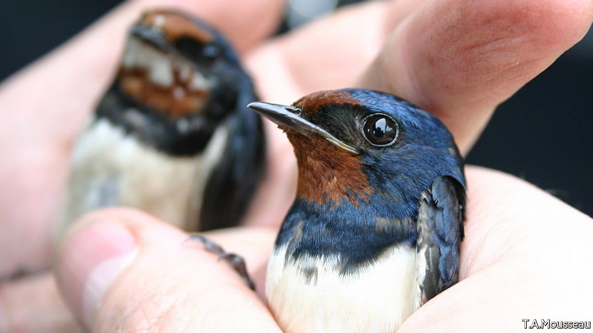

###### The Chernobyl Research Initiative Lab

# War in Ukraine threatens an intriguing piece of wildlife science 

##### A long-term study of radiation’s effects on nature may be over 

 

> Mar 19th 2022 

THE MELTDOWN in 1986 at the Chernobyl nuclear power plant in Ukraine was a human tragedy. But it was also a biological opportunity. Since 2000 Timothy Mousseau of the University of South Carolina and Anders Moller of the Ecology, Systematics and Evolution Laboratory in Orsay, near Paris, have run the Chernobyl Research Initiative Lab in collaboration with a dozen Ukrainian colleagues. They have looked at how animals and plants in what is now, by default, a wildlife sanctuary, have adjusted to their radioactive surroundings.

Over the years, they have published more than 120 papers. They began by studying the genetics of barn swallows (pictured) living at varying distances from the reactor. They discovered that mutations made the birds’ body sizes more variable in areas of high radiation. They then demonstrated that populations of colourful birds have declined more than those of less colourful ones, supporting a long-standing contention that bright colours are used as an honest signal of good health (something birds are unlikely to enjoy in such a hostile place). They have even found evidence that birds around Chernobyl have evolved radiation tolerance, by showing that those living there have higher population densities than conspecifics in similar circumstances near the Fukushima plant in Japan. This melted down a mere 11 years ago, rather than 36, allowing the locals less time to have adapted.


All this work has been shut down following the invasion of Ukraine. Among the casualties are a six-year camera-trap experiment recording the distribution and abundance of mammals, a project monitoring the effects of radiation on the microbiomes of feral dogs, a study of the genomics, physiology, reproduction and ecology of rodents, and a collaboration with NASA, America’s space agency, to understand how plants adapt to chronic exposure to radiation—something that might be important if crops are ever grown on board spacecraft, or on celestial bodies with little or no radiation-intercepting atmosphere.

There is also the threat that the study site might be permanently damaged. Dr Mousseau suspects that noise from combat in the area has already led wildlife to flee in the opposite direction. He saw something similar during noisy clean-ups at Fukushima—though the animals did eventually return.

Fukushima was not, however, seeded with landmines, which he worries may have happened when Russian troops moved through the area. If true, that would pose a hazard to wildlife and biologists alike.

To enjoy more of our mind-expanding science coverage, , our weekly newsletter.

Read more of our recent coverage of the 

