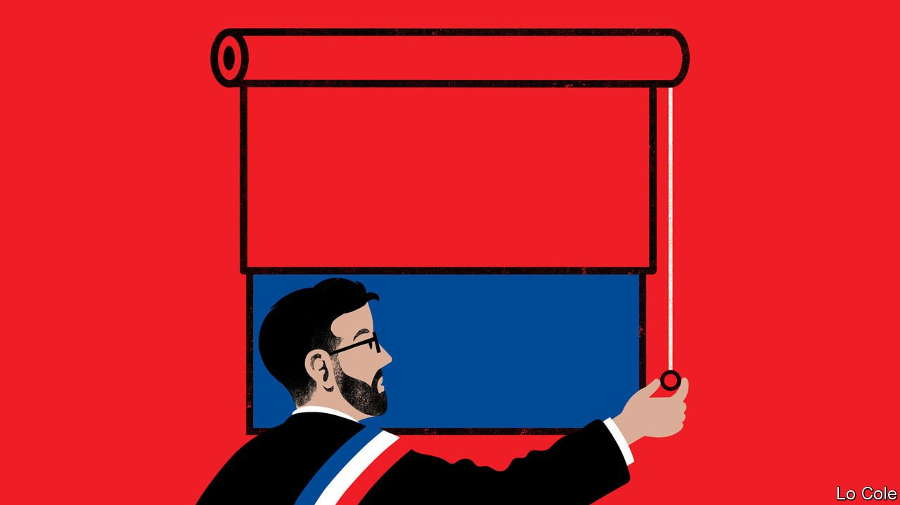

###### Bello

# Chile’s new president won from the left. Can he govern like that? 

##### The heart and head of Gabriel Boric 

 

> Mar 19th 2022 

“WE ARE HERE today but we don’t forget where we came from,” Gabriel Boric told several thousand supporters in the square behind the Moneda palace on his first evening as president of Chile on March 11th. “We wouldn’t be here without your mobilisation,” he said, referring to the large and sometimes violent demonstrations in 2019 that shook what had widely been seen as one of Latin America’s most successful countries. The upshot was the swift replacement of the political class, the election victory of Mr Boric, who at 36 is the world’s youngest president, and the arrival in power of Chile’s most left-wing government since Salvador Allende, the radical socialist ousted by Augusto Pinochet in a coup in 1973.

Mr Boric quoted Allende in his speech and had earlier paid homage to his statue in the square. His own destiny may be different. Allende nationalised hundreds of businesses and presided over strikes and hyperinflation. Mr Boric wants to set up a state development bank and a lithium company but has promised fiscal responsibility and wants broad agreements, including with the private sector. To win a run-off election, he heeded the advice of centre-left economists to lower expectations and recognise that change would have to be gradual.


His job will be tough. His left-wing coalition, even after allying with the centre-left, lacks a majority in Congress. Chile’s economy has more than recovered from the pandemic thanks to big subsidies, which lasted too long, and irresponsible laws to allow people to withdraw early 30% of their pension savings—both approved to assuage an angry country. As these measures cease, the economy is cooling and may enter recession. The outgoing government’s budget, which Mr Boric says he will implement, cuts spending by 22%. Inflation is eating into living standards. People in the north are upset about immigrants. In the south a low-level insurgency by some Mapuches, an indigenous people, is mixed with organised crime. The new interior minister was greeted with gunfire when she visited this week. Hanging over Chile’s immediate future is a constituent convention set up to calm the protests, which is drafting a new constitution. It includes a large group from the hard left.

“These are circumstances that would test any government,” says Giorgio Jackson, Mr Boric’s top aide. “The first challenge is to show we are capable of governing.” The new team has three other priorities. The first is a reform to raise the tax take from 21% of GDP to 26% in four years. This will involve cracking down on tax evasion and avoidance, which is rife among the rich, and raising personal income tax and mining royalties, according to Mario Marcel, the new finance minister. He hopes to get at least part of this through Congress this year. The money will be spent mainly on improving health care and pensions and on reducing the burden of student debt, a big issue for Mr Boric’s followers.

A second priority is pension reform. Once widely praised abroad, Chile’s system of individual accounts run by private funds failed to provide decent pensions. Last month the outgoing Congress approved a taxpayer-funded universal minimum pension worth $230 per month. Mr Boric has pledged to abolish the private funds and to pay extra contributions into a new public fund. He may end up being less radical.

The third priority is to influence the convention, which is independent, so that the proposed constitution commands enough support to be approved in a referendum due in October. Rejection would gravely weaken the government. The new charter is certain to add social and environmental rights, decentralise government and give more autonomy to indigenous peoples. It is not yet clear whether it will establish an effective political system or provide enough certainty for businesses to invest. “The business mood is one of wait and see,” admits Mr Marcel. Investors are sceptical, too, as to whether the government will resist pressures to spend recklessly.

Mr Boric’s heart is with the memory of Allende. His inauguration guests were luminaries of the hard left, such as Jeremy Corbyn, Britain’s former Labour leader, people from Spain’s Podemos and Álvaro GarcÍa Linera, the brains behind Evo Morales, Bolivia’s former leader. But the new president is also an instinctive politician. To succeed he will have to disappoint some of the people in the square. The trick will be to satisfy as many as possible while reassuring the rest of the country.

Read more from Bello, our columnist on Latin America: (Feb 26th) (Feb 19th)

 (Feb 12th)

