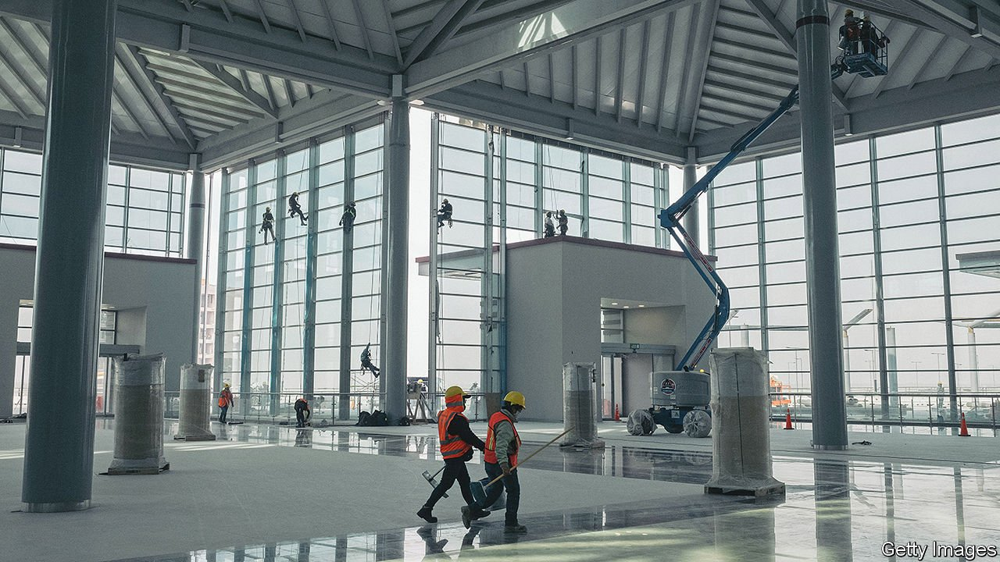

###### Planes, a train and automobile fuel

# Mexico’s new megaprojects may do more harm than good 

##### The president has built a sparkling airport, but is it the right one? 

 

> Mar 19th 2022 

MEXICO’S ARMED FORCES are proud of the toilets at the Felipe Ángeles International Airport. The army built the airport near Mexico City, which is due to open on March 21st, and will run it, but it is a commercial facility. Each bathroom has a theme, explains a sergeant providing a tour. Among them are lucha libre (wrestling) and the Day of the Dead. From loos to lounges the terminal sparkles—but that does not make it a good investment.

The airport is one of President Andrés Manuel López Obrador’s three signature infrastructure projects. The others are an oil refinery in Tabasco, his home state, and a train around the Yucatán peninsula. The trio have provoked even more controversy than most big public works. No one doubts that Mexico needs more investment. At 1.3% of GDP, government investment is the lowest in the OECD, a club mainly of rich countries. But Mexico “needs projects with a high return, whether social or economic”, says Sofía Ramírez of México, ¿Cómo Vamos?, a think-tank.


It is hard to say whether Mr López Obrador’s projects will deliver that, since the planning documents give no analysis of costs and benefits. In November the president decreed that the projects were a matter of national security, ostensibly to speed up permits. But the decision also made related documents secret (and is being challenged in the courts).

The capital needs a new airport. But does it need Felipe Ángeles? In 2018 Mr López Obrador cancelled construction of another airport that was half built, costing the government at least 185bn pesos ($9bn). That airport had problems, but there are also worries about the new one. It has a capacity of just 19.5m passengers a year, about 40% of the number served by Mexico City’s current airport in 2019. So the two will operate in tandem, complicating management of the airspace around the city. Road and rail links to the new airport are unfinished, which means it will be under-used. Just four airlines have said they will fly from Felipe Ángeles. The only international route is to Venezuela.

The case for the refinery is weaker still. It is intended to make Mexico self-sufficient in fuel, but it will not arrest the fall in the amount of oil produced by Pemex, the debt-laden state-owned energy giant. It is a big bet on fossil fuels at a time when many governments are promoting renewables. The refinery is unlikely to open this year as scheduled and is expected to cost at least 40% more than the planned $8.9bn.

Roads and electricity would probably provide bigger benefits to the poor south-east than the “Maya train”, which is to transport tourists, locals and cargo around the Yucatán. It will bypass the centres of two of the region’s biggest cities, Campeche and Mérida. It is damaging forests and threatening the area’s famous cenotes (flooded caves).

The final verdict on Mr López Obrador’s pet projects, when it comes, is unlikely to be positive. They appear to have been chosen by presidential whim. Many of the jobs they create will be temporary. The opportunity cost is what bothers Ms Ramírez most. In a country with so much poverty, she fears the government is pouring money into the wrong things. ■

For more coverage of climate change, register for , our fortnightly newsletter, or visit our 

