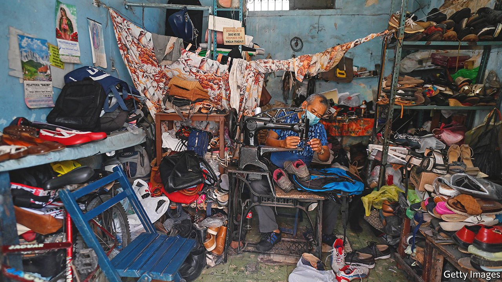
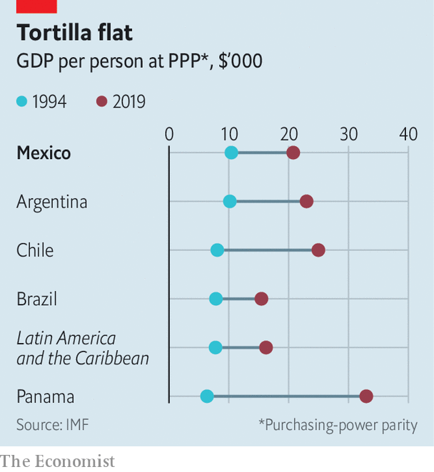

###### Can’t grow, won’t grow

# Why Mexico’s economy underperforms 

##### Red tape, taxes and gangsters keep small firms small 

 

> Mar 19th 2022 

RAMóN RUNS a successful business in Mexico City moulding plastics for blister packaging. When the pandemic dented demand he found a new opportunity in making facial visors. Despite his acumen, Ramón (not his real name) does not want to expand his business. At his factory there is no sign and no window advertising his wares. “I don’t want to grow because I will be worse off,” he says. Not only will his tax rates jump from 2% of profits to 30%, he says, but he will attract attention from both trade unions and organised crime, which will charge derecho de piso—extortion.

Ramón’s story helps explain something that would otherwise be baffling: why the Mexican economy grows so slowly. Given its advantages, Mexico should be an engine of growth for Latin America. It shares a long land border with the United States. It is part of a free-trade area that lets Mexican industry integrate into North American supply chains. Thanks to abstemious fiscal policies, it has avoided the high inflation and debt that afflict South American economies like Argentina and Brazil. And yet over the quarter-century before the pandemic Mexico managed annual average growth in GDP per person, on a purchasing-power-parity basis, of just 2.8% (see chart). That was little better than Brazil, worse than Argentina and well short of the performance of stars like Chile and Panama.


This disappointing record looms larger after the brutal experience of the pandemic. In 2020 Mexico suffered its worst economic contraction since the great depression. Aggregate output shrank by 8.5%. Between 2018 and 2020 at least 3.8m people fell into poverty (according to a measure that takes into account access to services as well as income). That brought the poverty rate to almost 44%. The recovery is looking equally disappointing. Mexico’s economy contracted in the last two quarters of 2021. The IMF and Mexico’s central bank have revised down sharply their forecasts for growth in 2022 relative to earlier estimates, back to the usual 2-3% range.

 


No single factor explains Mexico’s underperformance. “It’s like a good mole [a traditional sauce], with many ingredients,” quips Gordon Hanson of Harvard University. His work suggests that Mexico’s doldrums are at least partly due to bad luck. Although it experienced some success in building a manufacturing sector in the 1980s and 1990s—an effort that received a boost from the North American Free Trade Agreement starting in 1994—Mexico’s fortunes shifted after China joined the World Trade Organisation in 2001.

Thereafter, Mexico’s share of American imports dropped while China’s soared. China offered a much larger workforce at lower wages, making goods that were substitutes for those made in Mexican factories. Nonetheless, Mexico’s close economic ties to the United States meant that the latter’s housing bust and lacklustre recovery sapped Mexican growth. In 2009, for example, output across emerging markets as a whole rose by 2.8%, but in Mexico GDP contracted by 5.3%.

Yet even had Mexico been more fortunate, internal economic problems would probably have weighed on growth. Criminal groups can obstruct businesses or force them to pay for “security”, as Ramón’s experience shows. More mundane difficulties abound. Mexico ranked 60th of 190 countries in the World Bank’s ease-of-doing-business index (which ceased publication after 2020). It can be a struggle to get electricity. Paying taxes takes a whopping 241 hours per year on average for firms in the formal sector. More and better infrastructure is needed, especially in the poorer southern states that are disconnected from the global economy, says Valeria Moy, an economist who heads IMCO, a think-tank in Mexico City.

Formal businesses face red tape and high taxes in exchange for poor public services. That is why so many firms and employees stay informal. Almost 60% of the labour force and an even greater proportion of businesses do not pay the required taxes and social-insurance contributions. Often informal enterprises do not obey labour rules. Despite the large number who toil in it, the informal economy accounts for only about a quarter of Mexican GDP. That is because productivity in informal firms is well below that in the formal sector, and it may well be falling. “It is like the Middle Ages with no technical change,” says Santiago Levy, a former deputy finance minister now at the Brookings Institution, a think-tank in Washington.

Life for workers with informal jobs is not easy. In Nápoles, a neighbourhood of the capital, Iván Jiménez runs a fruit-and-vegetable stand. The hours are long. To open the stall for ten hours a day he works for 17 hours from 4am, when he buys stock. (Mexicans work more hours per year than citizens of any other member of the OECD, a club mainly of rich nations, bar Colombia.) Mr Jiménez says the buying power of his earnings has not risen in recent years.

Yet work in the formal sector is not necessarily more attractive. Salvador Trejo, who runs a produce stall in another part of the city, says he can’t afford the taxes that he would have to pay if he moved to the formal sector. Formal employment can mean gaining health insurance, but its benefits are often little better than those provided by health care that can be obtained for nothing. Public pensions do not always sweeten the deal, either. To earn one, until recently a labourer had to work in the formal sector for 25 years, an unachievable feat for anyone over a certain age. The current administration has reduced that requirement to around 15 years, but it has dulled the incentive by introducing grants for older people regardless of their income or employment status.

Although past reforms have improved the growth climate in many respects, few administrations have done much to shrink the informal sector, despite potential gains in the form of higher productivity and tax revenue. Even so, the economy has a strong foundation on which to build.

Mexico has long been an attractive destination for foreign direct investment. Although recent supply-chain problems have affected important industries, such as car-making, the economy could benefit over the long run from a lack of confidence in global supply chains, as American firms move production closer to home. Indeed, in the northern states, which are closely integrated with the United States, industries like aerospace manufacturing are booming. Mexico could enjoy annual growth of around 4%, reckons Mr Levy, if it became more business-friendly and invested in infrastructure. Parts of Mexico do grow at good rates. In 2018 and 2019, for example, the northern state of Baja California Sur grew at an average annual rate of 3.5%.

Opportunity knocked back

But the government of Andrés Manuel López Obrador is squandering the opportunity. In some ways it is making things worse than they were before the pandemic. A recent move to hand control of the country’s electricity market to the Comisión Federal de Electricidad, a state-owned utility, has discouraged foreign investment. The president has portrayed the private sector as greedy and rattled businesspeople by cancelling . “Currently, it is predominantly domestic issues holding back investment,” says Jonathan Heath, a deputy governor of Mexico’s central bank.

That is a shame. “Mexico is a country of opportunities, whether you sell tacos or something else,” reckons José, who runs a carpet-cleaning business. The biggest opportunity would come from boosting the highly productive formal sector. Unless the government does that, Mexico’s growth will remain mediocre. ■

