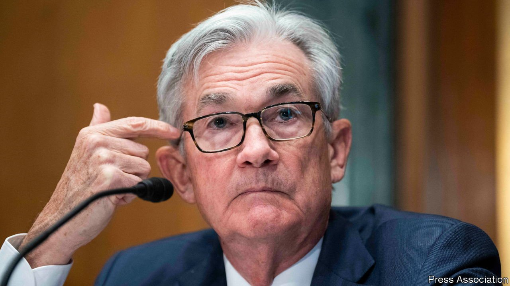

###### The world this week

# Business 

#####  

 

> Mar 17th 2022 

 by a quarter of a percentage point, lifting it to a target range of 0.25-0.50%, the first increase since 2018. America’s central bank also said that it expects to lift the rate at its six remaining meetings in 2022 with more to come next year, eventually bringing it to 2.8%. Despite the financial volatility caused by the war in Ukraine, the Fed felt it had to act to tame surging inflation; the conflict will only add to price pressures.


Sarah Bloom Raskin withdrew her nomination as Joe Biden’s choice to head financial regulation at the Fed. Ms Raskin, a former deputy secretary at the Treasury, came under attack from Republicans for her tough approach to financial risk posed by climate change. She withdrew after Joe Manchin, a Democratic senator from coal-loving West Virginia, said he would not vote for her.

Oil prices retreated rapidly from their recent highs. Brent crude fell below $100 a barrel, less than a week after it had hurtled towards $140. The International Energy Agency warned of a “global oil-supply shock” caused by the effect of sanctions on Russian production, observing that new trades on Russian oil have “all but dried up”. Only Saudi Arabia and the United Arab Emirates have the capacity to make up the shortfall, it said.

EDF raised its forecast of the cost it will bear from the French government’s cap on household energy increases, to €10.2bn ($11.2bn). The French utility also upped the estimate of the further hit it will take from reduced output at its nuclear power plants because of technical issues, to €16bn.

The G7 said it was working collectively to stop Russia obtaining financing from the IMF, World Bank and European Bank for Reconstruction and Development and that Russia would no longer be treated as a normal trading partner.

The Russian government moved to designate Meta as an “extremist organisation”, after reports that the parent company of Facebook and Instagram would allow Ukrainians to call for violence against Russian soldiers on its sites. Meta said there was no change to its policies on hate speech “as far as the Russian people are concerned”. The row does raise questions about Meta’s role in selecting just when it thinks support for violence is suitable across its platforms.

Don’t fly with me

Vladimir Putin signed a bill enabling Russia’s airlines to transfer planes they have leased from foreign entities to a domestic register. That complicates moves by foreign lessors to repossess their aircraft because of sanctions. Earlier the aviation authority in Bermuda, where most of the foreign jets are registered, suspended safety certifications for the jets.

The Chinese government promised that it would bring in “policies that are favourable to the market” in an attempt to shore up confidence after a rout in China’s stockmarkets. Several factors, including the war in Ukraine and surging covid-19 infections in China, have rattled investors. The CSI 300 index of share prices listed in Shanghai and Shenzhen fell sharply, as did Hong Kong’s Hang Seng, which dropped to a six-year low. After the government’s intervention the Hang Seng rebounded and had its best day since 2008.

Uncertainty about the future of  is another cause of investors’ jitters. The price of Didi  Global’s depositary shares in America plummeted by 44% after the ride-hailing company suspended plans to delist from New York and float on the Hong Kong exchange. This came after the Chinese government told Didi that it had not made progress in plugging supposed data-security leaks.

In Indonesia GoTo, the country’s biggest startup, said it would list on the Jakarta stock exchange in an IPO that could value the company at $29bn. GoTo was formed last year by the merger of Gojek, a ride-hailing platform, and Tokopedia, an e-commerce firm.

Intel announced plans to invest €33bn ($36bn) making and designing chips in Europe. At least €17bn will be spent on establishing a “Silicon Junction” in Germany for advanced chipmaking. Another €12bn will be ploughed into expanding its operations in Ireland, including building up its foundry business of making chips for other firms. The company could invest up to €80bn over the next decade in Europe, though this will rely on state subsidies.

It no longer suits you, sir

 


Britain’s statistics office rejigged the basket of goods that make up its consumer-price index. Out go men’s suits (because of remote working), single doughnuts (people now scoff them in packs, presumably because of remote working and probably why men cannot fit into suits) and coal (no one likes it). In come sports bras (covid’s effect on fashion) and antibacterial wipes (because of sticky fingers after all those doughnuts).

