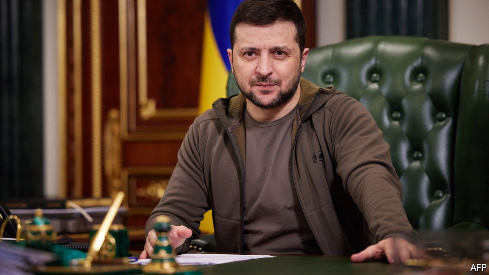
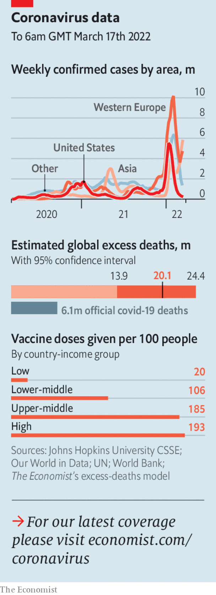

###### The world this week

# Politics 

#####  

 

> Mar 19th 2022 

Russia’s invasion of  appeared to have stalled, with Russian forces making few territorial advances. The invaders continued to bombard Ukrainian cities indiscriminately, leading to increasing reports of civilian casualties. The International Committee of the Red Cross warned of a “devastating humanitarian crisis”, although some non-combatants did manage to escape the port of Mariupol and other besieged locations.


In peace talks between Russia and Ukraine, both sides suggested that there had been some progress. Ukraine’s president, Volodymyr Zelensky, implied that Ukraine might have to give up its ambition to join NATO, but said that his country would seek strong alternative security guarantees. Vladimir Putin, his Russian counterpart, continued to rail against the “Nazis” and “criminals” running Ukraine, calling into question the sincerity of the negotiations.

In a show of solidarity the prime ministers of the Czech Republic, Poland and Slovenia travelled by train to Kyiv to meet Mr Zelensky. America’s Congress approved a further $11bn in humanitarian and military assistance for Ukraine. Mr Zelensky gave an impassioned speech to Congress, pleading for even more help. Afterwards the American authorities said they would send armed drones to Ukraine for the first time. Joe Biden called Mr Putin a war criminal.

A few days earlier Russia launched air strikes on a military base in western Ukraine, near the Polish border, which NATO had used before the invasion to train Ukrainian forces. Russia said the base was a hub for Western  flowing into Ukraine and warned that convoys carrying Western arms were “legitimate” targets.

America warned  that any effort to aid Russia or help it evade sanctions would be met with serious but unspecified consequences. Officials in Washington said that Russia had asked China for weapons, including drones, and that China appeared open to providing military and economic support. The Chinese foreign ministry accused America of spreading “disinformation”.

The number of refugees fleeing the fighting passed 3m, almost 2m of whom have gone to Poland. The mayor of Warsaw said he was struggling to find accommodation for the new arrivals; the city’s population has risen by a fifth in less than three weeks. , which had been accused of turning away refugees, announced a scheme whereby people could volunteer to host Ukrainians in their homes.

America backed away from an initiative to improve relations with Venezuela. The White House had sent its top adviser for Latin America to meet Venezuela’s president, Nicolás Maduro, in what many saw as an attempt to loosen his ties to Russia and boost oil production. But a political backlash in America against talks with the leftist dictatorship apparently prompted the Biden administration to reconsider.

Gabriel Boric took office as . The 36-year-old “libertarian socialist” is a departure from the centrist politicians who had governed since democracy was restored in 1990. In his inaugural speech he paid tribute to Salvador Allende, the socialist president deposed by a military coup in 1973.

Gustavo Petro, a left-wing senator and former member of the M-19 guerrilla movement, affirmed his position as front-runner in Colombia’s presidential election, scheduled for May, by winning more votes than any other candidate in primaries.

Following an international backlash, Guatemala’s Congress rescinded a recent bill that would have seen women imprisoned for up to ten years for having an abortion.

Mexico’s government captured Juan Gerardo Treviño “El Huevo” (The Egg), the alleged leader of the Northeast Cartel, a drug gang, and Troops of Hell, a band of assassins. He was extradited to America.

 


Russian mercenaries working for the government of Mali were accused by the UN of participating in the torture and killing of at least 30 people, including children. The government had hired the mercenaries to help the army keep Islamist insurgents at bay.

Armed men believed to be jihadists have killed more than 60 people in eastern Congo over the past week. Last year Uganda sent more than 1,000 troops across the border into Congo to fight jihadists belonging to a group calling itself the Allied Democratic Forces.

 at Erbil, the capital of the Kurdish region of Iraq, accusing the authorities there of conniving with Israel. No one was reported to have been killed.

Eighty-one men were executed in Saudi Arabia, mainly for supposed acts of terrorism. Shortly afterwards Britain's prime minister, Boris Johnson, visited the kingdom to try to persuade Prince Muhammad bin Salman, its de facto ruler, to pump more oil in an effort to lower prices.

A missile test by North  Korea—the tenth this year—ended in failure when the rocket exploded in the skies above Pyongyang, causing debris to rain down on the city. Analysts think that Kim Jong Un, the country’s dictator, is preparing to test-launch an intercontinental ballistic missile while America is distracted by the war in Ukraine.

Serdar Berdymukhamedov won a sham presidential election in Turkmenistan with 73% of the vote. The new president is the son of the outgoing one, Gurbanguly Berdymukhamedov, who won the previous election with 98% of the vote.

There is no escape

Cases of , where millions of people in more than a dozen cities were put into lockdowns. Businesses closed in the worst-affected areas. The outbreak is straining China’s zero-covid policy, which aims to stamp out the virus before it can spread widely. With vaccines that offer limited protection against the Omicron variant, the country is ill-prepared for a large wave.

