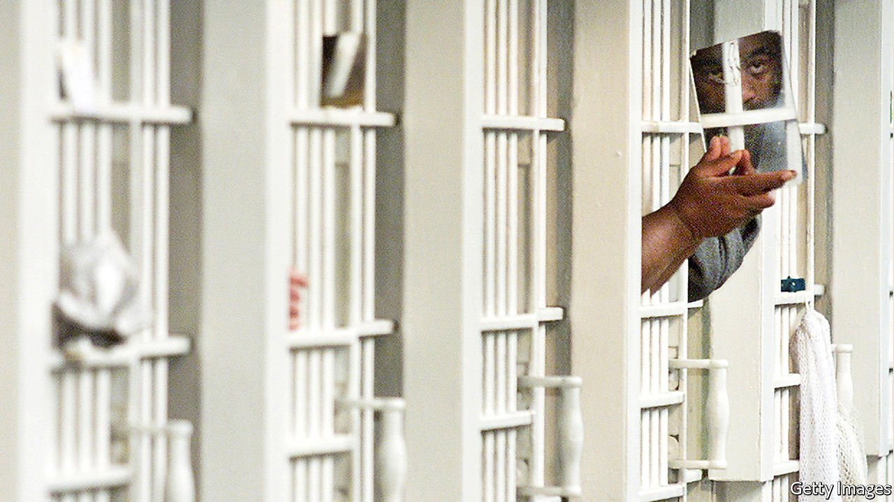

###### Prisons

# America’s prison system is becoming more inhumane 

##### Prisons are less crowded than before, but otherwise getting worse 

 

> Mar 19th 2022 

THE INMATES at Logan Correctional Centre, a women’s prison in rural Illinois, have to endure a lot. The kitchens are infested with cockroaches. The ceilings are crumbling. Many of the buildings are full of black mould. The showers and toilets often break down, and the plumbing occasionally backs up, pumping sewage onto the floors. According to Lauren Stumblingbear, a 36-year-old former inmate who was released last July after serving nearly a decade for taking part in an armed robbery, perhaps craziest of all were the raccoons. The critters were living in the housing unit of the prison, she says. “They would come down through holes in the ceiling.”

From March of 2020, however, even the raccoons seemed mild compared with what prisoners had to cope with. When covid-19 arrived, they were confined to their cells. For the first two weeks they could not shower or make phone calls. They could not use the commissary, because it was run by prisoners who were no longer allowed to move around, and had to eat sandwiches brought to their cells. “We sat there for months just not doing anything,” says Ms Stumblingbear. Covid ripped through the prison anyway. Two years later, the latest lockdown has only just been lifted.


Conditions in America’s prisons were terrible even before the pandemic. Like Logan, many have been dilapidated, overcrowded and understaffed for decades. A federal investigation of Alabama prisons in 2019 exposed rape, murder and drug trafficking. Guards not only failed to prevent it but were sometimes implicated.

The pandemic has pushed the system close to collapse. “Inhumane conditions prevail in prisons and jails in the United States at all levels of government, federal, state and local,” says Jon Ossoff, a Democratic senator from Georgia, who launched a working group on conditions in federal prisons in February. Even as the virus recedes, chronic staff shortages suggest conditions may not improve much.

According to data from the Department of Justice, in 2018 the number of deaths in state prisons hit the highest level since recording started in 2001. Though illness accounted for the vast majority, homicides and suicides also set records. Preliminary data for 2020 show deaths in state and federal prisons increased by 46% over 2019—unsurprisingly, given how fast covid spread inside. Violence may well have increased too, but it is hard to tell, because state departments of corrections often do not release information about it (local jails, which are usually reserved for suspects awaiting trial, are even worse). So evidence is patchy. A single jail in St Louis had four riots last year, as prisoners protested about delays to their court hearings.

One silver lining is that fewer people are in prison. Data collated by the Prison Policy Initiative, a think-tank, showed that the total number of people in state and federal prisons fell by around 14% from January 2020 to December 2021, to the lowest level in decades. That does not necessarily mean that the total number of people locked up has fallen by as much, however, since many have ended up serving their sentences in local jails instead, as prison authorities did not want to admit potentially infected people. And though some states promised to release people early to reduce numbers, in reality the entire reduction has come from admitting fewer people in the first place, says John Pfaff, of Fordham University in New York.

Now that the virus is receding, the number of prisoners may rise again, suggests Mr Pfaff, as jury trials resume. Yet many prison officers chose to quit or retire as covid raged. And as wages surge elsewhere, fewer are joining to replace them. Last summer, nearly one-third of positions in federal prisons were vacant.

In September an anonymous guard at Lee Arrendale State prison, a women’s facility in Georgia, told state representatives that “on a good day” there might be as few as six or seven officers to guard 1,200 inmates. Hannah Riley, of the Southern Centre for Human Rights, an advocacy group, reckons 70% of positions in the state are unfilled. (The Georgia Department of Corrections did not reply to a request for comment.) Georgia is now under investigation from federal authorities, such is the extent of violence inside.

What does this all add up to? Even with the recent decline, America imprisons more people than any other criminal-justice system. Black and Hispanic people are especially likely to be locked up. In 2018 one in 45 black men was in prison (and more still in jails). Poor conditions are not only egregious human-rights violations. They also make prison less effective. A Department of Justice study from 2018 found that five out of six people released from state prisons were rearrested within nine years. The fact that prisoners are warehoused with limited access to education or mental-health treatment, in a place where drug abuse and gangs are rife, is surely part of the reason.

Worsening conditions are likely to lead to more reoffending. Restrictions on visits mean many prisoners have lost contact with family over the past two years, says Jobi Cates, the founder of Restore Justice, a charity in Illinois which presses for criminal-justice reform. Visits are “everything for our people”, she says, but prisons have been slow to bring them back. It is not only family members who have been kept out, but also teachers, therapists and others who help prepare people for release.

Electronic means of keeping in contact got worse, too, because of staff shortages and worries about moving people around. “They made it to where you can only get one phone call a day,” says NaJei Webster, who was released from a prison in Illinois in September, and who now works for Ms Cates’s charity. Prisoners can get access to email through tablet computers, but these cost money—not only for the machine but also per email sent. Sending money to prisoners to pay for these services comes with exorbitant fees, charged by firms such as Global Tel Link and JPay, which saw its revenues spike in 2020.

The tragedy is that falling prison populations ought to be an opportunity to close some of the worst institutions. And state budgets are unusually replete with cash. Mr Ossoff says he has found that improving conditions in prisons (unlike releasing people) has bipartisan support. With several Republicans, he is pushing for more congressional oversight of prisons. But prison-guard unions are reluctant to accept changes that make their jobs harder, and, thanks to the staff shortages, they are more powerful than ever. It seems more likely that things will get worse. ■

Dig deeper

All our stories relating to the pandemic can be found on our . You can also find trackers showing ,  and the virus’s spread across .

For exclusive insight and reading recommendations from our correspondents in America, , our weekly newsletter.

