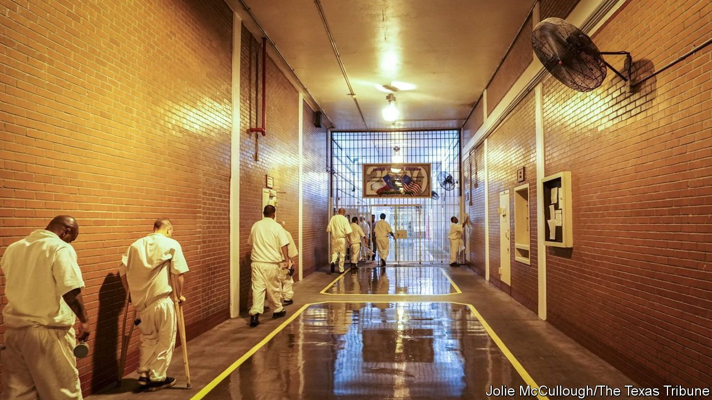

###### Prison conditions

# Debate over air conditioning in American prisons will heat up 

##### Prison guards, not just prisoners, will want more humane conditions 

 

> Mar 19th 2022 

MARCH 20TH marks the official start of spring in the northern hemisphere. Rising temperatures spell hard times for plenty of American prisoners. At least 14 states lack universal air conditioning in their prisons, including many in the South. Florida offers air-conditioned housing units in only 40% of its state-run correctional institutions; Texas provides it in only 30%. None of Louisiana’s seven men’s prisons provides air con universally where prisoners sleep, although its single women’s prison does.

In places where the summer temperature can exceed 100°F (37°C), buildings keep both offenders and heat trapped inside. Prisoners on medications to manage blood pressure or mental problems are especially prone to heat-related illnesses, as are those with asthma. Prisoners have died during heatwaves, prompting lawsuits against the states that held them. Some states allow prisoners a personal fan, but that does little good in extreme heat, as any southerner whose air con has broken down during the summer can attest.


Tough-on-crime attitudes among politicians are one reason for inaction. No one wants to be portrayed as pampering prisoners, says Mark Jones of Rice University in Houston: “It’s not a winning issue politically.” Frugality has been another factor. The Texas Department of Criminal Justice estimates that it would cost a whopping $1bn to add universal air conditioning in the state (though some believe that to be wildly overblown). Last year the Texas House passed a bill that would expand air conditioning in prisons, but without offering any funding, and the Senate never took it up.

Legal challenges are likely to continue. Although some state courts, such as Wisconsin’s, have ruled that incarceration in extreme temperatures violates the Eighth Amendment (which offers protections to those accused of a crime), the Supreme Court said in 1981 that the “constitution does not mandate comfortable prisons”. This has contributed to a perceived lack of urgency.

Staff shortages may do more to get politicians’ attention. High temperatures are a burden not just for prisoners but for guards and other staff, too. Recently James Le Blanc, secretary of Louisiana’s Department of Corrections, testified to state lawmakers that the lack of air conditioning is a major reason that his department is short of 12,175 correctional officers, about a quarter of positions. The estimated cost of adding it seems a snip compared with Texas’s scary figure: at around $30m, it is a fraction of Louisiana’s $500m annual corrections budget.

Some think that the federal government could help pick up the tab through a stimulus bill passed by Congress last year. Hope Osborn, a policy analyst with Texas 2036, a non-profit organisation, has argued that spending federal funds on a one-time expansion of air conditioning is shrewder than continuing a heated “loop of litigation” with prisoners and their families.

For exclusive insight and reading recommendations from our correspondents in America, , our weekly newsletter.

