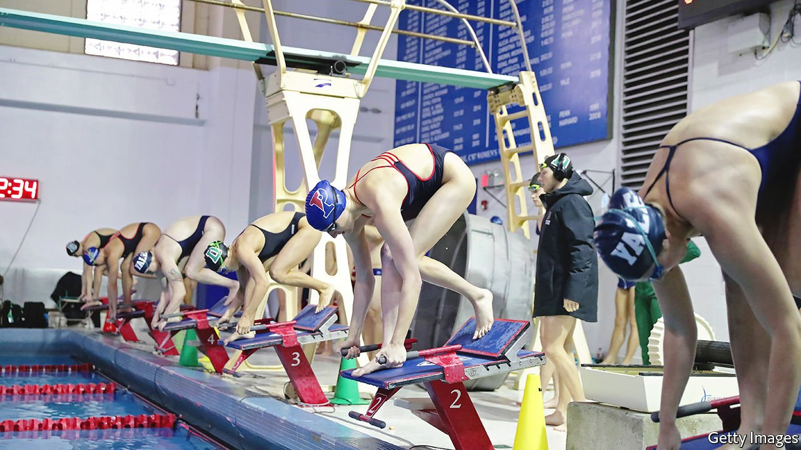

###### Trans women in sport

# How swimming became the centre of the trans-sports debate 

##### The sporting world is splitting into a mess of incompatible rules 

 

> Mar 19th 2022 

COLLEGE SWIMMING is far from the most talked-about sport in America. But this year’s National Collegiate Athletic Association (NCAA) Women’s Swimming and Diving Championships, which take place between March 16th and 19th in Atlanta, have attracted unusual attention. Most of it has been focused on a single athlete: Lia Thomas, from the University of Pennsylvania.

Ms Thomas has already broken records in previous competitions. In December she won a 1,650-yard freestyle race by 38 seconds. On that kind of form, in Atlanta Ms Thomas was expected to win comfortably.


But not without controversy. For although Ms Thomas identifies herself as a woman, biologically she is a male. Her dominant performances have thrust her into the centre of the debate around whether transgender women—males who, like Ms Thomas, identify as women—should be allowed to compete in women’s sport. It is an argument that is increasingly splitting sport, in America and beyond.

The argument is playing out inside stadiums, newspapers and state legislatures. At past events, some in the crowd have refused to applaud Ms Thomas’s victories, waiting for the second-place swimmer to finish before cheering. In February a letter by 16 of Ms Thomas’s team-mates was supportive of her new identity, but said that “biologically Lia holds an unfair advantage…in the women’s category.” (Citing fears about future employment, none was willing to sign their name.) A broader letter, published on March 15th and signed by more than 5,000 people—including many Olympic athletes—took a similar view.

On March 3rd Iowa became the 11th state to pass a law forbidding trans women from competing in women’s sports (others include Texas and Florida). Such rules have, in turn, prompted lawsuits attempting to get them overturned. Big national non-profit organisations, including GLAAD and the American Civil Liberties Union, support Ms Thomas competing in the women’s category. (A third letter, this time signed by 300 athletes, likewise supported Ms Thomas.) The argument ranges far beyond swimming, too, covering cycling, high-school athletics and even weightlifting. In 2021 USA Powerlifting, a weightlifting organisation, was sued over its policy that athletes should compete on the basis of their sex, not gender identity.

Testosterone-driven

Ms Thomas is breaking no rules. For many years the NCAA’s policy was that trans-women athletes could compete so long as they took medication designed to suppress their testosterone levels. Testosterone is the main male sex hormone and a potent anabolic steroid. Levels surge during puberty, which is the main reason why adult males outperform females in almost every sport. In swimming the women’s world record for the 400-metre freestyle, for instance, stands at three minutes and 56 seconds. The men’s record is 3:40. In some sports the gap is much larger. The American men’s combined powerlifting record is 1,296kg. The women’s record is 793kg.

The hope was that suppressing testosterone levels would reduce those advantages, letting female athletes compete with trans women on a reasonably level playing field. The science suggests that the compromise does not work. A pair of review studies, published in 2020 and 2021, concluded that testosterone suppression does not go far in removing the advantage bestowed by male puberty.

America’s swimming authorities are split. Having originally said it would follow the lead of USA Swimming, which governs elite swimming in America, the NCAA changed its mind in February when USA Swimming passed new, more restrictive rules that require trans women to prove that “prior physical development” had not given them a competitive advantage.

The issue is just as contentious outside America. In September a group of British sporting bodies concluded that balancing fair competition and the inclusion of trans women in women’s sport is impossible; individual sports would have to decide which was more important. Some of them, such as British Triathlon, welcomed the guidance. Others, such as the British Kickboxing Council, seemed less keen. (As with Ms Thomas’s teammates, the report found that few elite female athletes were willing to speak publicly about the topic, lest they lose sponsorship deals or team places.)

In 2020 World Rugby decided that trans women would not be allowed into the women’s game on grounds of both fairness and safety. But its remit extends only to international matches, and most domestic unions have the opposite policy. In Denmark, sports authorities have recommended that trans women be barred from women’s sport at the elite level. The result, says Ross Tucker, a South African sports scientist who was involved with the World Rugby decision, is a patchwork. Male athletes can compete against female ones in some sports, in some countries, and at some levels—but not others.

In the short term, that seems unlikely to change. Many sports take their lead from the International Olympic Committee. Before the Tokyo games last year, it had required trans-women athletes to suppress their testosterone levels. However, in the light of the scientific evidence, it promised new rules. Its new policy, announced in November, was greeted with bafflement. It threw the hot potato back to individual sports, but warned them, despite what the record-books say, that there should be no automatic assumption that males possess any advantage at all. Clarity seems further away than ever. ■

For exclusive insight and reading recommendations from our correspondents in America, , our weekly newsletter.

