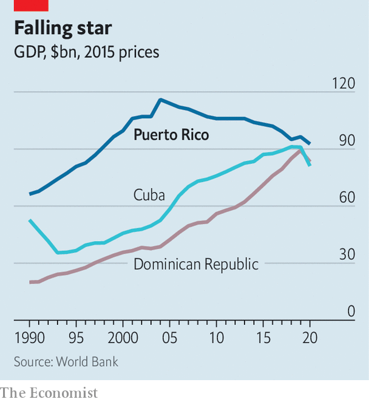

###### Puerto Rico’s finances

# Puerto Rico’s future is looking brighter 

##### With the end of bankruptcy in sight, the island has a decade to turn its economy round 

 

> Mar 19th 2022 

IT LOOKED LIKE Independence Day in America: dozens of flags with stars and stripes, carried by people marching past banks and fast-food restaurants. But on closer inspection, those flags had an extra star. On March 2nd, celebrating the day 105 years ago when Puerto Ricans were granted American citizenship, Víctor Parés hoped to rally support for statehood. “It’s up to our generation to finish what started with the Jones[-Shafroth] Act in 1917,” said Mr Parés, a politician leading the procession in San Juan, the capital. Only a few passers-by seemed interested. The dark traffic lights dangling above them, a casualty of the island’s recurrent power cuts, were a reminder of more humdrum concerns.

Yet change is coming, even if it falls short of Mr Parés’s dreams. On March 15th a bankruptcy deal came into effect that reduced Puerto Rico’s debt by almost 80%. The resulting new fiscal plan, coupled with an influx of federal dollars, marks the effective end of the island’s debt crisis. Now Puerto Rico has a chance to fix its economy, after years of recession.


The debt crisis that engulfed Puerto Rico in 2014 owes much to its peculiar legal status as an American commonwealth. Not bound by the strictures of a state, lawmakers in San Juan borrowed freely and disastrously. In 2016 Congress passed the Puerto Rico Oversight, Management and Economic Stability Act (PROMESA), giving the island a process to restructure its debt. In exchange, it saddled the place with a fiscal-oversight board. Derisively called la junta by locals, the board managed the island’s finances and led debt negotiations.

The bankruptcy agreement reached in January will relieve Puerto Rico of crushing interest payments, which will now take up 7% of the budget instead of over 25%, with a plan to balance long-term finances. “It is a sound basis for fiscal planning going forward,” says Antonio Weiss, who led the Treasury Department’s negotiation of PROMESA under Barack Obama.

The $67bn in federal funds allocated to help the island rebuild after Hurricane Maria in 2017 continues to arrive—blue tarps on roofs in poorer parts of San Juan are a testament to a shamefully slow recovery. But it is President Joe Biden’s legislative activity in 2021 that promises a torrent of spending. The American Rescue Plan is expected to deliver at least $23.5bn to Puerto Rico. The Infrastructure Investment and Jobs Act will bring yet more.

 


The oversight board projects that the economy will grow by 0.5% a year on average through 2030. The fact that it will take such a surge of spending just for Puerto Rico to barely escape recession underscores the task ahead. Since 2004 its economy has shrunk by 20% (see chart). Though living standards are still among the highest in Latin America, neighbours such as the Dominican Republic have steadily closed the gap. The island’s poverty rate of 44% remains more than twice that of Mississippi, the poorest American state.

The causes are no mystery. American firms flocked to Puerto Rico because profits earned there were exempted at one time from federal taxes. Loss of this perk in 2006 drove many to leave or cut their workforces. Infrastructure is patchy—blackouts and potholes are common. Even where there is growth, jobs are scarce. Manufacturing output has risen by 35% since 2006, but employment has fallen by 32%.

Fixing the island’s economy will hinge on reversing its population decline. Higher wages on the mainland have drawn people away for decades, but many would return, explains Jorge Duany of Florida International University. “Puerto Ricans come and go freely, vaivén.” The money sent back boosted the economy, and emigration was never enough to dent the island’s population growth. No longer. From a peak of 3.8m in 2004, the population has declined by 16.5%; the median age has risen from 33 to 45 since 2005 as younger people have left. That shrinks the tax base and saps Puerto Rico of its most dynamic talent.

OK by me in America

Policymakers still struggle with fully transparent budget-making and reforms. Voters have noticed. The two main parties, the Popular Democratic Party, which favours the status quo, and the New Progressive Party, which backs statehood, have seen their share of the vote wane. Protests in front of La Fortaleza, the governor’s 16th-century residence in San Juan, are common. Mr Weiss argues that the oversight board should now be retired, and fiscal control returned to local elected representatives. Voters seem to crave both sound management and accountability.

The federal government could do more for Puerto Rico, for example by funding Medicaid as much as it does for states. But no policy would have as dramatic an effect as changing the island’s status, through statehood or independence. None of the three referendums over the past decade (all yielding a majority for statehood) came with a commitment from Congress to respect the outcome. Mr Parés hopes the end of bankruptcy can prompt change. “The Jones Act was a law of transition, a transition that must ultimately end.” ■

For exclusive insight and reading recommendations from our correspondents in America, , our weekly newsletter.

