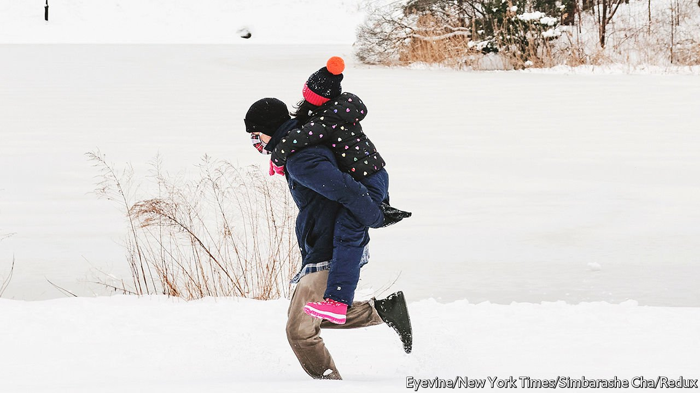

###### Schools and the weather

# Some districts opt for remote learning instead of snow days 

##### Snow school today? 

 

> Mar 19th 2022 

WHEN THEY hear snow on the forecast many American children cross their fingers and hope school will close. But “snow days” may soon melt away.

Last year New York City, the country’s largest school district with 1m children, announced that families should expect to take part in remote learning on snow days. Alexandria, Virginia, has taken snow days off the school calendar. Thanks to the pandemic, many districts have the tools and experience to turn to remote learning in an emergency.


Most states require 180 days of instruction a year. Remote-learning days do not generally count. If school is cancelled because of snow, hurricane or extreme heat, pupils have to make up for the day in person. Most districts tack on the days at the end of the school year. “The US calendar is already short by international standards,” says Michael Petrilli of the Thomas B. Fordham Institute, an education think-tank, “so we can’t afford to lose any of them.” This month New Jersey’s Senate unanimously voted to allow those days to count towards the mandatory days of learning. Nicholas Sacco, the bill’s author, says it has safeguards to prevent overuse.

The New Jersey Education Association, a teachers’ union, is not convinced that remote instruction is a proper substitute. Tafshier Cosby, a New Jersey parent and a member of the National Parents Union, which speaks for working parents, points out that not every child has ready access to a device.

Closing a school is a hard decision. Parents may have to take the day off work, perhaps without pay. Children may miss out on food and crucial therapy. But the danger of children being outdoors and travelling in extreme conditions can outweigh those considerations. “More superintendents have been fired by snow days, either calling it or not calling it, than anything else,” says Dan Domenech, head of the American Association of School Administrators.

Extreme weather has meant that some southern states, which lack the infrastructure to cope with snow, are having to consider snow days and remote learning, and the frequency of such disruption in colder parts of the country may well increase. Rupak Gandhi, superintendent of schools in Fargo, North Dakota, says he has had to cancel instruction because of inclement weather on an unusual five days this winter. If he has to close schools again his district will switch to distance learning.

Some superintendents wish they had the flexibility to make such a call. Mark Benigni, superintendent of Meriden Public Schools in Connecticut, says his district used remote snow days successfully during the pandemic, but this year the state will not approve them. Others remain wary. Matthew Baughman, the superintendent of Wolverine Community Schools in northern Michigan, believes “in preserving the magic of snow days for kids and teachers”.

For exclusive insight and reading recommendations from our correspondents in America, , our weekly newsletter.

