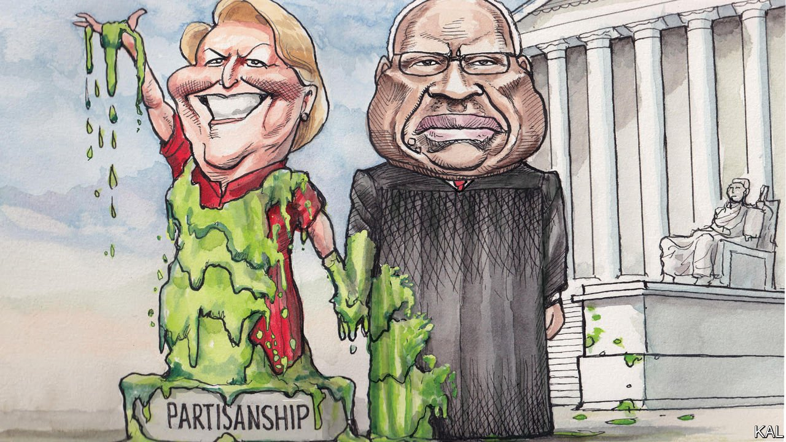

###### Lexington

# The embarrassing Mrs Thomas 

##### There is no conflict between Justice Clarence Thomas and his wife’s unhinged activism. That is the problem 

 

> Mar 19th 2022 

VIRGINIA THOMAS made headlines this week when she confirmed that she had attended Donald Trump’s pre-insurrection protest in Washington, DC, on January 6th 2021. Frankly, it would have been surprising if she hadn’t.

A well-connected activist, at the paranoid edge of the conservative establishment, Mrs Thomas was known for her fierce culture-warring long before Mr Trump made it Republican orthodoxy. The 65-year-old Omahan abhors feminism and affirmative action, and believes “America is in a vicious battle for its founding principles” against the “deep state” and a “fascist left” in which “transsexual fascists” are prominent. Schooled in such views by Steve Bannon, a former comrade of Mrs Thomas’s, Mr Trump was happy to promote them. Mrs Thomas was allegedly known in the Trump White House as the “wrecking-ball” (which by its standards was saying something) for her persistence in lobbying the president.


Yet what sets Mrs Thomas apart is not only her activism but also the fact that she is married to a Supreme Court justice, Clarence Thomas. No other SCOTUS spouse has played such an active political role. And given that Justice Thomas often appears at her work dos and fulsomely lauds her “24/7…defence of liberty”, perhaps no SCOTUS couple has, either. In the light of Mrs Thomas’s efforts to spread Mr Trump’s lie that the 2020 election was stolen, this has become newly contentious.

“LOVE MAGA people!!” she wrote on social media as they gathered on insurrection day. “GOD BLESS EACH OF YOU STANDING UP or PRAYING.” She later distanced herself from the violence that ensued (she says she went home early, because it got chilly). She has also downplayed it—including by signing a petition excoriating a House investigation into the riot, for which nearly 800 people have so far been charged with crimes, as a partisan witch-hunt against “private citizens who have done nothing wrong”.

Recent exposés of Mrs Thomas’s activities have focused on the potential conflict they represent for her husband. The New York Times suggests Mr Trump patronised her only to cultivate Justice Thomas. The New Yorker warns that the court’s conservative majority is shortly expected to rule on significant affirmative-action, gun-rights and abortion cases in favour of activists associated with Mrs Thomas. Many note that Justice Thomas was the only dissenter from a Supreme Court decision that forced Mr Trump to comply with the January 6th inquiry.

In Justice Thomas’s defence, none of that looks like a clear breach of conflict-of-interest rules. His jurisprudence, it should also be noted, is in theory sufficient to explain most of his judgments without recourse to his politics. A committed originalist, he is one of the more intellectually consistent jurists on the bench, as well as the most conservative. Yet, in a divided country, appearances matter. Public trust in the court is plummeting precisely because it is viewed as too political. That makes Justice Thomas’s cheerleading for his wife’s activism reckless at best.

It is also at odds with his concern to avoid appearances troubling to conservatives. Justice Thomas was a lone dissenter on the court against the recent expansion of postal voting on the basis that, even if it were not—as Republicans claimed—fraudulent, he feared it might seem to be. While ignoring a real, if exaggerated, liberal concern about his wife’s activism, in other words, he took care to mollify a baseless conservative gripe.

He is hardly the first justice to reveal his partisan colours. Ahead of the general election in 2016 the late Ruth Bader Ginsburg lambasted Mr Trump. Two years later Brett Kavanaugh delivered a seething partisan rant at his Senate confirmation hearing. He claimed that Democratic opposition to his nomination to the Supreme Court was not in response to the allegation of sexual impropriety he faced, but rather “pent-up anger about President Trump” and “revenge on behalf of the Clintons”. However, Justice Kavanaugh’s partisanship has been somewhat muffled by his institutionalism, which urges restraint. Justice Thomas’s jurisprudence, by contrast, appears to amplify his politics.

His take on the constitution’s original meaning not only leads him to be unerringly supportive of conservative causes, from gun rights to Mr Trump. It has also made him unusually dismissive of opposing views, even when enshrined in legal precedent. When a past judgment is “demonstrably erroneous”, he wrote in 2019, “we should not follow it.” Not even the late Antonin Scalia, his fellow originalist and hero, so presumed to overthrow settled law. “I’m an originalist and a textualist, not a nut,” Scalia once explained.

Originalist sin

Scholars have long admired the cogency of Justice Thomas’s legal philosophy. It is nonetheless hard to reconcile with the Supreme Court’s claim to be politically neutral or, given the outsize mediating role that politicians have foisted upon it, a healthy democracy. And yet the growing bullishness and impatience with precedent among the court’s dominant conservatives suggest Justice Thomas’s view, which was once an outlier, is becoming dominant. “One can be both an admirer of Thomas’s jurisprudence and deeply fearful of what it portends,” says Steve Vladeck, a legal scholar.

By contrast, it is hard to admire Mrs Thomas’s grievance-peddling in almost any way. Whatever laudable aims she once held, she encapsulates the many Republicans whose exaggerated fears of the left drove them to justify whatever new low Mr Trump had in store. And yet, unfortunately for Justice Thomas, an admirably self-made man, her activism and his judging are comparable.

In politics and the law, both Thomases are too intolerant of opposing views—even when they represent the settled opinion of most Americans and, in Justice Thomas’s case, legal tradition. This equivalence is the most troubling significance of Mrs Thomas’s political activities. They are not in conflict with her husband. But rather the opposite. ■

Read more from Lexington, our columnist on American politics: (Mar 12th)

 (Mar 5th) (Feb 26th)

For exclusive insight and reading recommendations from our correspondents in America, , our weekly newsletter.

