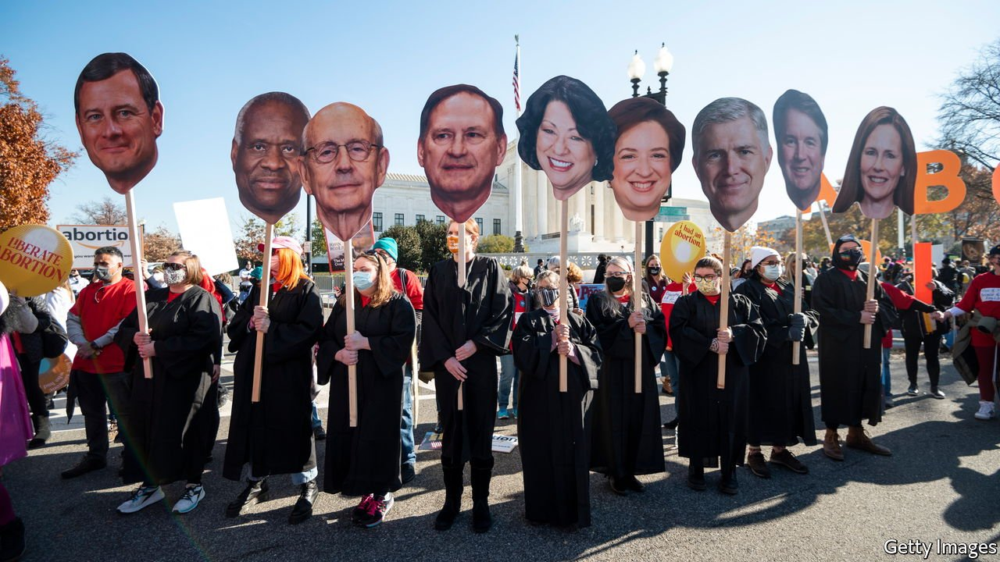

###### Abortion laws

# The race to undermine reproductive rights in America 

##### Some states can’t wait to end abortion 

 

> Mar 19th 2022 

LIKE SCHRöDINGER’S unfortunate cat, Roe v Wade is in a quantum state as America awaits word from the Supreme Court on a case that could put an end to the constitutional right to abortion. The justices are expected to open that box—in a case challenging Mississippi’s ban on terminating a pregnancy after 15 weeks—by the end of June. But several states are not waiting to see what is revealed. They are forging ahead as if Roe, a precedent from 1973 which protects a woman’s freedom to choose an abortion, were already dead.

The reckoning has been brewing for a while. Three years ago, highly restrictive abortion laws were enacted in nine states. Alabama’s was the most extreme: it banned nearly all abortions, beginning at the point of fertilisation. Most of these laws were promptly blocked in federal courts. The point, however, was to begin to get an increasingly conservative Supreme Court to reconsider Roe.


Texas took a different tack last year with Senate Bill 8, an abortion ban from about six weeks enforced not by the state but through private lawsuits. Despite its incompatibility with Roe, which protects abortion rights to about the 23rd week of pregnancy, the law was let through by the Supreme Court on September 1st, and the number of abortions in Texas promptly plummeted. The justices held a hearing two months later and, on December 10th, released their ruling: an 8-1 decision offering a narrow path to challenge the bill’s constitutionality. Although most potential defendants were out of reach, the majority said, the plaintiffs may sue state officials who have a hand in enforcing the bill.

On March 11th a final roadblock closed that path. Following the Supreme Court’s ruling, the Fifth Circuit Court of Appeals declined to let the case move forward in the trial court. Instead, the Fifth Circuit sent a query to the Texas state Supreme Court: do these agency heads in fact play a role in enforcing Senate Bill 8, making them proper targets of a lawsuit challenging the law under Roe? The judges’ answer was no. The architects of Texas’s law—derisively dubbed “some geniuses” by Justice Elena Kagan—prevailed in their quest to craft an abortion ban that would stymie broad legal challenge.

Other states are catching on. Idaho is on the verge of adopting a ban modelled on Texas’s. A legislator in Missouri is pushing a provision that uses Texas’s private-lawsuit mechanism to stop women from seeking abortions outside their state. Anyone who helps a Missourian obtain an abortion across state lines—from doctors to appointment schedulers—could be subject to a lawsuit. Another bill in Missouri in effect bans abortions for ectopic pregnancies, nonviable fertilisations outside the uterus that are dangerous if not terminated.

These proposals mark a new, radical frontier. They join more conventional 15-week bans under consideration in Arizona, Florida and West Virginia. The comparatively moderate tactics in those states may be designed to test the waters “to see if there is backlash to less sweeping measures”, suggests Mary Ziegler of Florida State University College of Law. But if Roe goes, Ms Ziegler predicts, no red states may be “content regulating just what happens inside their own borders”. ■

For exclusive insight and reading recommendations from our correspondents in America, , our weekly newsletter.

