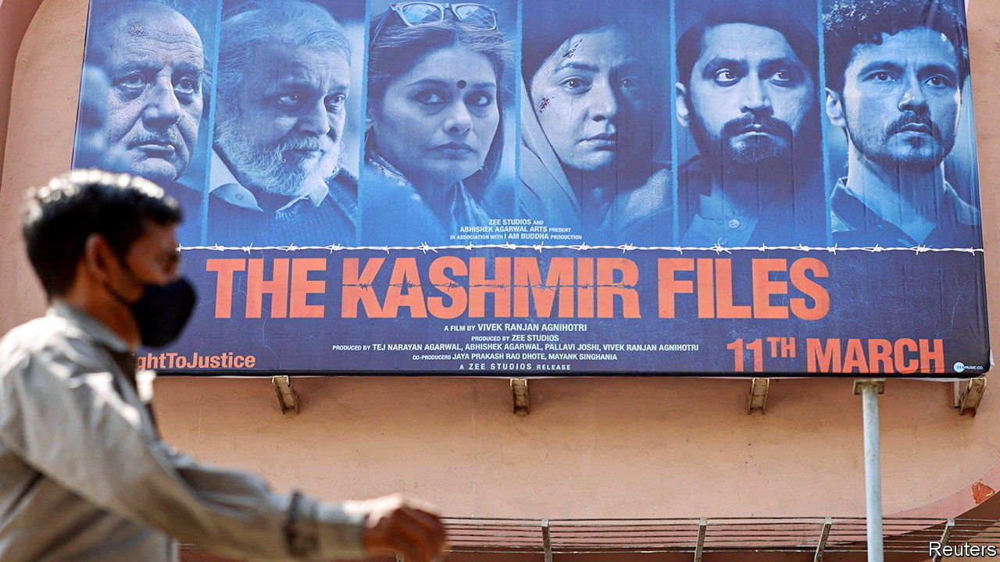

###### Horrible histories

# A new film on Kashmir has found a fan in Narendra Modi 

##### “The Kashmir Files”, a violent drama, opens old wounds and feeds new fears 

 

> Mar 26th 2022 

INSIDE CINEMAS, “The Kashmir Files” starts with a disclaimer: “This film... does not claim accurateness or factuality of historic events.” Outside the cinema, in contrast, the relentlessly violent drama is being promoted with what might be called a very big claimer. Narendra Modi himself, India’s prime minister, has hailed the film for exposing long-buried truths. So keen to share these is his Bharatiya Janata Party (BJP) that states it runs have scrapped local entertainment taxes for the movie.

High-powered promotion is not the sole reason why “The Kashmir Files” has bagged over $25m since it opened on March 11th, a post-pandemic record. The film also provokes strong emotions. Its story revolves around the very real tragedy of the Kashmiri Pandits, an ancient community of high-caste Hindus who were once perhaps 5% of the population of the Kashmir Valley.


Pandits were targeted by Islamists backed by Pakistan during a cataclysmic surge in violence in the 1990s. Police protection was scant. All but a few fled, never to return. Official reports and scholarly research suggest that more than 200 were murdered, among the 14,000 civilians, 5,000 Indian soldiers and 22,000 militants killed during the past three decades of strife in the valley.

These other casualties get no mention in the film. Instead, within its first 15 minutes we see Muslims betraying Hindu neighbours, chanting “Convert or die!”, beating Pandit children and visiting unspeakable (but apparently not unfilmable) acts of savagery upon women. By the end of the film it is not just the awfulness of Muslims that is doggedly bludgeoned into viewers. So is the perfidy of whiny leftists, intellectuals and politicians who dare suggest that Muslims, who are 95% of the Kashmir Valley’s population, might be victims of a sort, too. Small wonder that in cinemas across India hot-headed youths, many of whom appear to belong to extreme Hindu-nationalist groups, are making rousing sectarian speeches.

In the Kashmir Valley itself the film has been met with silence. This is partly because cinemas there closed in the 1990s. Zayd Hanief, a 22-year-old law student who watched the film on a visit outside the valley, says he was revolted. “It simply confirms the worst stereotypes about Muslims.” To some, the boosting of the film by Mr Modi, whose government in 2019 imposed direct rule on the once semi-autonomous state of Jammu and Kashmir, and has cracked down fiercely on dissent, feels ominous. “Kashmiris see it as a prelude to more serious oppression,” says Sheikh Showkat Hussain, a legal scholar and political analyst based in the valley. “The movie will be used as justification for whatever the government is doing or will do here.”

