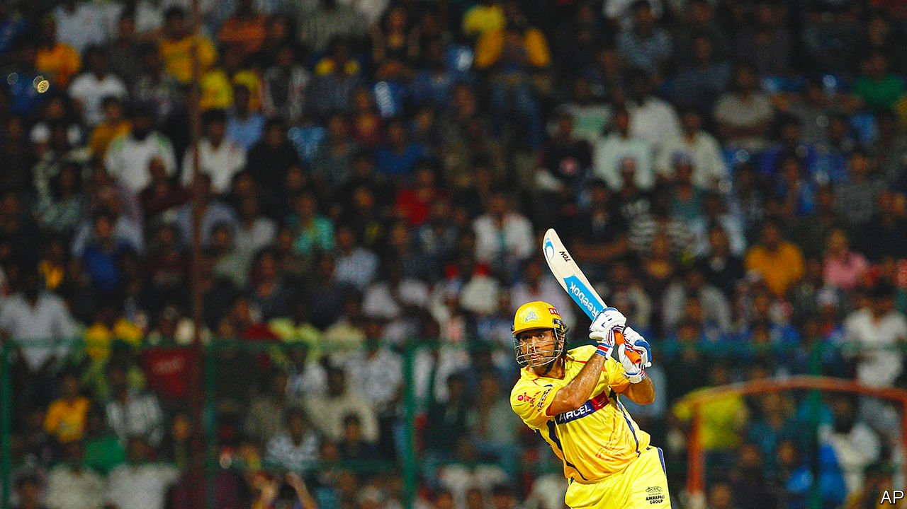
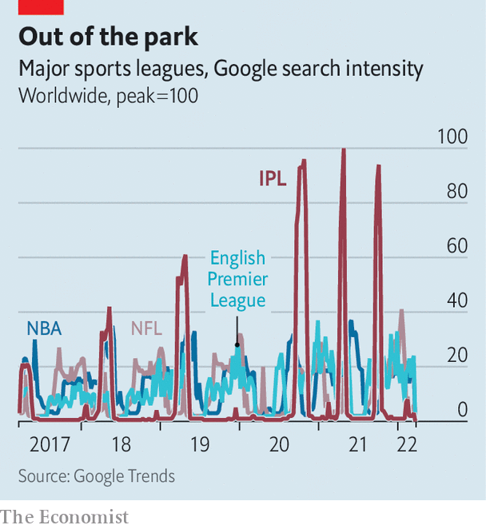

###### Beyond the boundary

# How the IPL reflects India’s strengths—and weaknesses 

##### The cricket league is a useful lens through which to see the country 

 

> Mar 26th 2022 

IN AUGUST THE Board of Control for Cricket in India (BCCI), a sports-administration body, invited sealed bids for two new franchises in the Indian Premier League (IPL), an annual domestic tournament of the world’s greatest sport. Two months later, at an event in Dubai, it opened the envelopes. The BCCI had set a confident minimum price of $270m for each team. The largest bid was an eye-popping $940m. The next biggest stood at $750m—more than the total price of all eight franchises when the league started in 2008.

The 2022 tournament, which begins on March 26th, is only the 15th season of the IPL. In that time it has not only turned cricket upside down, but “completely revolutionised the Indian mindset and how the world looks at India”, says Boria Majumdar, an academic who studies cricket.


The idea for the IPL came along in 2007, a propitious time for Indian enterprise. Like the e-commerce platform Flipkart, the ticket-booking firm redBus and the ride-hailing company Ola, all of which emerged in roughly the same period, the IPL took an American idea and gave it a local twist. Lalit Modi, a mid-ranking BCCI official, saw the creation of Twenty20 cricket, a made-for-television, three-hour version of the game, as an opportunity to create a lucrative, city-based competition.

Mr Modi persuaded members of India’s business and entertainment elite to stump up a combined $723m for the ownership of eight franchises. Despite a name that pays homage to English football, he borrowed liberally from American sports. A small number of teams and a short fixture list were designed to make every game feel important. Matches were played at the same time every evening to encourage families to tune in regularly. The lack of promotion or relegation protected the value of investors’ assets from a sudden depreciation. A team salary cap prevented the richest franchises from dominating. Sony, which runs a network of channels in India, paid $1bn for broadcast rights to the first ten editions. When that contract ended Star India, another broadcaster, paid two and a half times as much for half as many years.

The league was an immediate hit. The cricket was fast-paced and exciting. The grounds were packed with celebrities. Imported cheerleaders added an exotic twist. By broadcasting in regional languages and opening fan zones for people to watch matches on big screens in remote parts of the country, the IPL made cricket more accessible and reflected the diversity of India. The acceptance of players from other states and even countries in teams named after a city or a state promoted the idea of Indian tolerance and cosmopolitanism.

 


Sponsors, too, began to wake up to the tournament’s heterogeneous audience. By 2017 the Kings XI Punjab team jerseys bore the logo of Lotus Herbals, a make-up and skincare brand. Women were 43% of the IPL’s television audience in 2020; plans for a women’s league are gaining momentum. Alec Scheiner, a partner in RedBird Capital which bought a stake in Rajasthan Royals last year, believes the popularity of the IPL “is like the NFL [an American-football league] and the NBA [America’s basketball league] combined” (see chart).

The tournament has also promoted social mobility. Though cricket has long been a national preoccupation, it was an elite pursuit (a former national captain’s childhood nickname was maharajah; another was literally a prince). The beginnings of India’s economic liberalisation in 1991 led “to an explosion of the middle class and the empowerment of small towns everywhere”, says Amit Varma, a writer based in Mumbai. Within a decade some of India’s finest players, such as M.S. Dhoni (pictured), a former captain who once worked as a ticket inspector for Indian Railways, were emerging from places and families with no cricketing pedigree.

By expanding opportunities in the sport, the IPL supercharged this trend. League contracts alone offer a very good living, but success there has become a springboard for a place in the national team. Mohammed Siraj, a fast bowler and the son of a rickshaw-driver, won a contract to play in the IPL for Sunrisers Hyderabad and now represents India in Twenty20 cricket and in Test matches, the most prestigious form of the game.

The IPL has also made a mark outside India, becoming a big cultural export and prompting nearly every other cricketing nation to copy its format. Some, such as the Caribbean Premier League, have succeeded in establishing themselves. Others have imploded amid corruption or financial scandals. Mr Majumdar believes the replication of the IPL around the world “has given a rising India a sense of confidence that it is possible to create a brand that goes on to achieve global dominance”.

Yet if the league holds up a mirror to all the things India likes about itself, it also reflects some of its weaknesses. Two separate match-fixing scandals emerged in 2013. Two teams were banned for two seasons, but the credibility of the league and the reputation of its brand were tarnished. Players from Pakistan, cricket’s second-biggest market, remain unwelcome. And the BCCI still maintains a highly protectionist attitude towards Indian players. Although set numbers of foreigners are welcome in the IPL, Indian cricketers are banned from playing in franchise tournaments abroad. Unmukt Chand, who led India to victory in the Under-19 World Cup in 2012, was forced to retire from all cricket in India to take up contracts to play in America and Australia.

The IPL is now sufficiently dominant within cricket that it can do whatever it likes. No national boards want to compete by scheduling matches against it. A new domestic broadcasting-rights deal is imminent, which is expected to double in value to at least $1bn a year, conferring yet more power. But there are reasons for the BCCI to be cautious. Increasing the number of teams risks reducing the quality of the cricket, and longer seasons could bore viewers. In its first decade and a half the IPL has shown that, by borrowing ideas from elsewhere and adapting them to the local market, Indian entrepreneurs can dominate at home and abroad. Its next 15 years will reveal what kind of leadership it wants to project. That applies to India itself as much as to the Indian Premier League. ■

