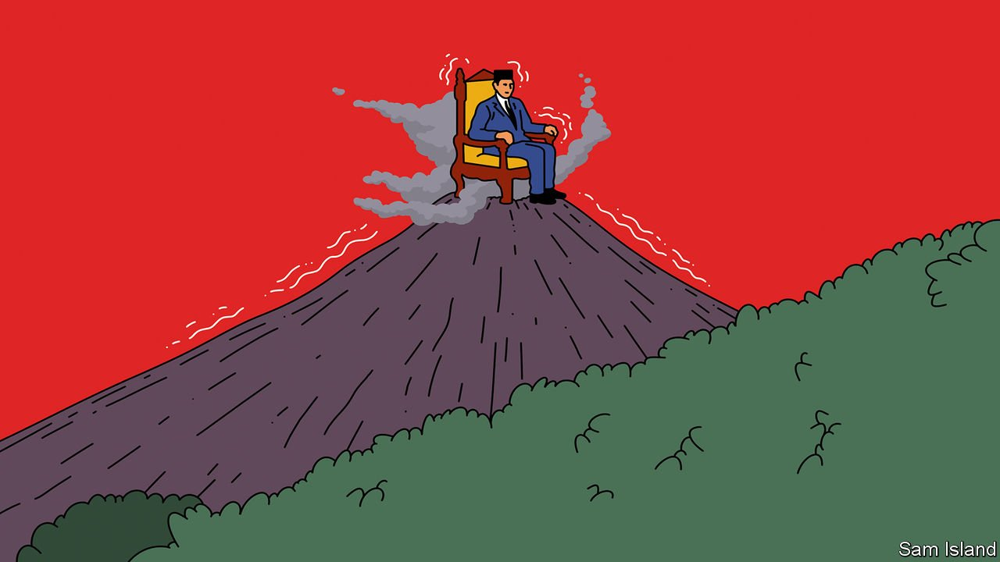

###### Banyan

# Joko Widodo is considering extending his term in office 

##### Indonesia’s president is contemplating an assault on his country’s democracy 

 

> Mar 26th 2022 

WHO CAN forget that moment, eight years ago, when a slight former furniture salesman with a winning grin rose to the presidency of Indonesia? Joko Widodo, known as Jokowi, had a modest upbringing in the small city of Solo in Central Java. He had become that city’s mayor, from where his reputation for rolling up his sleeves and fixing problems had propelled him to the governorship of Jakarta, the country’s sprawling capital, and then to the presidential palace. A man of the people, he connected with voters in the markets and back alleys. For the first time, a ruler did not hail from the army or the country’s elites. And so, in the story of Indonesia’s democratisation, Jokowi’s election in 2014 marked a decisive break from the era of Suharto, the dictator whose regime had crumbled in 1998.

And who can fail now to notice ominous parallels emerging with the late strongman, who in effect abolished politics, co-opting the army along the way? Jokowi’s second term ends in 2024, after which he has to step down. Yet Jokowi’s powerful henchmen, if not yet the man himself, muse aloud about his staying on by altering the constitution to extend his term by three years. Why, asks Luhut Panjaitan, a minister and sidekick, go to the unnecessary expense of elections? Why risk (unspecified) election violence? Besides, argues the former general of the Suharto era, calls for Jokowi to stay abound on social media. Mr Luhut says he and others are merely “trying to accommodate the aspirations of the public from this big data”.


Presidential hopefuls who cry foul, such as the governor of Jakarta, Anies Baswedan, are dismissed as self-serving. The views of the main political parties are more consequential: the support of two-thirds of parliament is required to amend the constitution. Gerindra, the third-largest party, says it opposes an amendment. So do members of the Indonesian Democratic Party of Struggle, or PDI-P, to which the president belongs.

But Jokowi’s talents for co-option are legend. Gerindra’s leader, another former general, Prabowo Subianto, twice ran for president against Jokowi, but is now defence minister. Two weeks ago Jokowi invited PDI-P’s boss, Megawati Sukarnoputri, to his palace in Bogor, west of the capital. She knows it well, both as a former president herself and as a daughter of Sukarno, the country’s independence leader. She is nothing if not a dynast, and the president could offer her daughter, Puan Maharani, parliament’s speaker, the vice-presidency. Democratic norms, says a former minister, are hanging by a thread.

Power has changed Jokowi. Explanations for his quest to extend his rule include the fact that the non-dynast has turned dynast himself. He is known to be keen to see his son, who has followed in his footsteps as mayor of Solo, become governor of Central Java, a province of some 37m people.

Another is Jokowi’s grand scheme to carve a new capital, Nusantara, out of the jungle of East Kalimantan province on the island of Borneo. The justification is that the current capital is gridlocked, sinking and flood-prone. But as Mr Anies argues, Jakarta is fixing its problems by cutting groundwater extraction and building sea walls. Bureaucrats and their families hate the idea of moving. The main boosters—from the political and business elite around Jokowi—have land and other interests around the site. If Jokowi loses power it is much less likely the $35bn white elephant will get built.

Strolling in the garden of the palace in Bogor, Jokowi once rehearsed Suharto’s qualities for Banyan’s benefit: the dictator got stuff done. Jokowi’s obsession, too, is for building things—roads, ports, power plants and more. The difference, says a former ally, is that Suharto had a team of technocrats to set economic priorities; he then got his business cronies to carry out the plan. By contrast, Jokowi’s cronies set the priorities.

In the end cronyism, corruption and economic crisis did for an out-of-touch Suharto. A whiff of economic crisis is in the air again, exacerbated by the war in Ukraine. Jokowi frets that sharp increases in the price of cooking oil are distressing poorer households. Prices of fuel, wheat and other foodstuffs are rising, too. That may be just the beginning. Yet Jokowi seems less attuned to the anger building among the middle class over the possibility of a power grab. The risks of a twin economic and political backlash are clear. If Jokowi is not careful, the man whom popular acclaim brought to power may yet be confronted by raging popular discontent.

Read more from Banyan, our columnist on Asia: (Mar 19th) (Mar 12th)

 (Mar 5th)

