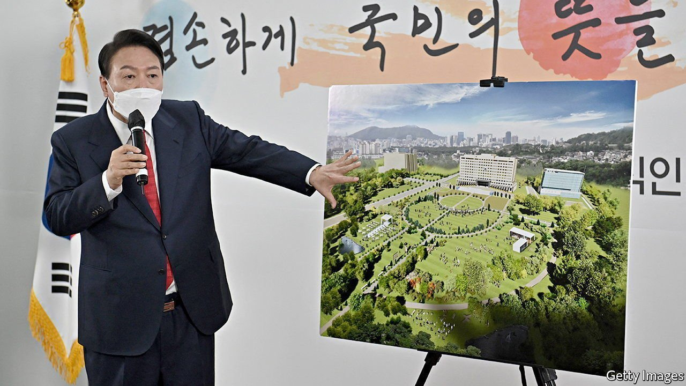

###### Palace politics

# South Korea’s president-elect starts with an unpopular personal project 

##### Yoon Suk-yeol wants to move the presidential office. Citizens would rather he focus on the economy 

 

> Mar 26th 2022 

ARRANGED IN TWO straight lines as if in formation, protesters outside South Korea’s defence ministry pumped their fists in time with a martial beat. “How many livelihoods are going to be killed by this move?” one demonstrator shouted. Ordinarily they would be found in Gwanghwamun, a wide plaza a few hundred metres from the presidential palace, known as the Blue House after the azure tiles on its soaring roof. But news that Yoon Suk-yeol, the president-elect, wants to move the administration to the ministry complex, a few miles south, had brought them to its gates.

Mr Yoon revealed his decision at a press conference two days earlier, on March 20th. He described the Blue House, nestling at the foot of an imposing mountain and sequestered behind security barricades and a long driveway, as an “isolated royal palace” and a “symbol of imperial power”. Instead, the man from the conservative People Power Party plans to bring power closer to said people upon his inauguration on May 10th. An existing building within the defence ministry’s grounds is to be converted into the presidential office (a residence has yet to be decided). A new park will be built around it, giving citizens a view of their government hard at work. It is in keeping with Mr Yoon’s victory-speech promise to “listen to the valuable opinions of the people”.


The people’s opinion is that it is a waste of money and a risk to national security. Mr Yoon’s transition team estimates the price tag at just under 50bn won ($40m). But that does not include the cost of moving defence officials currently in situ, which Mr Yoon’s own party estimates at another 120bn won. And while the defence ministry is already amply fortified, bunker and all, putting the president there would allow a missile strike to wipe out both military and political leadership in one fell swoop. A petition opposing the move quickly reached the 200,000 signatures needed to trigger an official reply.

My Yoon’s new neighbours are not thrilled either. In Samgakji, a dense, low-rise district next to the defence ministry, some business-owners welcomed the prospect of increased footfall. But many more seemed concerned about what else might come along with it: more traffic, annoying new security rules and the disruptive rabble of demonstrators and accompanying police officers that frequently fill Gwanghwamun. “Where do you think they’re going to protest?” grumbles the owner of a local dry-cleaner. “They’re going to protest in front of my shop.”

Moon Jae-in, the outgoing president, tried to make a similar move before admitting defeat in the face of logistical problems. His Minjoo party argues that a president-elect lacks the authority to move a government building or to allocate funds for such a move.

South Koreans complain that Mr Yoon promised on the campaign trail that his top priority would be addressing the economic damage caused by covid-19. Instead he has decided to spend political capital forcing through a personal project. With his popularity already at a historic low for an incoming president, Mr Yoon may find that his attempt to bring the people closer actually drives them farther away. ■

