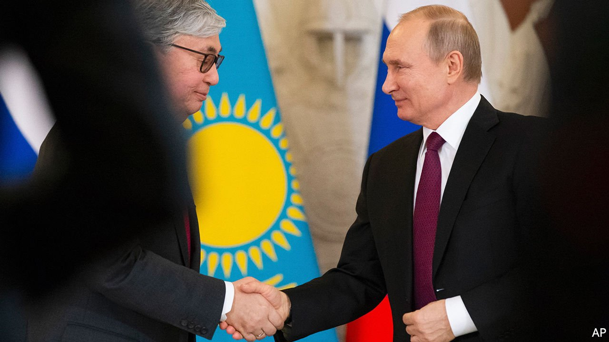
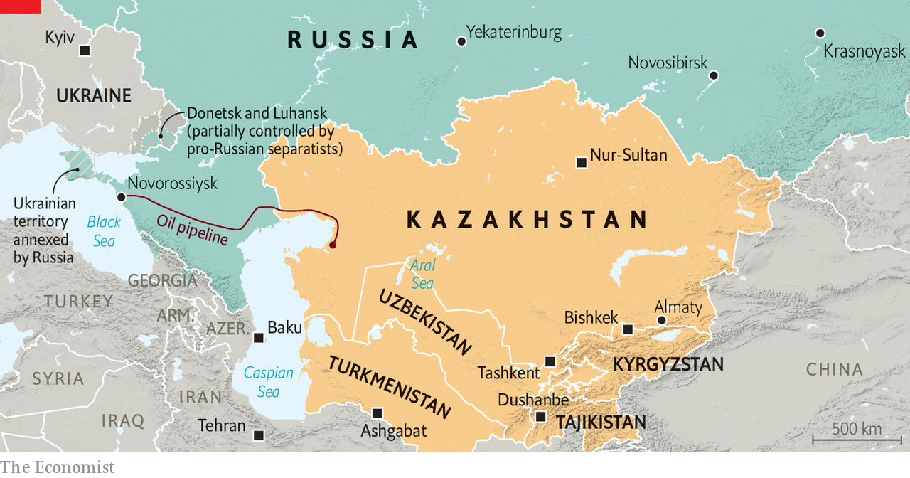

###### Silent Stans

# The Stans want nothing to do with Vladimir Putin’s invasion of Ukraine 

##### Central Asia’s post-Soviet republics have maintained a studied silence on the war 

 

> Mar 26th 2022 

IT WAS ONCE part of the Soviet Union, shares a long border with Russia and counts among its citizens a large ethnic-Russian minority. Russian nationalists lay claim to swathes of its territory and President Vladimir Putin has in the past cast aspersions on its statehood. Gennady Zyuganov, the leader of Russia’s Communist Party, has accused it of Russophobia and the oppression of Russian-speakers. Little wonder then that Kazakhstan is watching Mr Putin’s invasion of Ukraine with apprehension verging on horror.

The war has set nerves jangling across Central Asia. The “Stans”, as the region’s five post-Soviet states are known, are, broadly speaking, allies of Russia. But the aggressive expansionism of their former colonial master is testing that friendship to the limit. None of the countries has condemned the invasion. But nor has any offered public support or succumbed to pressure to follow Mr Putin’s lead and recognise the breakaway regions of Luhansk and Donetsk in eastern Ukraine. At a vote in the UN General Assembly deploring the invasion, on March 2nd, three abstained and two simply did not show up.


Kazakhstan, the biggest and richest of the lot, has long cultivated warm relations with Russia. It is a member of a collective-security treaty with its bigger neighbour, along with a handful of other countries including Kyrgyzstan and Tajikistan. In January, when protests in several cities turned violent and threatened to destabilise the country, Kassym-Zhomart Tokayev, Kazakhstan’s president, invoked the treaty’s mutual-defence clause and asked for help from Mr Putin, who duly delivered. But the country also enjoys good relations with the West and has no desire to join Russia as an international pariah. Mr Tokayev has said that his priority is to safeguard Kazakhstan’s “security, sovereignty, territorial integrity”. He is the only Central Asian leader to have spoken to Volodymyr Zelensky, Ukraine’s president, since the invasion began. (He has regular chats with Mr Putin.) He has offered to mediate.

 


Most countries are treading a fine line. Authorities in Almaty, Kazakhstan’s largest city, have allowed anti-war protests—though only once—and Kazakh police have fined drivers displaying the letter Z, a symbol of Mr Putin’s invasion. Yet two bloggers known for anti-Russian rhetoric have been jailed, too. Uzbekistan has supported Ukraine’s territorial integrity and declined to recognise the breakaway republics. But it has also leant on journalists who are noisily sympathetic to Ukraine.

Kyrgyzstan, which hosts a Russian military base, has come closest to offering (muted) support for Russia. Mr Putin’s recognition of Luhansk and Donetsk may have been “a necessary measure to protect the civilian population”, mused Sadyr Japarov, the president, on Facebook. But that was before the invasion. Since then his public stance has been one of neutrality. Uppermost in his mind may be the position of millions of Kyrgyz migrants working in Russia. That is also a concern for remittance-dependent Tajikistan, which has maintained a studied silence. So has isolationist Turkmenistan, which barely acknowledges what is happening in the outside world and is in any case busy establishing a political dynasty as Serdar Berdymukhamedov, its new president, assumes power from his father, Gurbanguly.

Whatever their leaders’ diplomatic manoeuvres, it will be hard for the Stans to avoid the economic fallout. The rouble’s collapse has dragged down their currencies. The Kyrgyzstani som has plunged by 15% since the invasion started and the Kazakhstani tenge by 14%. In part, that is because remittances from Russia are likely to slump, too: by a third in Kyrgyzstan and a fifth in Tajikistan, reckons the World Bank. That will hurt. Remittances are worth nearly a third of GDP in Kyrgyzstan and over a quarter of GDP in Tajikistan.

Kazakhstan, Turkmenistan and Uzbekistan are energy-rich and may hope to cash in on buoyant oil and gas prices. But even that can be held hostage. Russia says a pipeline, which crosses its territory to the Black Sea and carries most Kazakh oil, may close for repairs for two months. The move is seen by many as a response to sanctions, with Kazakhstan as collateral damage. “There is this famous saying that if Russia sneezes, Kazakhstan gets a cold,” says a senior Kazakh official. “This will be not a sneeze but perhaps pneumonia, and we will get covid or something.” ■

