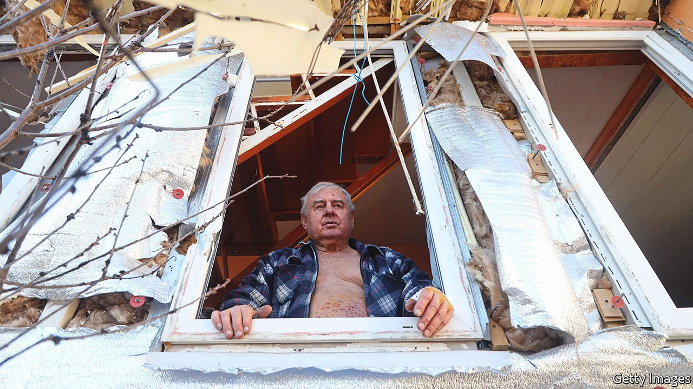
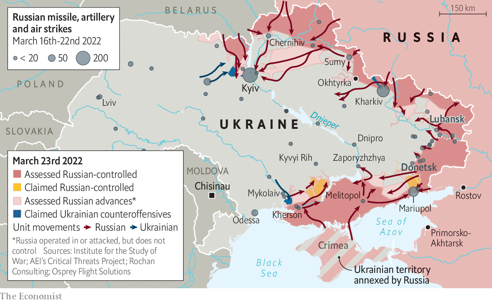
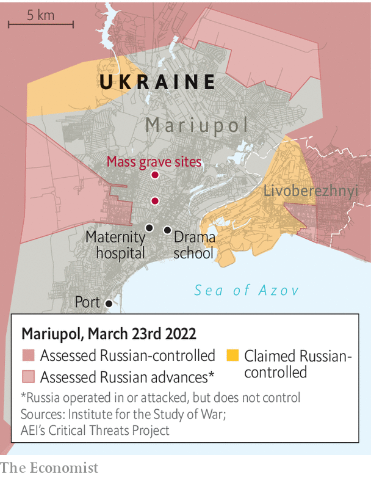

###### The war in Ukraine

# An uncertain outlook across Ukraine 

##### Russia’s atrocities in Mariupol have not brought it closer to victory. But they have not yet spread farther afield, either 

 

> Mar 26th 2022 

IN GEOPHYSICS, an epicentre is the place on the surface of the Earth closest to the point in its depths where intolerable pressure has triggered an earthquake. In war-torn Ukraine, the Epicentr hypermarket in Zaporyzhzhya is the rallying point in government-held territory closest to the intolerable pressure Russian forces have imposed on Mariupol, some 220km away.

Many of those fleeing the violence—some on foot, some in wheelchairs—have nothing but the shopping centre’s address to guide them. Some make it only to intervening villages. But 2,000-5,000 a day are reaching the hastily organised gathering point, as shocked as the survivors of earthquakes and tsunamis. More shocked, perhaps: the destruction they escaped was not some sudden act of God, but a protracted, deliberate and horribly human assault.


You can sense the arrival of a new convoy before you encounter any of the survivors on board—they carry the smoky smell of the burning city even after days of travel. On arrival they get soup and bread—which they hold to their noses before devouring—fresh clothes and first aid delivered by local volunteers. They fight back tears, not always successfully, as they work out if friends and relatives have managed to escape. They are the lucky ones, they keep saying; the ones who found cars and petrol. They are not still trapped in basements. They are not the old women begging for a lift on the edge of town, money in one hand and icons in the other.

 


Mariupol, once a city of 400,000, was surrounded by Russian forces from Crimea and Donbas in the first week of the war. It has fared far worse since than the other cities around which the Russians are encamped, in part because of its strategic importance—it is crucial to the establishment of a land bridge from Donbas to Crimea—in part because, unlike Kharkiv or Kyiv in the north, it is entirely encircled.

The Russian forces close to Kyiv have been held at bay for the past two weeks. Kira Rudik, a member of the Ukrainian parliament, says the capital is the “best defended place in Ukraine”. No one in the city now believes that Russian forces have the fighting power needed to take and occupy it. There are even some areas where Ukrainian troops are reported to have pushed back the invaders, though at least some of those reports have turned out not to be true. In Makariv, 50km west of the capital, the Ukrainian authorities claimed the Russians had been “driven back”. When your correspondent tried to visit he found a different situation. Fierce fighting made it impossible to get into the town. The local mayor said the Russians had seized 15% of it at the end of February and had neither advanced or been pushed back since then.

In the centre of Kyiv, however, life is improving. Petrol is no longer rationed, and there is more traffic on main roads than at any time since the invasion began on February 24th. Bread is back on supermarket shelves. Trains enter and leave the city.

But the signs, sounds and horrors of war persist. Every day since around March 14th the capital has been struck by a handful of missiles, with the north-west hit particularly badly. Late in the evening of March 20th a Russian missile pulverised a gym, a shopping centre and an office building, hurling debris for hundreds of metres. According to the Russian Ministry of Defence, which produced a video to support its claim, there were Ukrainian missile launchers in a parking area underneath the gym. If true, their detonation in the blast could explain the force of the explosion.

Oleksiy Arestovych, an adviser to Volodymyr Zelensky, Ukraine’s president, says that of every four incoming missiles one is intercepted, one hits a military target and two hit civilian targets. “I can’t say that in Kyiv they are trying to hit civilians on purpose but a lot of times they miss,” he says, adding that elsewhere residential areas have been knowingly targeted.

 


Mariupol exemplifies that savagery. On March 10th Russian aircraft started to bomb the city; unlike Kyiv, it has no air defences. Soon a few bombs a day became a few dozen bombs a day. On March 16th Russian missiles fell on a swimming pool, a cinema and a theatre; all three were being used for shelter by civilians. The theatre contained over 1,000 people, according to an eyewitness there the day before; the word “children” was written in large letters on the pavement outside the theatre, but did nothing to prevent the attack. No one currently knows how many survived, nor how many may remain buried alive.

In nine other towns and cities talks between Russia and Ukraine have established humanitarian corridors through which civilians can escape. Such talks have not worked for Mariupol. As things have worsened the escape routes, already dangerous, have become more deadly. Oleksandr Horbachenko, a welder, says that when he left on March 18th the city was in a state of collapse, with no municipal services, no drinkable water and no food. He says at least 80% of buildings are bombed out. “The whole of the centre is in ruins, with wires and glass everywhere. The worst thing is seeing the corpses strewn across the street. There are hundreds of them rotting away near the central market.”

On March 20th a Russian bomb hit a school on the eastern side of the city, where 400 people were reportedly sheltering. Later that day, Russia delivered an ultimatum: surrender the city by 5am the following morning. The Ukrainian government refused. But it has no way of breaking the blockade. On March 19th Mr Arestovych said the nearest available forces were more than 110km away. To reach the city they would have to traverse terrain on which they would be completely exposed to Russian air attacks.

Many interpreted the ultimatum as a warning of worse crimes to come, and fighting intensified in the days that followed; ships are currently adding to the bombardment. The city is close to falling. On March 20th Andriy Biletsky, the founder of the Azov regiment, a paramilitary outfit fighting alongside elite Ukrainian forces from the 36th Marine Brigade, confirmed that street-to-street fighting was under way in the east of the city. With 3,500 Ukrainian soldiers facing 14,000 invaders, around a tenth of the total estimated Russian force in the country, their prospects look daunting, even though attackers are generally reckoned to need a large numerical advantage.

The carnage in Mariupol and the success in Kyiv have both strengthened Ukrainian resolve. But the country continues to pursue negotiations with the invaders. And Russia’s requirements from such talks, though still beyond what Ukraine says it is willing to give, are much more modest now than they would have been when the invasion was launched in expectation of an easy and near total victory. The four principal ones are: a declaration of Ukrainian neutrality; Ukrainian demilitarisation; formal acceptance that Crimea, which Russia seized in 2014, is Russian territory and that the Donbas region, some of which was controlled by separatists backed by Russia before the war, is independent; and relief for Russia from Western sanctions.

Ukraine appears ready to agree to some of these demands. It has stated publicly that it will make no concessions on territorial integrity with regard to Crimea and Donbas, but behind closed doors there appears to be more willingness to experiment with different formulas. However its negotiators see no willingness to move on the other side. “They’re not as confident and self-assured as they used to be in the first days,” Dmytro Kuleba, Ukraine’s foreign minister, said in an interview with The Economist. “But on all big issues they are still where they were [when the negotiations began].”

If there is something Russia clearly wants, it is relief from sanctions. “Almost every tenth sentence [Russian negotiators] say is about sanctions,” Mr Kuleba said. “It’s a pain for them.” As a result Ukraine is pressing its Western supporters to turn up the pressure. A cost the Russians do not talk about is their mounting death toll. According to a NATO estimate, 7,000-15,000 Russians have died; the organisation puts the total number of those dead, injured and captured at around 40,000. If casualties are indeed in that sort of range then almost a quarter of the original invasion force is out of action.

But the Ukrainians are not sure that the Russian negotiators know how bad the situation is. The team is “second tier”, according to an intelligence official in Kyiv; Mr Kuleba says they do not appear empowered to resolve issues such as the nature of the security guarantees Ukraine wants.

Mr Putin’s failure to provide better negotiators could well reflect a lack of interest in seeing the negotiations bear fruit, perhaps because he thinks time is on his side. Though many Russian advances have stalled, there are quite a few places where it could increase its bombardments. A security official in Kyiv says that Ukrainian intelligence has had several warnings that a massive, sustained rocket attack on the capital is imminent. For unknown reasons, no such attack has materialised. But it remains a possibility. And Ukraine does not yet have the resources for decisive counterattacks.

Yet Mr Putin has been wrong about this war before. He may be again. Ms Rudik, the MP, says time is of the essence. She just doesn’t know who it favours. “The Russian economy is collapsing but we are dying. The question is who falls first.” ■

Read more of our recent coverage of the 

